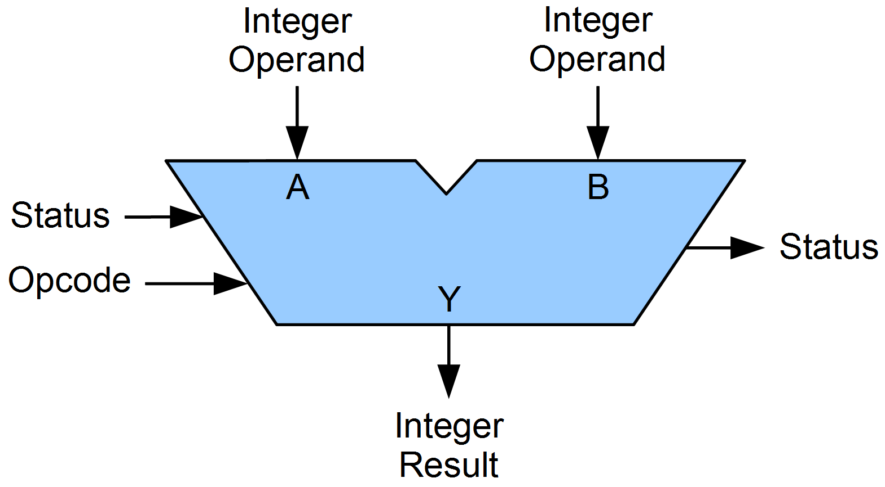
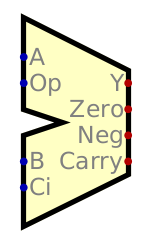

**********************************
Arithmetic logic Unit and the ESAP
**********************************

* The Arithmetic Logic Unit (ALU) is a combinational logic circuit for integer arithmetic and logical operations
* ALU designs can vary significantly and has implications for the total design of the computer

The Idea of the ALU
===================

    Generic symbol for an ALU.

* With sophisticated ALUs, some operation is applied to the inputs (operands) to produce some output
* The operator is specified with some *opcode* passed to the ALU
* These operations may include

    * Addition/Subtraction
    * Increment/Decrement
    * AND/OR/XOR/NOT
    * Bit Shift/Rotate

* Further, the ALU may update the system's status flags, and, in turn, may behave differently depending on the flags

    * For example, the system may remember if the last operation resulted in an output of zero
    * Status flags are a topic to be discussed later

* Digital does not have a built in ALU like the other components discussed so far

    * However, it does have a custom ALU one can import
    * Although, this custom ALU will not be used here

    Digital's importable ALU.

* Designing a sophisticated ALU is not difficult
* However, integrating one into a larger architecture may challenging
* Thus, to start, a simple ALU will be built and used
* Even with the simple ALU, the system being designed will be Turing Complete

.. note::

    One may have noticed that the ALU is effectively a function that takes inputs to produce outputs. However, one may
    also notice that this function may have *side effects* --- changing system status flags.

    In your computer science courses there has been a strong emphasis on avoiding side effects and writing pure
    functions, which this seems to violate. For better or worse, under the hood, the common modern designs/architectures
    for computers are very stateful and full of side effects.

    Fortunately, as one goes to higher levels of abstraction, like software, systems are designed such that side effects
    can be eliminated, despite the fact that the underlying hardware is stateful.

The Eater Simple as Possible Architecture (ESAP)
================================================

Design of the ESAP ALU
======================

For Next Time
=============

* Something?