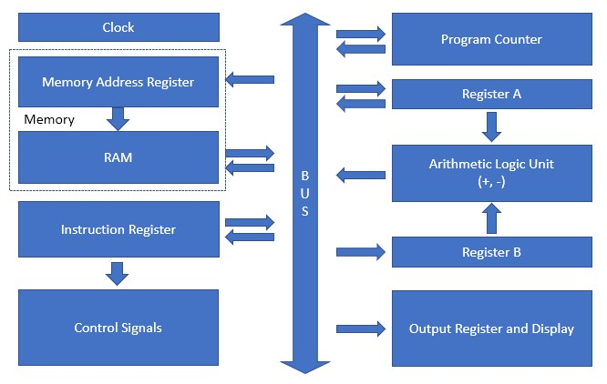
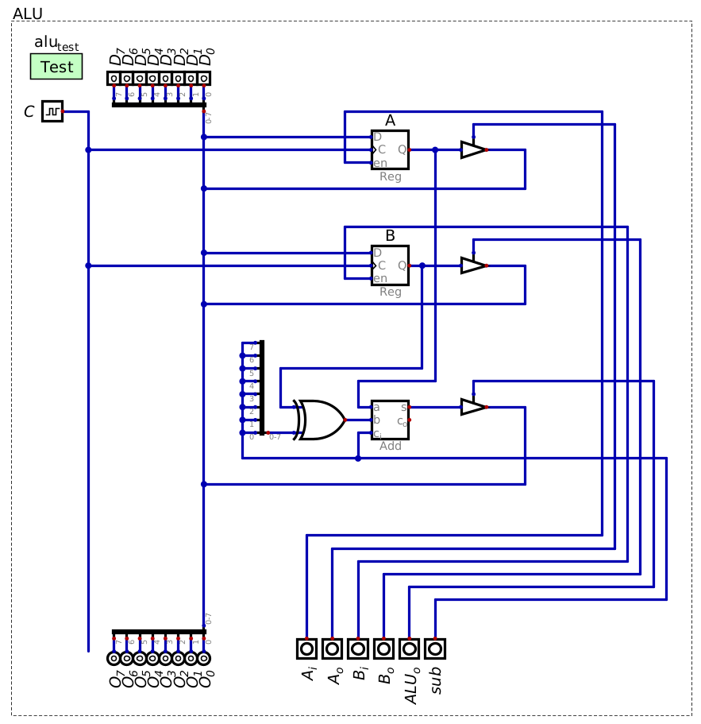
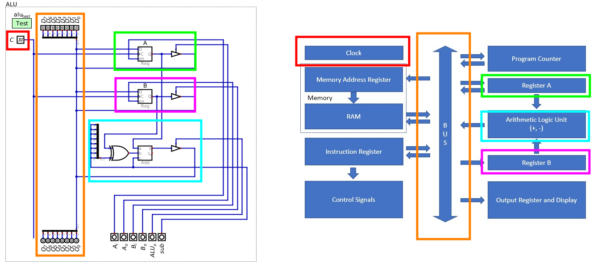
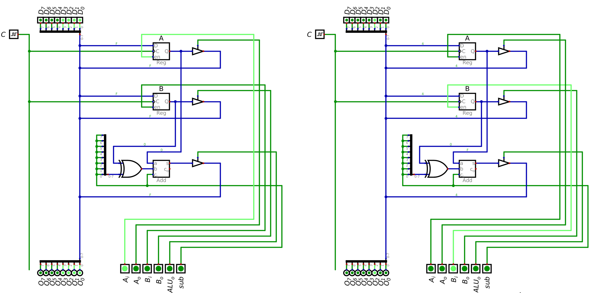
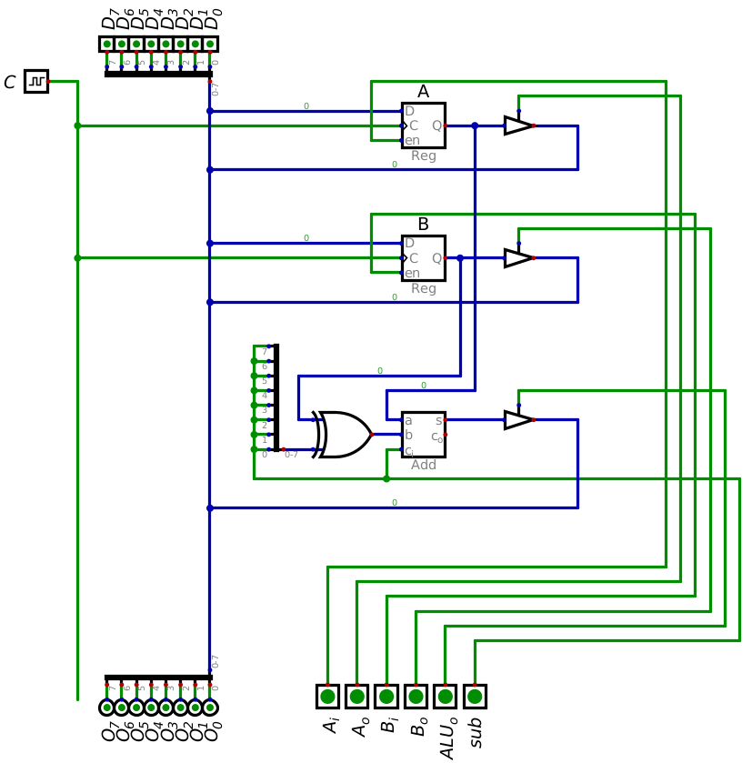

**********************************
Arithmetic logic Unit and the ESAP
**********************************

* The Arithmetic Logic Unit (ALU) is a combinational logic circuit for integer arithmetic and logical operations
* ALU designs can vary significantly and has implications for the total design of the computer

The Idea of the ALU
===================

.. figure:: alu_symbol.png
    :width: 500 px
    :align: center
    :target: https://en.wikipedia.org/wiki/Arithmetic_logic_unit

    Generic symbol for an ALU.

* With sophisticated ALUs, some operation is applied to the inputs (operands) to produce some output
* The operator is specified with some *opcode* passed to the ALU
* These operations may include

    * Addition/Subtraction
    * Increment/Decrement
    * AND/OR/XOR/NOT
    * Bit Shift/Rotate

* Further, the ALU may update the system's status flags, and, in turn, may behave differently depending on the flags

    * For example, the system may remember if the last operation resulted in an output of zero
    * Status flags are a topic to be discussed later

* Digital does not have a built in ALU like the other components discussed so far

    * However, it does have a custom ALU one can import
    * Although, this custom ALU will not be used here

.. figure:: alu_digital_symbol.png
    :width: 150 px
    :align: center

    Digital's importable ALU.

* Designing a sophisticated ALU is not difficult
* However, integrating one into a larger architecture may challenging
* Thus, to start, a simple ALU will be built and used
* Even with the simple ALU, the system being designed will be Turing Complete

.. note::

    One may have noticed that the ALU is effectively a function that takes inputs to produce outputs. However, one may
    also notice that this function may have *side effects* --- changing system status flags.

    In your computer science courses there has been a strong emphasis on avoiding side effects and writing pure
    functions, which this seems to violate. For better or worse, under the hood, the common modern designs/architectures
    for computers are very stateful and full of side effects.

    Fortunately, as one goes to higher levels of abstraction, like software, systems are designed such that side effects
    can be eliminated, despite the fact that the underlying hardware is stateful.

The Eater Simple as Possible Architecture (ESAP)
================================================

* The base architecture for the system being built is the *Simple as Possible* (SAP) design [#]_

    * Created by Malvino & Brown

* `There exist several versions of the SAP design <https://en.wikipedia.org/wiki/Simple-As-Possible_computer>`_
* For this course, a modified version of the SAP architecture by Ben Eater is used

    * This architecture will be referred to as Eater's SAP, or *ESAP*
    * `Ben Eater has a YouTube playlist of him physically building this computer on breadboards <https://www.youtube.com/playlist?list=PLowKtXNTBypGqImE405J2565dvjafglHU>`_
    * Note, however, that slight modifications to this design are made for the purposes of this course

    Overview of the ESAP Architecture. Arrows show how data is transferred between components of the computer system.
    With this design, the address and data bus are not entirely separate. This overview does not show the control bus.

* The design is simple to follow and understand, while still being Turing Complete

    * Further, it is straightforward to add to
    * It will also serve as the basis of going deeper in architecture complexity

* The ALU will serve as the starting point for building a computer with this architecture

Design of the ESAP ALU
======================

    Configuration of the ESAP ALU connected to a data bus and control bus within Digital. This ALU always calculates the
    sum (or difference) of the integer values stored in registers A and B.

* The ESAP ALU is only capable of performing addition and subtraction

    * A control line (:math:`sub`) controls if the ALU performs addition or subtraction

* The ALU is always calculating the sum/difference of the two integer values stored in registers A and B

    * Loading from the data bus into the registers is controlled by :math:`A_{i}` and :math:`B_{i}`
    * There is control logic for the registers to output to the data bus (:math:`A_{o}` and :math:`B_{o}`)
    * There is no control for the registers' output to the adder
    * Thus, the adder always has the sum/difference of whatever data is stored in A and B

* Although the ALU is always calculating the sum/difference, its output is controlled with a control signal

    * :math:`ALU_{o}`

    Comparison of the ALU and the ESAP architecture overview. This ALU includes several parts of the whole ESAP design
    --- two registers, ALU, clock, and data bus. The ALU does include the start of the control bus for the whole system
    (the vertical signal lines on the right hand side of the ALU), which is not shown in the architecture overview.

* It is possible to see how the ALU fits into the whole ESAP architecture design
* With the ALU, several components of the whole system are present

    * Register A
    * Register B
    * ALU
    * Data bus
    * Clock

* Further, the ALU does include the start of the control bus for the system

    * This is not shown in the ESAP architecture overview
    * A control bus will be required for the system to function

* One may have noticed the layout of register B and the ALU are swapped

    * ALU is below both registers in the Digital design, but between the registers in the overview
    * This difference is effectively irrelevant
    * As long as the inputs/outputs are configured correctly, this will have no functional impact on the system

* However, there is one slight difference that will have a functional impact on the system --- register B out

    * The designed ALU's register B can receive input from and output to the data bus
    * But the architecture overview shows that register B can only receive input

* Adding the ability to output from register B does provide some additional, yet minimal, flexibility to the design
* The original design does not allow for outputting from register B due to physical constraints and the minimal benefit

    * Remember, the original design was physically built on breadboards

Executing Arithmetic on the ESAP ALU
====================================

* With careful control over which parts of the system are inputting and outputting, a program can be run on the ALU

    * In the same way data was swapped between RAM and registers in an earlier topic

* As an example, consider the problem of adding the numbers 15 and 4 together
* Based on the configuration of the ALU, think about the individual steps that would need to be performed

    #. Load the number 15 into register A
    #. Load the number 4 into register B
    #. Output the sum from the ALU to the data bus

.. note::

    For brevity, hexadecimal will be used to encode binary numbers where appropriate. Fortunately, it is simple to
    convert numbers between bases when they are powers of each other, as previously discussed
    :doc:`here </topics/numbers/number-bases>`.

    Consider that :math:`2^{4} = 16`. It is possible to take groupings of 4 bits and easily convert it a single
    hexadecimal digit. Further, it is possible to take an 8 bit binary number and convert it to two hexadecimal
    digits.

        #. Given some 8 bit binary number --- ``0b01101011``
        #. Split the number into two groups of 4 bits --- ``0b0110`` and ``0b1011``
        #. Convert the 4 bit numbers into their hex digits --- ``0x6`` and ``0xB``
        #. Put the digits together to form the two digit hex number --- ``0x6B``

    This patten would also work with more groupings of four bits.

    Note that ``0b`` and ``0x`` prefixed the binary and hexadecimal numbers to eliminate ambiguity. These are common
    prefixes used in computing.

* Below is a table showing how to add the numbers 15 and 4 together with the ALU

    * Like with the bus, this is not so much a truth table, but a program
    * ``C`` means clock pulse
    * ``Z`` is a high impedance state

.. list-table:: Program to add 15 and 4 together
    :widths: auto
    :align: center
    :header-rows: 1

    * - :math:`A_{i}`
      - :math:`A_{o}`
      - :math:`B_{i}`
      - :math:`B_{o}`
      - :math:`ALU_{o}`
      - :math:`sub`
      -
      - :math:`D`
      -
      - :math:`C`
    * - ``1``
      - ``0``
      - ``0``
      - ``0``
      - ``0``
      - ``0``
      -
      - ``0x0F``
      -
      - ``C``
    * - ``0``
      - ``0``
      - ``1``
      - ``0``
      - ``0``
      - ``0``
      -
      - ``0x04``
      -
      - ``C``
    * - ``0``
      - ``0``
      - ``0``
      - ``0``
      - ``1``
      - ``0``
      -
      - ``Z``
      -
      - ``0``

    The left image shows the signals to load the value 15 (``0x0F``) into register A, and the right shows the signals to
    load the value 4 (``0x04``) into register B. A clock pulse would be required in both scenarios to have the data
    latch into the registers. These images correspond to the first two rows in the above table.

.. figure:: esap_alu_output_sum.png
    :width: 500 px
    :align: center

    Signals to output the sum of registers A and B to the data bus. This image corresponds to the third and final row in
    the above table.

* There is no need for a final clock pulse to output from the ALU
* After executing the program, the result of the addition is output to the data bus

    * 15 + 4 = 19
    * ``0b00001111`` + ``0b00000100`` = ``0b00010011``
    * ``0x0F`` + ``0x04`` = ``0x13``

* To provide another example, consider the problem of 15 - 4, but storing the result into register A

    #. Load 15 into register A
    #. Load 4 into register B
    #. Set the subtraction control signal
    #. Output from the ALU
    #. Store the result into register A
    #. Output from register A

* Below is a table representing the above program
* Notice how, in this example, several steps are able to be performed in a single clock pulse

    * Namely, setting subtraction, outputting from the ALU, and inputting into A

.. list-table:: Program to subtract 15 and 4 and store the result in A, then output the final result
    :widths: auto
    :align: center
    :header-rows: 1

    * - :math:`A_{i}`
      - :math:`A_{o}`
      - :math:`B_{i}`
      - :math:`B_{o}`
      - :math:`ALU_{o}`
      - :math:`sub`
      -
      - :math:`D`
      -
      - :math:`C`
    * - ``1``
      - ``0``
      - ``0``
      - ``0``
      - ``0``
      - ``0``
      -
      - ``0x0F``
      -
      - ``C``
    * - ``0``
      - ``0``
      - ``1``
      - ``0``
      - ``0``
      - ``0``
      -
      - ``0x04``
      -
      - ``C``
    * - ``1``
      - ``0``
      - ``0``
      - ``0``
      - ``1``
      - ``1``
      -
      - ``Z``
      -
      - ``C``
    * - ``0``
      - ``1``
      - ``0``
      - ``0``
      - ``0``
      - ``0``
      -
      - ``Z``
      -
      - ``0``

* After executing the program, the result of the subtraction is stored in A and output to the data bus

    * 15 - 4 = 11
    * ``0b00001111`` - ``0b00000100`` = ``0b00001011``
    * ``0x0F`` - ``0x04`` = ``0x0B``

* Below is an animation of the program being executed

    Animation of (a) loading 15 into register A, (b) loading 4 into register B, (c) outputting and saving the difference
    to register A, and (d) outputting the contents of register A to the data bus.

.. note::

    Be mindful of the current state of the system. Consider what is happening when outputting the difference from the
    ALU to register A before and after the clock pulses.

    .. figure:: esap_alu_output_difference_to_a.png
        :width: 400 px
        :align: center

        State of the system before the clock pulse to output the difference of A and B back into A.

    In the above image showing the state of the system before the clock pulse, it is clear that the output of the system
    is 11 (``0b00001011``).

    .. figure:: esap_alu_output_difference_to_a_post_clock.png
        :width: 400 px
        :align: center

        State of the system immediately following the clock pulse to output the difference of A and B back into A.

    However, after the clock pulse, the output changes to 7 (``0b00000111``), which is not the correct difference. In
    fact, it appears to have applied the operation twice (15 - 4 - 4 = 7).

    Nevertheless, based on the state of the system, everything is correct. Remember, when the clock pulsed, the
    difference was stored into register A, the ALU is always calculating the sub/difference of the contents of the
    registers, and the ALU is still outputting to the data bus as per the control signal. In other words, the value on
    the data bus will in fact be the result of applying the operation twice. However, the true result of the subtraction
    is safely stored in register A.

For Next Time
=============

* Something?

----------------------

.. [#] Albert P. Malvino and Jerald A. Brown. *Digital computer electronics.* Glencoe/McGraw-Hill, 1992.