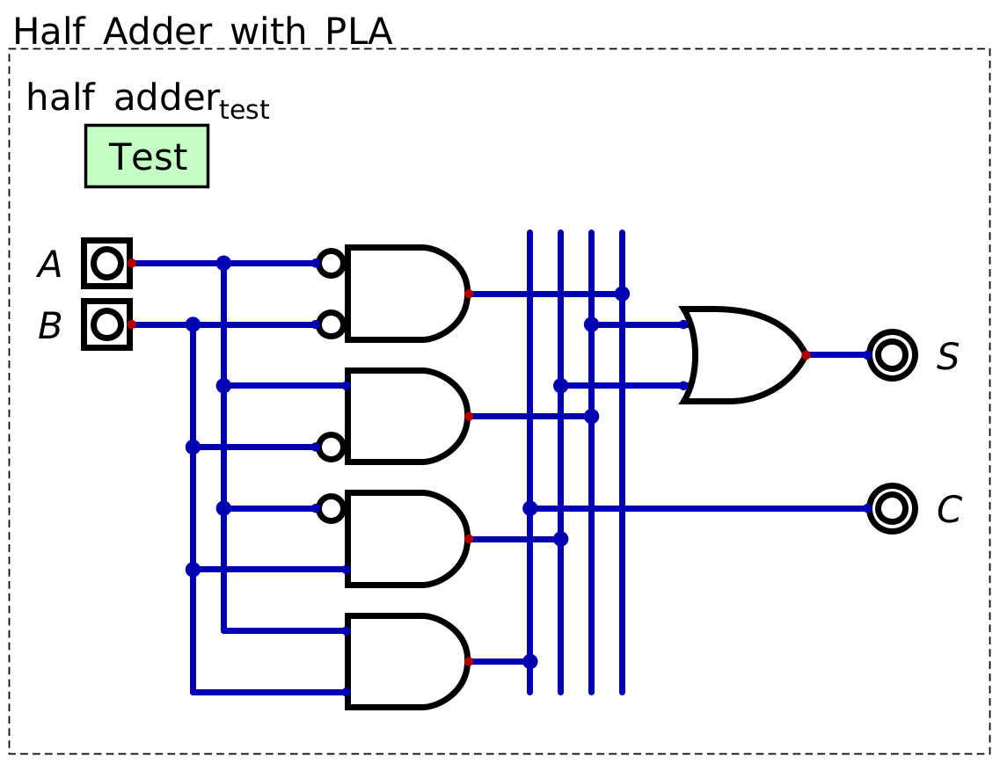
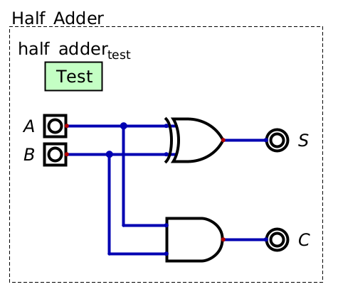
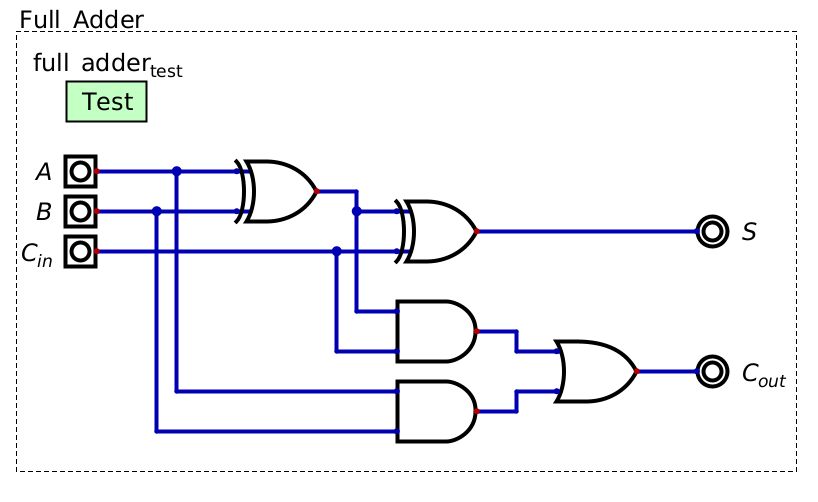
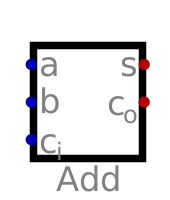

*****************
Half & Full Adder
*****************

* Memory was created using flip-flops, which are a form of sequential logic
* Earlier, combinational logic was used to perform logical operations
* Now, combinational logic will be used to perform addition

    * However, it will become clear soon that binary addition is effectively a logical operation

Binary Addition as a Logical Operation
======================================

* If one wants to add two bits together, how many output bits are needed?
* To answer this, consider the possibilities

    * :math:`0_{2} + 0_{2} = 0_{2}`
    * :math:`0_{2} + 1_{2} = 1_{2}`
    * :math:`1_{2} + 0_{2} = 1_{2}`
    * :math:`1_{2} + 1_{2} = 10_{2}`

* As one can see, when adding two ``1``\s together, a carry bit is needed
* Thus, when adding two bits together, two output bits are required

* In general, when adding two :math:`n` bit numbers together, :math:`n+1` bits is sufficient to output the correct sum

    * Remember, adding a bit doubles the number of representable values

* Consider the below table showing the result of adding two one bit numbers together

    * :math:`A` and :math:`B` are the two one bit numbers
    * :math:`S` is the sum bit
    * :math:`C` is the carry bit

.. list-table:: Two Bit Addition as a Logical Operation
    :widths: auto
    :align: center
    :header-rows: 1

    * - :math:`A`
      - :math:`B`
      -
      - :math:`C`
      - :math:`S`
    * - ``0``
      - ``0``
      -
      - ``0``
      - ``0``
    * - ``0``
      - ``1``
      -
      - ``0``
      - ``1``
    * - ``1``
      - ``0``
      -
      - ``0``
      - ``1``
    * - ``1``
      - ``1``
      -
      - ``1``
      - ``0``

* Referring to the above table, notice how this is effectively a logical operation

    * When both inputs are ``0``, output ``00``
    * When one input is ``1``, output ``01``
    * When both inputs are ``1``, output ``10``

* As previously discussed, programmable logic arrays can be configured to create any boolean logical function

    A PLA designed to perform the function of adding two one bit numbers together.

* A circuit capable of adding two one bit numbers together is called a *half adder*

Half Adder
==========

* A programmable logic array is sufficient for building a half adder
* However,  using programmable logic arrays is a bit like a brute force solution

* It is possible to greatly simplify the circuit and use less gates/transistors
* Referring to the above table describing the half adder's functionality, look at each output independently

    * :math:`S` is ``1`` only when either of the input bits are ``1``

        * This is the functionality of XOR

    * :math:`C` is ``1`` only when both input bits are ``1``

        * This is the functionality of AND

* In other words, instead of using 5 gates with a programmable logic array, a half adder can be built with only 2 gates
* Below is the typical configuration of a half adder

    A half adder created with only two gates, namely, an XOR calculating the value of the sum bit (:math:`S`), and
    an AND for calculating the value of the carry bit (:math:`C`). This is the typical design of a half adder circuit.

* Unfortunately, a half adder is only capable of adding two one bit numbers together
* To add numbers with more bits, one may be tempted to chain half adders together
* However, this will not work as the carry bit has no way to be accounted for in the next bit's addition

    * Think about regular base 10 addition
    * If the sum of one digit is greater than 10, the value is carried over and included in the sum of the next digit

* Thus, the half adder must be modified to incorporate an input of a carry bit

Full Adder
==========

* A *full adder* is a circuit designed to add binary numbers of arbitrary size
* The idea is the same as a half adder, but they provide a way to input carry bits to be accounted for in the sum
* Below is a table showing the desired functionality of a full adder

.. list-table:: Full Adder Functionality
    :widths: auto
    :align: center
    :header-rows: 1

    * - :math:`A`
      - :math:`B`
      - :math:`C_{in}`
      -
      - :math:`C_{out}`
      - :math:`S`
    * - ``0``
      - ``0``
      - ``0``
      -
      - ``0``
      - ``0``
    * - ``0``
      - ``0``
      - ``1``
      -
      - ``0``
      - ``1``
    * - ``0``
      - ``1``
      - ``0``
      -
      - ``0``
      - ``1``
    * - ``0``
      - ``1``
      - ``1``
      -
      - ``1``
      - ``0``
    * - ``1``
      - ``0``
      - ``0``
      -
      - ``0``
      - ``1``
    * - ``1``
      - ``0``
      - ``1``
      -
      - ``1``
      - ``0``
    * - ``1``
      - ``1``
      - ``0``
      -
      - ``1``
      - ``0``

    * - ``1``
      - ``1``
      - ``1``
      -
      - ``1``
      - ``1``

* Again, observe each output independently and find the patterns of when the output should be active

    * :math:`S` is high only when one or three of the inputs are ``1``; when an odd number of inputs are ``1``

        * This is, again, XOR's functionality
        * Remember from earlier, XOR can be used as a way to check even/odd

    * :math:`C_{out}` is ``1`` when any combination of two or more input bits are ``1``

        * If :math:`A` and :math:`B` are both ``1``
        * Or if :math:`A` and :math:`C_{in}` are both ``1``
        * Or if :math:`B` and :math:`C_{in}` are both ``1``
        * Or if :math:`A`, :math:`B`, and :math:`C_{in}` are all ``1``

* :math:`C_{out}` can be simplified to check if

    * :math:`A` and :math:`B` are both ``1``
    * Or if the sum of :math:`A` and :math:`B` is ``1`` and :math:`C_{in}` is ``1``

        * Note, if the sum of :math:`A` and :math:`B` is ``1``, then at least one of the inputs was ``1``

    A full adder, which is capable of including an inputted carry bit in the summation of the inputs.

Adding Larger Numbers
=====================

Full Adder Symbol
-----------------

* Adders are represented as a labeled box
* Within Digital, adders can be edited to allow for arbitrary input sizes

For Next Time
=============

* Read Chapter 2 Section 3 of your text

    * 2 pages