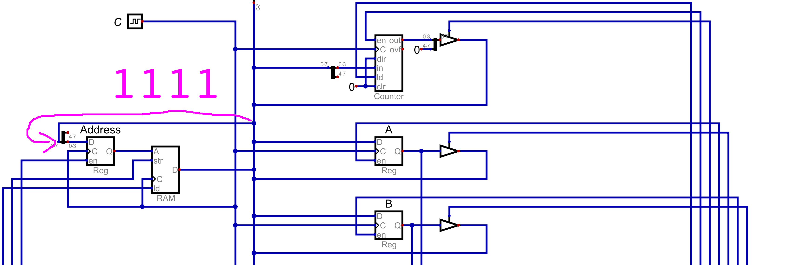
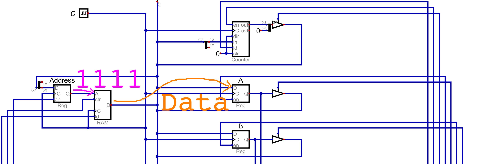

===========================
Instructions and Microcodes
===========================

* Although RAM has currently only held data, computation has been performed on the system
* With careful manipulation of the control signals, specific operations were executed by the system

    * Reading and writing to RAM
    * Performing arithmetic
    * Outputting values
    * Looping

* Realizing this, it becomes possible to create a set of well defined instructions for the system

Constraints
===========

* The designers of the computer (us) decide what instructions to include and how they are to be performed
* However, it is important to consider the limitations and constraints of the system

* Although the ESAP system is to be fully functional computer, it is limited by the fact that it's an 8 bit system

    * RAM is byte addressable
    * The main bus is 8 bits wide

* Thus, the information on the bus can only be 8 bits

    * This information includes data
    * But also includes *instructions*

* Details on what the instructions are and how the system deals with them will be covered later
* For now, consider that, for the ESAP system, individual instructions for the system will be made up of two parts

    * Operator (specifying an operation)
    * Operand

* For example, imagine an instruction to load data from a RAM address into register A

    * The operator is --- load data into register A
    * The operand is --- the RAM address of the data to be loaded into register A

* This means, there needs to be a way to encode the operator and the operand into the 8 bits

    * There needs to be a way to encode *load into A* and *the memory address of the data to load into A*

* A design decision must be made here --- how many bits for each of the two parts?

* For the ESAP system, the most significant 4 bits will be for the operator, and the remaining 4 will be for the operand

    * This means, a total of 16 unique operators and 16 unique operands can be represented
    * If the operand is a memory address, with 16 unique values, only 16 memory address may be indexed

        * This is why the system was designed with only 16 bytes or RAM

.. figure:: instruction_operator_operand.png
    :width: 333 px
    :align: center

    The ESAP system's 8 bit instruction broken down into the two parts --- operator and operand. The 4 most significant
    bits, represented as ``XXXX`` would specify some operator, while the 4 least significant bits, represented as
    ``YYYY`` would be the operand.

* Ultimately, it is possible to have different breakdowns of the 8 bits

    * For example, 3 and 5 could have been used for the operator and operands respectively

        * 3 bits for the operator --- 8 total
        * 5 bits for the operand --- 32 total

* But there is always going to be a trade off

    * Less vs. more flexibility with the number of operators, at the cost/benefit of operands and address space

* As previously mentioned, more details are to come on how the system encodes and manages the instructions
* For now, the takeaway is understanding how the 8 bits constrains the system's instructions

Microcodes
==========

* In several previous topics, it was observed that instructions were performed by moving data around the system

    * Moving data around to different modules
    * Some modules output data, while others input

* Consider the instruction of loading data from some memory address into register A

    * Any of the 16 memory addresses could be used in this example, but ``15`` (``0b1111``) is used here

* Think about the steps involved to perform this instruction within the context of the ESAP system design

    #. Load the value of the target memory address (``0b1111``) from the bus into the memory address register
    #. Output the value stored in RAM to the bus and input the value from the bus into register A

    Subsection of the ESAP system so far, corresponds to step 1 above. From the bus, load into the memory address
    register the address of the data to be accessed from RAM. Here, the address is ``15``, or ``0b1111``.

    Subsection of the ESAP system so far, corresponds to step 2 above. Output the data stored in RAM address ``15``
    (``0b1111``) to the bus, and input the data from the bus into register A.

* Below is a table showing how the control lines would be configured for the two steps

    * The data and clock columns are excluded
    * Like before, each row corresponds to one clock cycle

.. list-table:: Control logic for loading data from some memory address to register A
    :widths: auto
    :align: center
    :header-rows: 1

    * - :math:`Address`
      - :math:`RAM`
      - :math:`A`
      - :math:`B`
      - :math:`ALU_{o}`
      - :math:`sub`
      - :math:`out_{i}`
      - :math:`sign`
      - :math:`PC`
      - :math:`PC_e`
    * - ``1``
      - ``0/0``
      - ``0/0``
      - ``0/0``
      - ``0``
      - ``0``
      - ``0``
      - ``0``
      - ``0/0``
      - ``0``
    * - ``0``
      - ``0/1``
      - ``1/0``
      - ``0/0``
      - ``0``
      - ``0``
      - ``0``
      - ``0``
      - ``0/0``
      - ``0``

* These two steps put together achieve the instruction of loading data from a specific RAM address into register A
* The steps individual steps are called *microcodes*
* Each of these microcodes took one clock cycle

* Most instructions are made up of several microcodes

    * These instructions would be things like loading data from RAM, addition, outputting data, etc.
    * Additional instructions are to be discussed shortly

* Thus, individual instructions may take multiple clock cycles

Fetch and Instruction Register
==============================

Instruction Set
===============

For Next Time
=============

* Something?

