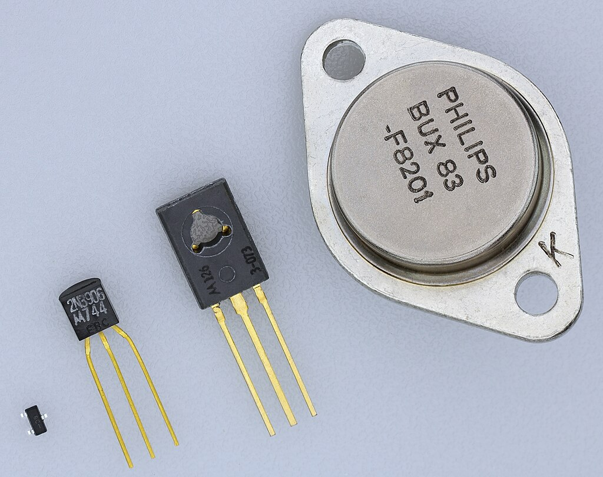
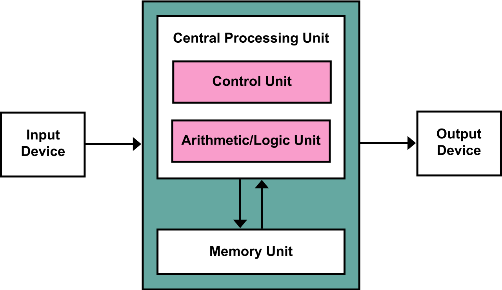
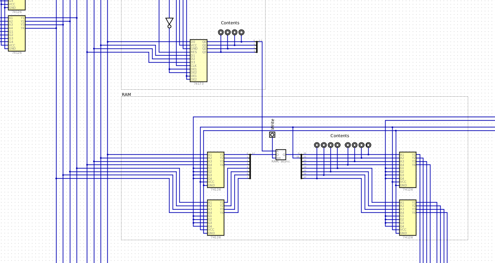
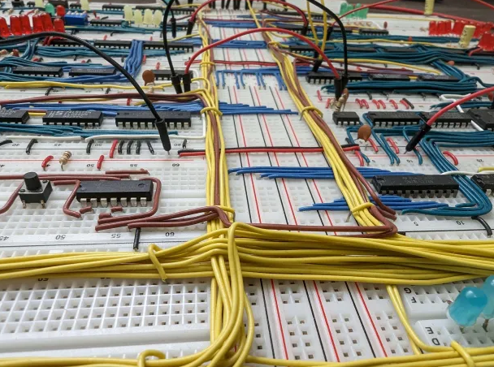
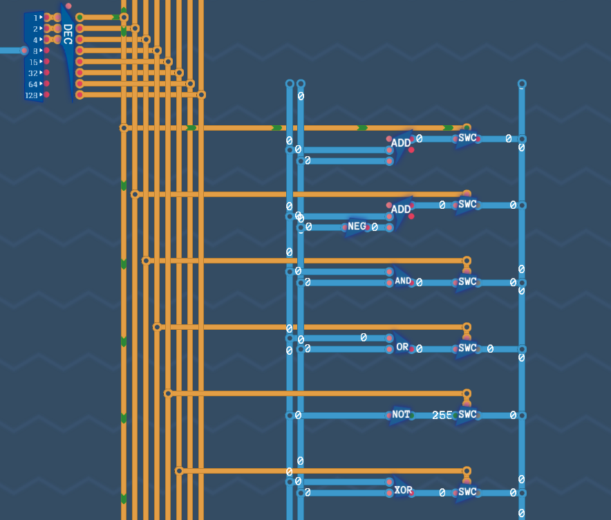

************
Introduction
************

* Before anything

    * :doc:`Read the outline </outline/outline>`
    * :doc:`Get set for the course </getting-set/getting-set>`

What Will I Learn?
==================

* The purpose of this course is to learn how a conventional computer works
* The topic starts with transistors and ends with programming a computer

    A collection of four transistors. Although these transistors are all physically different, their function is the
    same.

* There are several layers of abstraction between transistors and programming that will be covered

    * Transistors
    * Logic Gates
    * Latches
    * Registers
    * Memory
    * Adders
    * Arithmatic Logic Units (ALUs)
    * Combinatorial and Sequential Logic
    * Control Logic
    * CPUs
    * Architectures
    * Machine Language/Assembly Language
    * Compilers

    High-level idea of the von Neumann architecture. One of the interesting features of this architecture is how memory
    stores both data and instructions.

.. figure:: harvard_architecture.png
    :width: 500 px
    :align: center
    :target: https://en.wikipedia.org/wiki/Harvard_architecture

    High-level idea of the Harvard architecture. This architecture has separate memory for data and instructions.

Resources
=========

* This course only has one required special resource --- *Digital*

    * Free software for simulating digital circuits
    * Available on `GitHub <https://github.com/hneemann/Digital>`_

    Screenshot of a small portion of a modified version of the 8-bit computer designed by Ben Eater. The larger circuit
    is a simulated fully functional and programmable turing complete computer.

Supplementary Resources
-----------------------

* This course has several recommended supplementary resources

    * Not required, but provide additional practice, context, details, etc.

* At tne end of each topic, content from various resources will be suggested

* The course content is available on `GitHub <https://github.com/jameshughes89/cs2XX-ComputerArchitecture>`_

    * There is no requirement to access this content
    * However, students are encouraged to make contributions to the course content

* The textbook *Introduction to Computing Systems: From Bits & Gates to C/C++ & Beyond*

    * Not *required*, but for those that like textbooks, it is great

* `Ben Eater has an amazing YouTube playlist where they build a turing complete computer on breadboards <https://www.youtube.com/playlist?list=PLowKtXNTBypGqImE405J2565dvjafglHU>`_

    * These videos are fantastic and provide more details on components than will be covered in this course

    Part of the 8-bit breadboard computer, as designed by Ben Eater.

* The game `Turing Complete <https://store.steampowered.com/app/1444480/Turing_Complete/>`_

    * Players incrementally construct and program a turing complete computer

    Screenshot of an ALU from a larger computer made within the game "Turing Complete".

For Next Time
=============

* Get your computer at home :doc:`set up for the course </getting-set/getting-set>`
* `Watch Ben Eater's 8-bit computer overview video <https://www.youtube.com/watch?v=HyznrdDSSGM&list=PLowKtXNTBypGqImE405J2565dvjafglHU&index=1>`_
* Play the level "Crude Awakening" from the *Turing Complete* game
* Read Chapter 1 of your text

    * 19 pages
