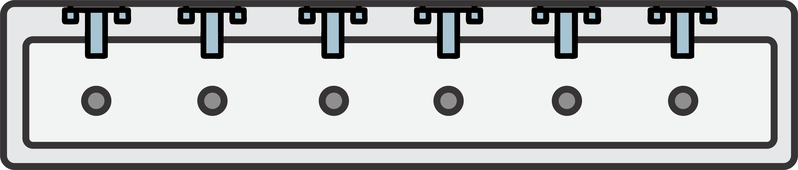

*******
The Bus
*******

* The bus physically connects several components within a computer
* It facilitates the transfer of information between these components, such as RAM and registers

* Typically, there are three types of busses

    * Data bus --- Transfer data between components
    * Address bus --- Transmits memory addresses
    * Control bus --- Sends signals responsible for controlling when components are active

Tri-State Logic
===============

* Tri-state logic was discussed in the previous topic when introducing drivers

    * Drivers were used to control RAM out

* Briefly, components can have three different states

    * Output a high signal by connecting the line to some voltage source (``1``)
    * Output a low signal by connecting the line to ground (``0``)
    * High impedance state/do nothing (``Z``)

* For a shared signal line like a bus, it is important that only one component is outputting a value at a time
* Outputting ``0`` is not the same as outputting nothing since any other signal on the same line would be sunk to ground
* In other words, if two components are connected to the same output line

    * If one component outputs ``0`` by connecting the line to ground
    * And the other outputs ``1`` by connecting the line to a voltage source
    * The line would ultimately have no voltage as it would be connected to ground

* As an analogy, consider a long sink with several faucets and drains connected to it

    A long sink representing some signal line with several components connected. Here, the sink itself represents the
    line and the faucet/drain represents the component's connection to the shared line.

* Here, the sink represents some shared signal line that several components can connect to
* The components' connections to the signal line are represented by the faucets and corresponding drains

* If a components is outputting a signal to the shared line, the faucet will either be on, or the drain will be open

    * When the output is ``1``, the faucet will be on adding water to the sink
    * When the output is ``0``, the drain will be opened, allowing any residual water to drain from the sink

* All other components will be left alone (``Z``), with neither the faucet on or the drains opened
* The presence or absence of water in the sink means that the signal is high or low, respectively

* Consider what would happen in this analogy if one tried to use ``0`` to mean nothing
* If one of the components had their faucets on, but others had their drains open, the water would immediately drain

    * The sink would remain empty

* This would be a problem since the sink *should* have water in it
* This is why it's important to have a third state

Connecting Components
=====================

Loading Data into RAM
=====================

Swapping Data
=============

For Next Time
=============

* Read Chapter 2 Section 2 of your text

    * 2 pages