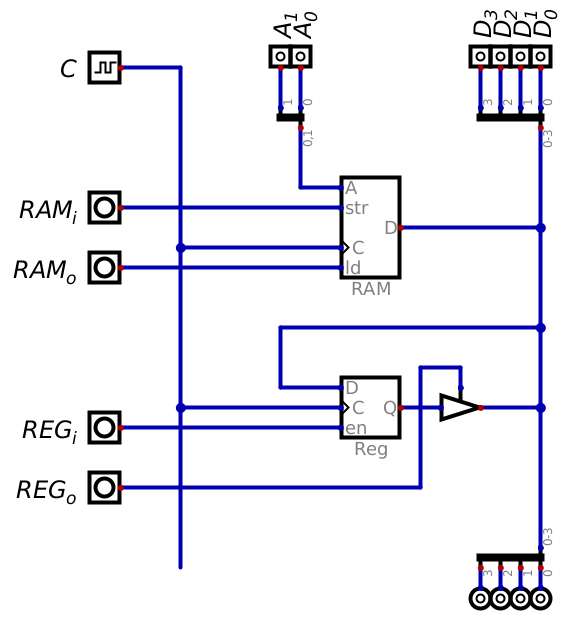
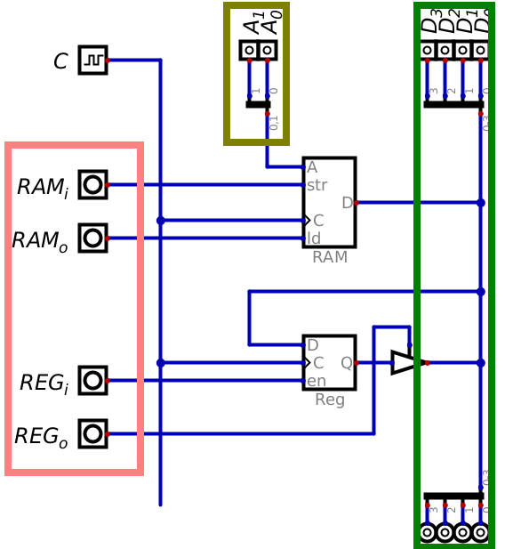
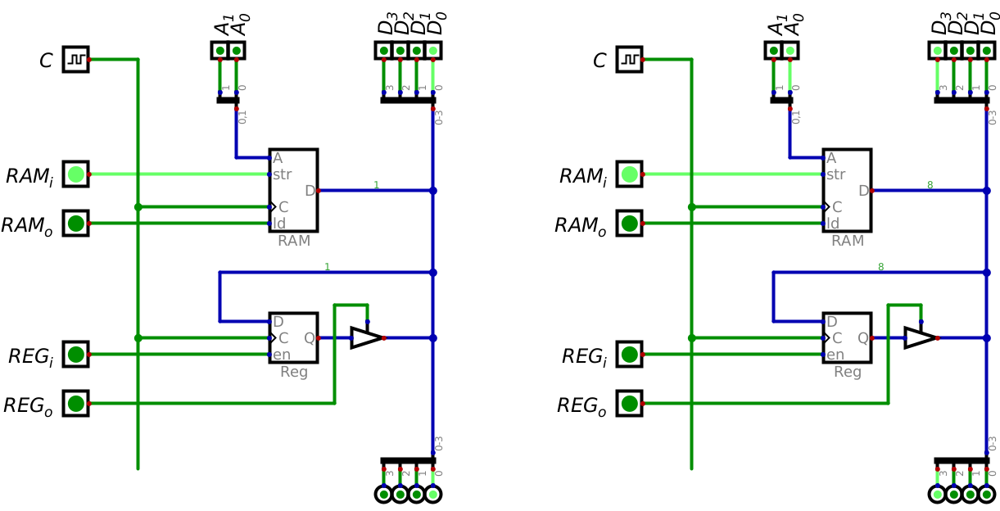
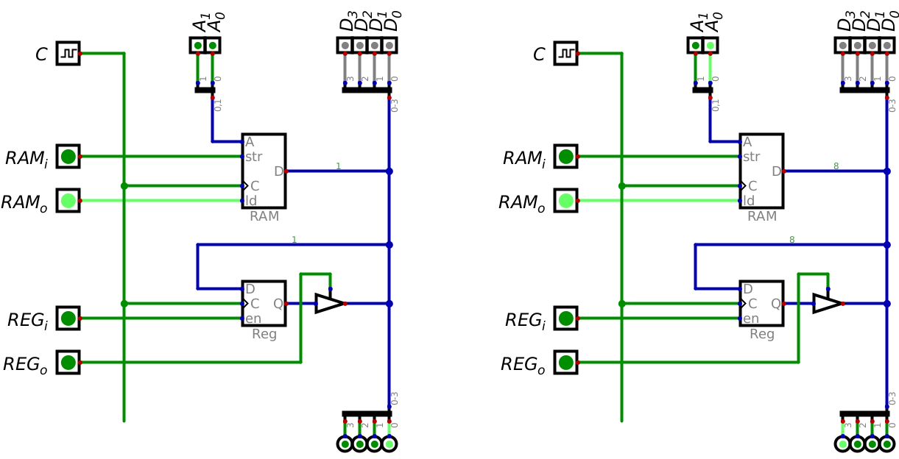
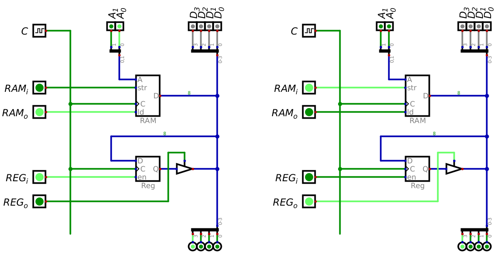
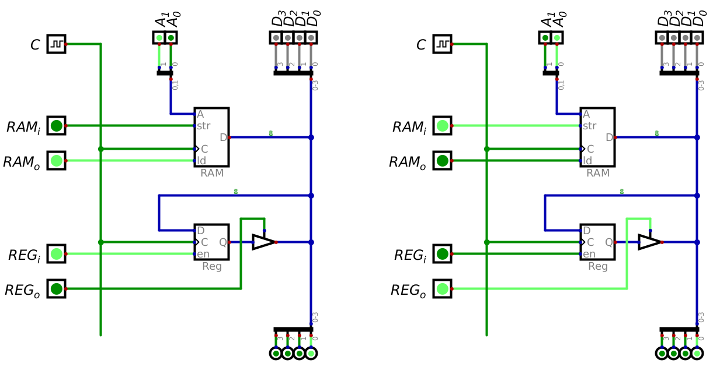

*******
The Bus
*******

* The bus physically connects several components within a computer
* It facilitates the transfer of information between these components, such as RAM and registers

* Typically, there are three types of busses

    * Data bus --- Transfer data between components
    * Address bus --- Transmits memory addresses
    * Control bus --- Sends signals responsible for controlling when components are active

Tri-State Logic
===============

* Tri-state logic was discussed in the previous topic when introducing drivers

    * Drivers were used to control RAM out

* Briefly, components can have three different states

    * Output a high signal by connecting the line to some voltage source (``1``)
    * Output a low signal by connecting the line to ground (``0``)
    * High impedance state/do nothing (``Z``)

* For a shared signal line like a bus, it is important that only one component is outputting a value at a time
* Outputting ``0`` is not the same as outputting nothing since any other signal on the same line would be sunk to ground
* In other words, if two components are connected to the same output line

    * If one component outputs ``0`` by connecting the line to ground
    * And the other outputs ``1`` by connecting the line to a voltage source
    * The line would ultimately have no voltage as it would be connected to ground

* As an analogy, consider a long sink with several faucets and drains connected to it

.. figure:: sink_with_many_faucets_and_drains.png
    :width: 500 px
    :align: center

    A long sink representing some signal line with several components connected. Here, the sink itself represents the
    line and the faucet/drain represents the component's connection to the shared line.

* Here, the sink represents some shared signal line that several components can connect to
* The components' connections to the signal line are represented by the faucets and corresponding drains

* If a components is outputting a signal to the shared line, the faucet will either be on, or the drain will be open

    * When the output is ``1``, the faucet will be on adding water to the sink
    * When the output is ``0``, the drain will be opened, allowing any residual water to drain from the sink

* All other components will be left alone (``Z``), with neither the faucet on or the drains opened
* The presence or absence of water in the sink means that the signal is high or low, respectively

* Consider what would happen in this analogy if one tried to use ``0`` to mean nothing
* If one of the components had their faucets on, but others had their drains open, the water would immediately drain

    * The sink would remain empty

* This would be a problem since the sink *should* have water in it
* This is why it's important to have a third state

Connecting Components
=====================

    RAM and a register connected to various busses. This configuration allows for inputting data into the bus from an
    external source (the input buttons), controlling the memory address used in RAM, and controlling when the RAM and
    register components are inputting/outputting data.

* Above is a RAM component connected to a register component via a data bus
* With this configuration, data can be input into the system via the input buttons
* The memory address the RAM component is referencing is controlled by address input buttons
* Finally, the components are controlled by turning on/off their inputs and outputs

    * Notice how the register only has an input enable on the component
    * To control the register's output, a driver is added after the register's output

* Here, how the components' signal lines are connected is important, not the actual physical layout of the components

    * The location of each component in the layout is arbitrary

* Within this layout are three physically separate busses

    * The data bus

        * For transferring data between components
        * In this configuration, there are four data lines, but more could be added
        * Here, data can be inputted into the system via the buttons labelled :math:`D_{0}` through :math:`D_{3}`
        * The data buttons are tri-state to provide a way to not input any value from an external source
        * The outputs at the bottom is there so one can see what value is on the bus at any given time

    * The address bus

        * For controlling which memory address in RAM is currently being used
        * Here, for simplicity, there are two address lines, meaning only four memory addresses can be accessed from RAM
        * These are controllable via the buttons labelled :math:`A_{0}` and :math:`A_{1}`

    * The control bus

        * Controls when individual components are reading from or writing to the data bus
        * Here, each is labeled with an :math:`i` or :math:`o` signifying input or output

* Below is an image of the layout with the busses identified

    Configuration of a RAM component and a register component connected to various busses. These data bus is shown
    within the green box on the right, the address bus is the yellow box in the top centre, and the control bus is shown
    by the pink box on the left.

Loading Data into RAM
=====================

* Consider how one would add data to RAM
* This would require manipulating the signals along the three busses in a specific way

* This is probably best explained with an example
* Add the value ``0001`` to memory address ``00`` and ``1000`` to memory address ``01``
* Below is a table showing how the signals would need to be set to achieve this
* This table however is not a truth table, but instead represents what is effectively a *program*
* In the below table, ``C`` means *clock pulse*, which would happen only after all other signals are set

.. list-table:: Program to add data to RAM
    :widths: auto
    :align: center
    :header-rows: 1

    * - :math:`RM_{i}`
      - :math:`RM_{o}`
      - :math:`RG_{i}`
      - :math:`RG_{o}`
      -
      - :math:`A_{1}`
      - :math:`A_{0}`
      -
      - :math:`D_{3}`
      - :math:`D_{2}`
      - :math:`D_{1}`
      - :math:`D_{0}`
      -
      - :math:`C`
    * - ``1``
      - ``0``
      - ``0``
      - ``0``
      -
      - ``0``
      - ``0``
      -
      - ``0``
      - ``0``
      - ``0``
      - ``1``
      -
      - ``C``
    * - ``1``
      - ``0``
      - ``0``
      - ``0``
      -
      - ``0``
      - ``1``
      -
      - ``1``
      - ``0``
      - ``0``
      - ``0``
      -
      - ``C``

    The left image shows how the signals should be set to add the value ``0001`` to memory address ``00``, and the right
    shows how they should be set to add the value ``1000`` to memory address ``01``. A clock pulse would be required in
    both scenarios to have the data be stored in RAM. These images correspond to the two rows in the above table.

* If one wants to verify that the data did in fact get stored, a different set of signals is needed
* The data stored in RAM would be displayed on the outputs at the end of the data bus
* Be mindful that the data input lines need to be set to ``Z``, otherwise their inputs will interfere with RAM's output
* Clock pulses are not actually needed here, but are included in the table for completeness

.. list-table:: Program to verify that data is in RAM
    :widths: auto
    :align: center
    :header-rows: 1

    * - :math:`RM_{i}`
      - :math:`RM_{o}`
      - :math:`RG_{i}`
      - :math:`RG_{o}`
      -
      - :math:`A_{1}`
      - :math:`A_{0}`
      -
      - :math:`D_{3}`
      - :math:`D_{2}`
      - :math:`D_{1}`
      - :math:`D_{0}`
      -
      - :math:`C`
    * - ``0``
      - ``1``
      - ``0``
      - ``0``
      -
      - ``0``
      - ``0``
      -
      - ``Z``
      - ``Z``
      - ``Z``
      - ``Z``
      -
      - ``C``
    * - ``0``
      - ``1``
      - ``0``
      - ``0``
      -
      - ``0``
      - ``1``
      -
      - ``Z``
      - ``Z``
      - ``Z``
      - ``Z``
      -
      - ``C``

    The left image shows how the signals should be set to verify that the value ``0001`` is stored in memory address
    ``00``, and the right shows how they should be set to verify that the value ``1000`` to memory address ``01``. These
    images correspond to the two rows in the above table. The data stored in RAM at the specified memory addresses is
    displayed on the output at the bottom of the data bus.

Swapping Data
=============

* Now consider a more complex problem --- swap the values between the two memory addresses

    * Move the contents of memory address ``00``, which is ``0001`` to memory address ``01``
    * And move the contents of address ``01`` (``1000``) to memory address ``00``

* Be careful to not overwrite the values in either memory address

    * A third, unused memory address should be used to ensure no data is lost

* What would this program be?
* At a high level, the solution would be

    * Move the value stored at memory address ``00`` to a free address, such as ``10``
    * Move the value at memory address ``01`` to ``00``
    * Move the value in address ``10`` to ``01``

* However, RAM can only output *or* input at a clock pulse

    * It's not possible to move a value between RAM addresses directly

* This is where the register comes in

    * The register will serve as temporary storage to facilitate moving data between RAM addresses

* This means the strategy to swap data would more accurately be

    * Move the value from memory address ``00`` to the register
    * Move the value from the register to address ``10``
    * Move the value at address ``01`` to the register
    * Move the value from the register to address ``00``
    * Move address ``10``\'s value to the register
    * Move the register's value to ``01``

* Below is a table showing the program of how the signals should be set along the busses

.. list-table:: Program to swap values between memory address ``00`` and ``01``
    :widths: auto
    :align: center
    :header-rows: 1

    * - :math:`RM_{i}`
      - :math:`RM_{o}`
      - :math:`RG_{i}`
      - :math:`RG_{o}`
      -
      - :math:`A_{1}`
      - :math:`A_{0}`
      -
      - :math:`D_{3}`
      - :math:`D_{2}`
      - :math:`D_{1}`
      - :math:`D_{0}`
      -
      - :math:`C`
    * - ``0``
      - ``1``
      - ``1``
      - ``0``
      -
      - ``0``
      - ``0``
      -
      - ``Z``
      - ``Z``
      - ``Z``
      - ``Z``
      -
      - ``C``
    * - ``1``
      - ``0``
      - ``0``
      - ``1``
      -
      - ``1``
      - ``0``
      -
      - ``Z``
      - ``Z``
      - ``Z``
      - ``Z``
      -
      - ``C``
    * - ``0``
      - ``1``
      - ``1``
      - ``0``
      -
      - ``0``
      - ``1``
      -
      - ``Z``
      - ``Z``
      - ``Z``
      - ``Z``
      -
      - ``C``
    * - ``1``
      - ``0``
      - ``0``
      - ``1``
      -
      - ``0``
      - ``0``
      -
      - ``Z``
      - ``Z``
      - ``Z``
      - ``Z``
      -
      - ``C``
    * - ``0``
      - ``1``
      - ``1``
      - ``0``
      -
      - ``1``
      - ``0``
      -
      - ``Z``
      - ``Z``
      - ``Z``
      - ``Z``
      -
      - ``C``
    * - ``1``
      - ``0``
      - ``0``
      - ``1``
      -
      - ``0``
      - ``1``
      -
      - ``Z``
      - ``Z``
      - ``Z``
      - ``Z``
      -
      - ``C``

    The left image shows how the signals should be set for moving the contents of memory address ``00`` to the register.
    The right shows how they should be set to move the contents of the register to memory address ``10``. These two
    images correspond to the first two rows in the above table.

    The left image shows the signals for moving the contents of memory address ``01`` to the register and the right
    shows how to move the contents of the register to address ``00``. These two images correspond to the middle two
    tows in the above table.

    The left shows how to move the contents of address ``10`` to the register, and the right shows how to move the data
    in the register to memory address ``01``. These two images correspond to the last two rows in the above table.

For Next Time
=============

* Read Chapter 2 Section 2 of your text

    * 2 pages