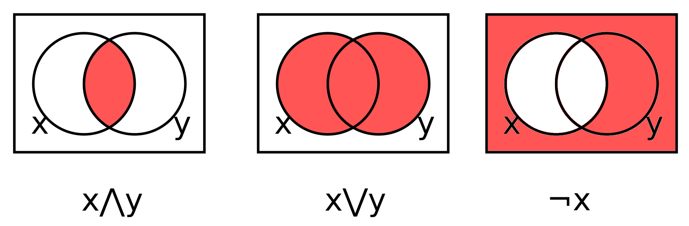
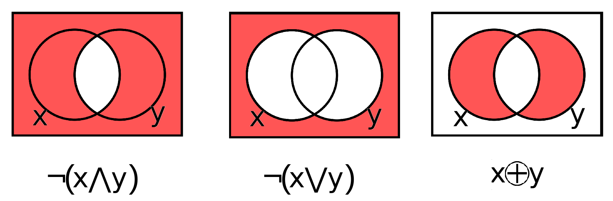
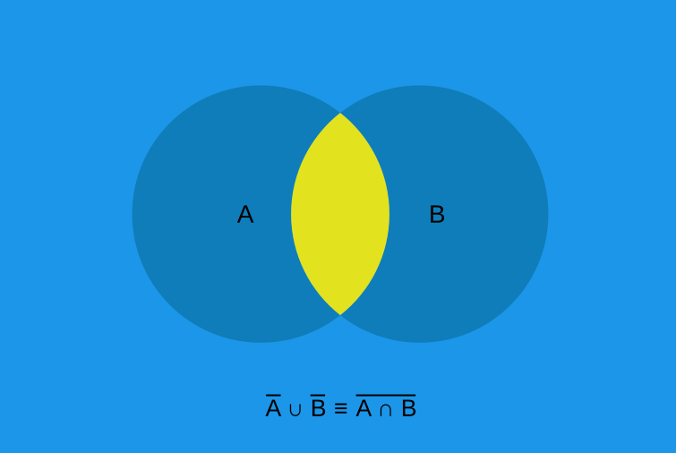
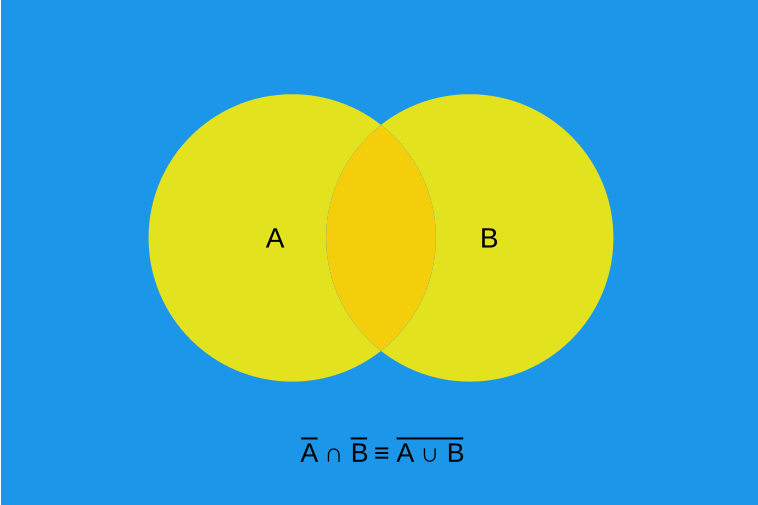

*************
Boolean Logic
*************

* Much of the following will likely be a review of already well understood concepts
* This content is covered for completeness, but will be kept at a relatively high level

Boolean Operators and Operands
==============================

* Boolean logic is a form of algebra that operates on boolean values that can take on only two states
* These states are typically called *true* and *false*

    * Depending on context, these are sometimes referred to as *On*/*Off*, ``1``/``0``, or *high voltage*/*low voltage*

* Within the algebra, the *operands* are values that take on one of these two states
* The *operators* act on these operands to produce a new boolean value

.. note::

    If this terminology is throwing you off, remember that this is like the integer operators/operands you are familiar
    with. Consider the expression :math:`1 + 2`. The operands here are integers :math:`1` and :math:`2` and the operator
    is :math:`+`, which means addition. Here, addition is an operator that takes two integer values and produces a new
    integer value.

* There are three basic boolean operators

    * :math:`not`

        * Unary operator --- only operates on a single operand to produce a single value
        * Given some boolean value :math:`a`, invert it

            * In other words, if :math:`a` is *true*, not :math:`a` is *false*, and *vice versa*

        * Typically denoted as :math:`\lnot a` or sometimes :math:`\overline a`

    * :math:`and`

        * Binary operator --- operates on two operands to produce a single value
        * Given boolean values :math:`a` and :math:`b`, return *true* if both values are *true*, *false* otherwise
        * Denoted as :math:`a \land b`

    * :math:`or`

        * Binary operator --- operates on two operands to produce a single value
        * Given boolean values :math:`a` and :math:`b`, return *true* if both or either are *true*, *false* otherwise
        * Denoted as :math:`a \lor b`

    Visual representations of the basic boolean operators with Venn diagrams. The images represent :math:`and`,
    :math:`or`, and :math:`not` respectively.

* There are additional boolean operators that can be made up from the three basic operators
* Three of these are commonly used within the context of computer architecture, thus they will be presented here

    * :math:`Exclusive` :math:`or` (:math:`xor`)

        * Binary operator --- operates on two operands to produce a single value
        * Given boolean values :math:`a` and :math:`b`, return *true* if either are *true*, *false* otherwise

            * Similar to :math:`or`, but if both are *true*, it returns *false*

        * Denoted as :math:`a \oplus b`
        * Equivalent to :math:`(a \lor b) \land \lnot (a \land b)`

    * :math:`not` :math:`or` (:math:`nor`)

        * Literally :math:`not` :math:`or`
        * Sometimes denoted as :math:`\overline \lor`
        * Equivalent to :math:`\lnot (a \lor b)`
        * Functionally complete --- can be used to generate all other boolean operators

    * :math:`not` :math:`and` (:math:`nand`)

        * Literally :math:`not` :math:`and`
        * Sometimes denoted as :math:`\overline \land`
        * Equivalent to :math:`\lnot (a \land b)`
        * Functionally complete --- can be used to generate all other boolean operators

    Visual representations of the additional boolean operators with Venn diagrams. The images represent :math:`nand`,
    :math:`nor`, and :math:`xor` respectively.

Truth Tables
============

* Truth tables provide a structured visualization of all possible truth values for logical expressions
* These are probably best understood with examples
* Below is a truth table for the above boolean operators for all possible combinations of values for two operands

.. list-table:: Truth Table for Basic and Common Logical Operators
    :widths: auto
    :align: center
    :header-rows: 1

    * - :math:`a`
      - :math:`b`
      -
      - :math:`\lnot a`
      - :math:`a \land b`
      - :math:`a \lor b`
      -
      - :math:`a \oplus b`
      - :math:`\lnot (a \land b)`
      - :math:`\lnot (a \lor b)`
    * - :math:`false`
      - :math:`false`
      -
      - :math:`true`
      - :math:`false`
      - :math:`false`
      -
      - :math:`false`
      - :math:`true`
      - :math:`true`
    * - :math:`false`
      - :math:`true`
      -
      - :math:`true`
      - :math:`false`
      - :math:`true`
      -
      - :math:`true`
      - :math:`true`
      - :math:`false`
    * - :math:`true`
      - :math:`false`
      -
      - :math:`false`
      - :math:`false`
      - :math:`true`
      -
      - :math:`true`
      - :math:`true`
      - :math:`false`
    * - :math:`true`
      - :math:`true`
      -
      - :math:`false`
      - :math:`true`
      - :math:`true`
      -
      - :math:`false`
      - :math:`false`
      - :math:`false`

* In the context of digital circuits, it is common to use ``0`` and ``1`` in place of :math:`false` and :math:`true`
* Going forward, ``0`` and ``1`` will be used for this course

.. note::

    The empty columns do not have any formal meaning. They are included here for visual clarity.

Building Out the Truth Table
----------------------------

* Notice the :math:`\lnot (a \land b)` and :math:`\lnot (a \lor b)` columns in the truth tables are compound operations

    * They are made up of two operations --- :math:`not` and :math:`and`/:math:`or`

* These columns are the inverse of the basic and/or columns in the table

    * Literally :math:`not` the result of those columns

* Consider a more complex compound expression --- :math:`(a \land \lnot b) \lor \lnot c`
* It is often helpful to break the operation down into parts that are easier to calculate
* Then, build out a truth table to solve each part individually

.. list-table:: Truth Table for :math:`(a \land \lnot b) \lor \lnot c`
    :widths: auto
    :align: center
    :header-rows: 1

    * - :math:`a`
      - :math:`b`
      - :math:`c`
      -
      - :math:`\lnot b`
      - :math:`\lnot c`
      -
      - :math:`a \land \lnot b`
      -
      - :math:`(a \land \lnot b) \lor \lnot c`
    * - ``0``
      - ``0``
      - ``0``
      -
      - ``1``
      - ``1``
      -
      - ``0``
      -
      - ``1``
    * - ``0``
      - ``0``
      - ``1``
      -
      - ``1``
      - ``0``
      -
      - ``0``
      -
      - ``0``
    * - ``0``
      - ``1``
      - ``0``
      -
      - ``0``
      - ``1``
      -
      - ``0``
      -
      - ``1``
    * - ``0``
      - ``1``
      - ``1``
      -
      - ``0``
      - ``0``
      -
      - ``0``
      -
      - ``0``
    * - ``1``
      - ``0``
      - ``0``
      -
      - ``1``
      - ``1``
      -
      - ``1``
      -
      - ``1``
    * - ``1``
      - ``0``
      - ``1``
      -
      - ``1``
      - ``0``
      -
      - ``1``
      -
      - ``1``
    * - ``1``
      - ``1``
      - ``0``
      -
      - ``0``
      - ``1``
      -
      - ``0``
      -
      - ``1``
    * - ``1``
      - ``1``
      - ``1``
      -
      - ``0``
      - ``0``
      -
      - ``0``
      -
      - ``0``

.. admonition:: Activity

    Create and complete a truth table for the boolean expression :math:`\lnot(a \land b) \lor (a \land \lnot b)`.

    .. list-table::
        :widths: auto
        :align: center
        :header-rows: 1

        * - :math:`a`
          - :math:`b`
          -
          - :math:`\lnot b`
          - :math:`a \land b`
          -
          - :math:`a \land \lnot b`
          - :math:`\lnot(a \land b)`
          -
          - :math:`\lnot(a \land b) \lor (a \land \lnot b)`
        * -
          -
          -
          -
          -
          -
          -
          -
          -
          -
        * -
          -
          -
          -
          -
          -
          -
          -
          -
          -
        * -
          -
          -
          -
          -
          -
          -
          -
          -
          -
        * -
          -
          -
          -
          -
          -
          -
          -
          -
          -

Properties of Logical Operators
===============================

* There are several algebraic properties that hold for boolean logic
* Most of these are intuitive, but will be presented here for completeness

.. list-table:: Boolean Algebra Laws
    :widths: auto
    :align: center

    * - Identity for :math:`\lor`
      - :math:`a \lor false = a`
    * - Identity for :math:`\land`
      - :math:`a \land true = a`
    * - Idempotence for :math:`\lor`
      - :math:`a \lor a = a`
    * - Idempotence for :math:`\land`
      - :math:`a \land a = a`
    * - Annihilator for :math:`\lor`
      - :math:`a \lor true = true`
    * - Annihilator for :math:`\land`
      - :math:`a \land false = false`
    * - Associativity of :math:`\lor`
      - :math:`a \lor (b \lor c) = (a \lor b) \lor c`
    * - Associativity of :math:`\land`
      - :math:`a \land (b \land c) = (a \land b) \land c`
    * - Commutativity of :math:`\lor`
      - :math:`a \lor b = b \lor a`
    * - Commutativity of :math:`\land`
      - :math:`a \land b = b \land a`
    * - Complementation 1
      - :math:`a \land \lnot a = false`
    * - Complementation 2
      - :math:`a \lor \lnot a = true`
    * - Double negation
      - :math:`\lnot (\lnot a) = a`
    * - Distributivity of :math:`\lor` over :math:`\land`
      - :math:`a \lor (b \land c) = (a \lor b) \land (a \lor c)`
    * - Distributivity of :math:`\land` over :math:`\lor`
      - :math:`a \land (b \lor c) = (a \land b) \lor (a \land c)`
    * - Absorption 1
      - :math:`a \lor (a \land b) = a`
    * - Absorption 2
      - :math:`a \land (a \lor b) = a`
    * - De Morgan's 1
      - :math:`\lnot a \lor \lnot b = \lnot (a \land b)`
    * - De Morgan's 2
      - :math:`\lnot a \land \lnot b = \lnot (a \lor b)`

.. note::

    If the absorption laws are unclear, consider the corresponding distributive and idempotent laws. For example, below
    is the first absorption law:

        :math:`a \lor (a \land b) = (a \lor a) \land (a \lor b) = a \land (a \lor b)`

    If :math:`a` is :math:`false`, given the :math:`\land` annihilator law, the expression evaluates to :math:`false`.

        :math:`false \land (false \lor b) = false`

    If :math:`a` is :math:`true`, given the :math:`\land` identity law, the expression evaluates to the result of
    :math:`(a \lor b)`, which, given the :math:`\lor` annihilator law, evaluates to :math:`true`, therefore, the whole
    expression evaluates to :math:`true`.

        :math:`true \land (true \lor b) = true \land true = true`

    If still not convinced, below is the truth table for the first absorption law.

    .. list-table:: Absorption Law 1 --- :math:`a \lor (a \land b) = a`
        :widths: auto
        :align: center
        :header-rows: 1

        * - :math:`a`
          - :math:`b`
          -
          - :math:`a \land b`
          -
          - :math:`a \lor (a \land b)`
        * - ``0``
          - ``0``
          -
          - ``0``
          -
          - ``0``
        * - ``0``
          - ``1``
          -
          - ``0``
          -
          - ``0``
        * - ``1``
          - ``0``
          -
          - ``0``
          -
          - ``1``
        * - ``1``
          - ``1``
          -
          - ``1``
          -
          - ``1``

    The proof follows similar for the second annihilation law.

De Morgan's Law
---------------

.. warning::

    Although consistently numbered here, the labels of the first and second De Morgan's laws is arbitrary.

* De Morgan's laws are of particular interest in the context of computer architecture

    * Given the popularity of :math:`nor` and :math:`nand` in circuit design

* De Morgan's laws are as follows

        :math:`\lnot a \lor \lnot b = \lnot(a \land b)`

        :math:`\lnot a \land \lnot b = \lnot(a \lor b)`

* Consider that the right hand side of both equations are :math:`nand` and :math:`nor` respectively
* This means that, not only can :math:`nand` be made with :math:`not` and :math:`and`, but also with :math:`not` and :math:`or`

    * One does not even need the :math:`and` operator to create :math:`nand`
    * In fact, given only :math:`not` and :math:`or`, one can create :math:`and`

        * :math:`\lnot(\lnot a \lor \lnot b) = \lnot(\lnot(a \land b)) = a \land b`

    * This would work the same for :math:`nor` being made with :math:`not` and :math:`and`

* The below truth table provides an exhaustive proof of De Morgan's laws

.. list-table:: De Morgan's Laws
    :widths: auto
    :header-rows: 1

    * - :math:`a`
      - :math:`b`
      - :math:`\lnot a`
      - :math:`\lnot b`
      - :math:`a \lor b`
      - :math:`a \land b`
      - :math:`\lnot a \lor \lnot b`
      - :math:`\lnot a \land \lnot b`
      - :math:`\lnot (a \lor b)`
      - :math:`\lnot (a \land b)`
    * - ``0``
      - ``0``
      - ``1``
      - ``1``
      - ``0``
      - ``0``
      - ``1``
      - ``1``
      - ``1``
      - ``1``
    * - ``0``
      - ``1``
      - ``1``
      - ``0``
      - ``1``
      - ``0``
      - ``1``
      - ``0``
      - ``0``
      - ``1``
    * - ``1``
      - ``0``
      - ``0``
      - ``1``
      - ``1``
      - ``0``
      - ``1``
      - ``0``
      - ``0``
      - ``1``
    * - ``1``
      - ``1``
      - ``0``
      - ``0``
      - ``1``
      - ``1``
      - ``0``
      - ``0``
      - ``0``
      - ``0``

* De Morgan's laws may not be immediately obvious, but think about what they *mean*

    * Visualizations may help with grasping the intuition

* Consider the first law

    :math:`\lnot a \lor \lnot b = \lnot(a \land b)`

    Visualization of De Morgan's first law. In this figure, blue is what is included in the result, yellow is what is
    excluded. Here, :math:`\cup` (set union) is equivalent to **or** (:math:`\lor`) and the :math:`\cap` (set intersect)
    is equivalent to **and** (:math:`\land`).

* It is easier to see how the above figure represents :math:`\lnot(a \land b)`

    * Think of the Venn diagram of :math:`and`, then invert it

* But also imagine what :math:`\lnot a` and :math:`\lnot b` would be

    * :math:`\lnot a` would be everything *but* what is within :math:`a`, including that which is in :math:`b`
    * :math:`\lnot b` would be everything *but* what is within :math:`b`, including that which is in :math:`a`

* It may be helpful to think of two versions of the figure, one which is :math:`\lnot a` and the other :math:`\lnot b`
* Then, :math:`or` would be the *union* of these two images, which is the same as the above figure

    * Union being, keep all points from both images

* Now consider the second law

    :math:`\lnot a \lor \lnot b = \lnot(a \land b)`

    Visualization of De Morgan's second law. In this figure, blue is what is included in the result, yellow is what is
    excluded. Here, :math:`\cup` (set union) is equivalent to **or** (:math:`\lor`) and the :math:`\cap` (set intersect)
    is equivalent to **and** (:math:`\land`).

* Similar to the first law, it is easier to see how the above figure represents :math:`\lnot(a \lor b)`
* Imagine what :math:`\lnot a` and :math:`\lnot b` would be

    * It's easier to think of two versions of the image, one for each :math:`\lnot a` and :math:`\lnot b`

* Then, :math:`and` would be the *intersect* of these two images, which is the same as the above figure

    * Intersect being, only keep the points that exist in both images

For Next Time
=============

* `Watch Ben Eater's video on how transistors work <https://www.youtube.com/watch?v=DXvAlwMAxiA>`_
* Read Chapter 3 Sections 1

    * 3 pages