*******************
Combinational Logic
*******************

* With an understanding of logic gates, more complex logic structures can be constructed
* Here, structures that can make decisions based on some combination of inputs will be explored

Decoders
========

* Consider a situation where an input signal controls two outputs, where only one should be active at a time

    * When the input signal is low, one of the two outputs is high
    * When the input signal is high, the other output should be high

.. list-table:: Single Bit Decoder
    :widths: auto
    :align: center
    :header-rows: 1

    * - Input
      -
      - Output a
      - Output b
    * - ``0``
      -
      - ``1``
      - ``0``
    * - ``1``
      -
      - ``0``
      - ``1``

.. note::

    Until now, all truth tables were shown to demonstrate how the boolean operators worked, each taking some number of
    inputs and producing a single output. These truth tables were used to describe how each operator worked.

    Here, the truth table is not describing any specific operator, but some desired functionality. The goal would then
    be to construct some circuit with logic gates to produce the desired functionality.  Further, it's showing how the
    desired functionality has more than one output. More specifically, when the input is ``0``, output a should be ``0``
    and output b should be ``1``, and when the input is ``1``, output a should be ``1`` and output b should be ``0``.

* Based on the truth table, how could this functionality be achieved with boolean operators?

    * Output a is the inversion of the input
    * Output b is simply the input

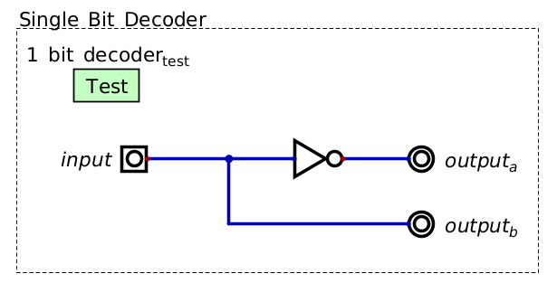

    A single bit decoder. At any point in time, a single output is always high. The specific output that is high is
    controlled by the input signal.

* This is an example of a single bit decoder

    * The one input signal can be thought of as a single bit
    * The input signal is "decoded" to control the output signals

More than One Input Bit
-----------------------

* Now consider a situation where four separate circuits need to be controlled by a decoder

    * These circuits will be labeled 0 to 3 for ease

* There needs to be a way to specify which of the four circuits should be running at any given time
* Unfortunately, a single bit of information can only be decoded to two states --- ``0``/``1``
* However, two input signals can have a total of four unique states

* Continuing the idea that a signal can be thought of as a single bit, two signals can represent a two bit binary number
* Each of these binary numbers could then correspond to each of the 0 -- 3 circuits

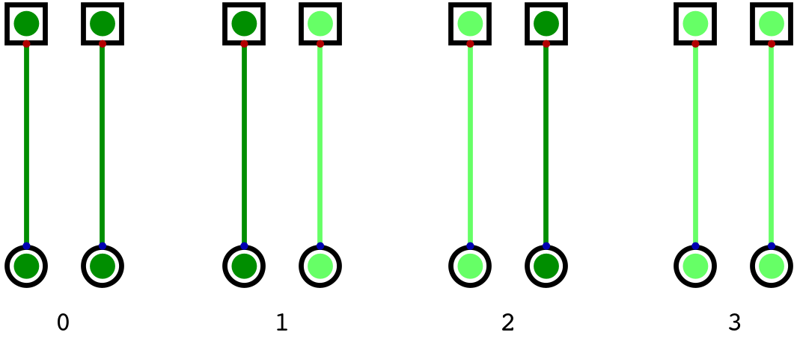

    All four states two signals can represent. If treating the signals as bits, these correspond to the numbers, from
    left to right, :math:`00_{2}`, :math:`01_{2}`, :math:`10_{2}`, and :math:`11_{2}`, which correspond to the numbers
    :math:`0_{10}`, :math:`1_{10}`, :math:`2_{10}`, and :math:`3_{10}` respectively.

* The below truth table describes the desired functionality
* Notice the relationship between the binary number the input signals represent and which output signal is high

.. list-table:: Two Bit Decoder
    :widths: auto
    :align: center
    :header-rows: 1

    * - Input a
      - Input b
      -
      - Output 0
      - Output 1
      - Output 2
      - Output 3
    * - ``0``
      - ``0``
      -
      - ``1``
      - ``0``
      - ``0``
      - ``0``
    * - ``0``
      - ``1``
      -
      - ``0``
      - ``1``
      - ``0``
      - ``0``
    * - ``1``
      - ``0``
      -
      - ``0``
      - ``0``
      - ``1``
      - ``0``
    * - ``1``
      - ``1``
      -
      - ``0``
      - ``0``
      - ``0``
      - ``1``

* To design a circuit for such functionality, think about each row and corresponding output at a time
* Consider the first row and output 0

    * When input a is *not* high *and* input b is *not* high, output high for only output 0

* This functionality can be achieved with a single two input and gate with both inputs inverted

    * This gate will only output ``1`` when both inputs are ``0``
    * Output 0 is :math:`\lnot a \land \lnot b`

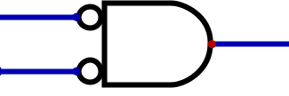

    And gate with two inverted inputs. This gate will only output ``1`` when both inputs are ``0``.

* Now consider the second row and input 1

    * When input a is *not* high *and* input b is high, output high for only output 1
    * Output 1 is :math:`\lnot a \land b`

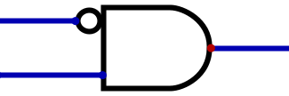

    And gate that will only output ``1`` when the input signal is ``01``, where the top signal is the most significant
    bit.

* Following this pattern, a two bit decoder can be a series of four and gates with every combination of inverted inputs

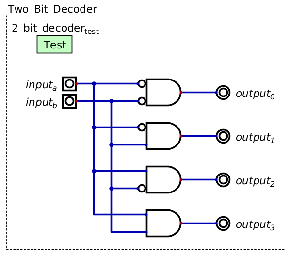

    A two bit decoder, often called a 2-4 decoder. Two input signals are decoded to control a the four output signals.
    At any time, only one of the four output signals is high.

* This particular design scales such that one can create decoders of any size

    * The only constraint, for lack of a better term, is the relationship between the number of inputs and outputs
    * Given :math:`n` inputs, a total of :math:`2^{n}` outputs can be controlled

* In general, and gates with various inverted inputs are ideal for situations where a specific input pattern is required

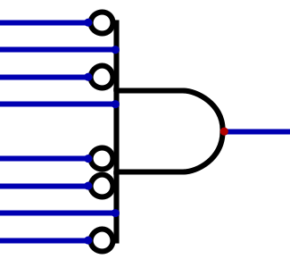

    Example of an and gate that only outputs ``1`` when an input pattern of ``01010010``, where the top input is the
    most significant bit, is observed.

Decoder Symbol
--------------

* Decoders are a common tool used in digital circuits, and as such, they are often represented with a single symbol
* There is no universally set symbol for decoders, so the symbol used for decoders could differ
* For this course, the symbol from Digital for decoders will be used

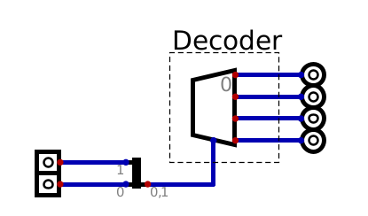

    The trapezoid component represents a 2-4 decoder.

* The above image shows a 2-4 decoder

    * Two inputs
    * Four outputs

* Within this image, the input/output symbols are minimized for easier representation
* Further, the two input signals are merged into a single signal line with a splitter/merger

    * One can think of the single line entering the decoder as two separate signals

* The splitter/merger is used to simplify circuit designs to condense the number of signal lines

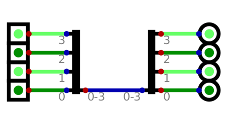

    Example of four signals being merged into a single line and then being split into the four signal lines. This has no
    purpose other than to demonstrate how the splitter/merger works.

Multiplexers (Mux)
==================

* Multiplexers (mux) are used to select one of many input signal to to map to an output

    * The input signals could be arbitrary (high or low)
    * They only have a single output

* In addition to input signals, multiplexers have selector signals to control which input is mapped to the output
* The below truth table demonstrates the desired functionality for a 2 bit mux

.. list-table:: Two Bit Mux
    :widths: auto
    :align: center
    :header-rows: 1

    * - Input a
      - Input b
      -
      - Select
      -
      - Output
    * - ``0``
      - ``0``
      -
      - ``0``
      -
      - ``0``
    * - ``0``
      - ``0``
      -
      - ``1``
      -
      - ``0``
    * - ``0``
      - ``1``
      -
      - ``0``
      -
      - ``0``
    * - ``0``
      - ``1``
      -
      - ``1``
      -
      - ``1``
    * - ``1``
      - ``0``
      -
      - ``0``
      -
      - ``1``
    * - ``1``
      - ``0``
      -
      - ``1``
      -
      - ``0``
    * - ``1``
      - ``1``
      -
      - ``0``
      -
      - ``1``
    * - ``1``
      - ``1``
      -
      - ``1``
      -
      - ``1``

* Truth tables like this may be simplified such that the values of the input signals are treated as some variable

.. list-table:: Two Bit Mux Simplified
    :widths: auto
    :align: center
    :header-rows: 1

    * - Input a
      - Input b
      -
      - Select
      -
      - Output
    * - ``X``
      - ``Y``
      -
      - ``0``
      -
      - ``X``
    * - ``X``
      - ``Y``
      -
      - ``1``
      -
      - ``Y``

* Here, the values of ``X`` and ``Y`` are not important
* What is important is that the value ``X``/``Y`` is mapped to the output based on the value of the select signal
* This simplified view is not only smaller, but arguably makes the desired functionality more clear

* Below is an image of a two bit multiplexer
* The implementation idea is similar to that of a decoder in that it uses and gates with inverted inputs

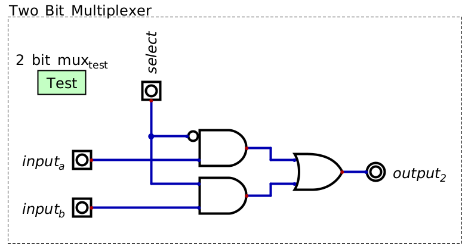

    A two bit multiplexer. Two input signals are selected between with the selector. The value of the selected input
    signal will be mapped to the output.

* One may notice that the input signals are never inverted on any gate, only the selector signal
* This is because, if the gate for a given input is selected, the input should be directly mapped to the output

    * If the gate is selected and the input is ``1``, the and gate outputs ``1``
    * If the gate is selected and the input is ``0``, the and gate outputs ``0``
    * If the gate is not selected with the selector, the and gate always outputs ``0``

.. note::

    Notice that there is an or gate before the final output signal. This or gate's only purpose is to combine all the
    outputs to a single line. However, one may wonder why it's necessary to use an or gate instead of simply combining
    the signals like in the below image.

    .. figure:: combining_output_signals_bad.png
        :width: 333 px
        :align: center

        Combining output signals on a single line directly creates problems and should not be done. This is true even if
        only one output line would be active at any given time. Instead, to combine output lines, use or gates.

    Connecting output signals like this will not work in practice. The nuanced reasoning for this is beyond the scope of
    the course and depends on the configuration of the transistors and other components within the logic gates. But
    briefly, often, when a gate outputs ``0``, its output is actually tied to ground. This means, if any other signal
    connected to the line is ``1``, it will ultimately be pulled to ground through the gates outputting ``0``, thereby
    making the whole line ``0``, even though it should be ``1``.

    To avoid the problem, an or gate is typically used to combine signals.

* Below is a four bit multiplexer

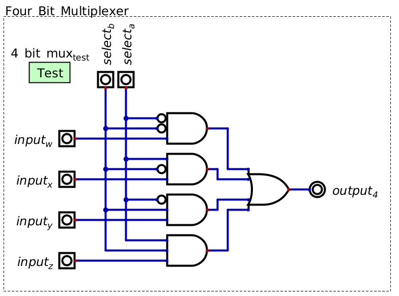

    A Four bit multiplexer. This design will scale to any input size as long as there are sufficient selector lines.

* Notice that the design is a scaled up version of the two bit multiplexer
* This design scales such that one can create multiplexers of any size

    * Here, the constraint is that for :math:`2^{n}` inputs, :math:`n` selector bits are needed

Multiplexer Symbol
------------------

* Like decoders, multiplexers are a common tool that are often represented with a single symbol
* Unlike decoders, multiplexers have a common symbol, which is similar to the decoder's symbol in Digital

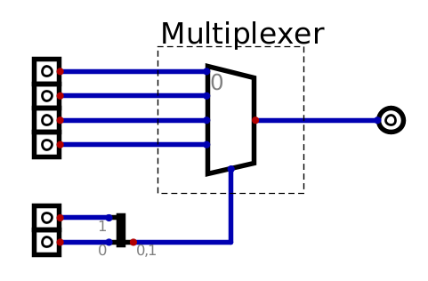

    The trapezoid component represents a four bit decoder.

* The above image shows a four bit multiplexer

    * Four inputs
    * Two selectors
    * One output

* Within this image, the input/output symbols are minimized for easier representation
* Further, the two select signals are merged into a single signal line with a splitter/merger

Demultiplexer (Demux)
---------------------

* A demultiplexer (demux) is another common tool
* It is the inverse of a multiplexer

    * Take one input and output it to some selected output signal line

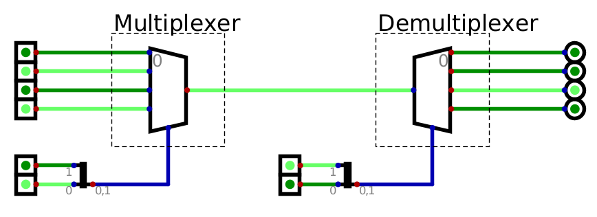

    Multiplexer with an output directly connected to a demultiplexer.

* Below is a simplified truth table with the functionality of a demultiplexer

.. list-table:: Four Bit Demux Simplified
    :widths: auto
    :align: center
    :header-rows: 1

    * - Input
      -
      - Select b
      - Select a
      -
      - Output 0
      - Output 1
      - Output 2
      - Output 3
    * - ``X``
      -
      - ``0``
      - ``0``
      -
      - ``X``
      - ``0``
      - ``0``
      - ``0``
    * - ``X``
      -
      - ``0``
      - ``1``
      -
      - ``0``
      - ``X``
      - ``0``
      - ``0``
    * - ``X``
      -
      - ``1``
      - ``0``
      -
      - ``0``
      - ``0``
      - ``X``
      - ``0``
    * - ``X``
      -
      - ``1``
      - ``1``
      -
      - ``0``
      - ``0``
      - ``0``
      - ``X``

* One may notice that this is very similar to a decoder
* The difference is that

    * Instead of outputting ``1`` on the selected signal like a decoder
    * A demultiplexer maps the arbitrary value of the input to the output

Programmable Logic Arrays (PLA)
===============================

* Programmable logic arrays (PLA) are a general purpose design for implementing any boolean logic functionality

    * Can map any input to any desired output

* PLAs are effectively decoders where the single decoded output signal may activate multiple final outputs
* They consist of two main parts

    * A collection of and gates, called an and array, which acts as a decoder
    * A collection of or gates, called an or array, which activates an output when specific decoded signals are high

* The number of and gates depends on the number of inputs

    * Given :math:`n` inputs, there will be a total of :math:`2^{n}` and gates
    * Like decoders

* The number of or gates depends on the number of desired output signals

    * One or gate for each output

* The number of inputs to each or gate depends on the number of decoded signals that could activate the or gate's output

    * The or gates serve as a way to connect multiple gate outputs to a single output

* The idea of a PLA is best described with an example
* Below is a truth table describing some mapping of two input signals to three output signals

    * The outputs are arbitrary and have no meaning other than to provide some example

.. list-table:: Two Input PLA with Some Output
    :widths: auto
    :align: center
    :header-rows: 1

    * - Input 1
      - Input 0
      -
      - Output 0
      - Output 1
      - Output 2
    * - ``0``
      - ``0``
      -
      - ``1``
      - ``0``
      - ``0``
    * - ``0``
      - ``1``
      -
      - ``0``
      - ``1``
      - ``1``
    * - ``1``
      - ``0``
      -
      - ``1``
      - ``1``
      - ``1``
    * - ``1``
      - ``1``
      -
      - ``1``
      - ``0``
      - ``1``

* To make the connection of input to output more clear, the truth table can be rewritten to include decoded inputs

.. list-table:: Two Input PLA with Some Output including Decoded (D) Signals
    :widths: auto
    :align: center
    :header-rows: 1

    * - In 1
      - In 0
      -
      - D 0
      - D 1
      - D 2
      - D 3
      -
      - Out 0
      - Out 1
      - Out 2
    * - ``0``
      - ``0``
      -
      - ``1``
      - ``0``
      - ``0``
      - ``0``
      -
      - ``1``
      - ``0``
      - ``0``
    * - ``0``
      - ``1``
      -
      - ``0``
      - ``1``
      - ``0``
      - ``0``
      -
      - ``0``
      - ``1``
      - ``1``
    * - ``1``
      - ``0``
      -
      - ``0``
      - ``0``
      - ``1``
      - ``0``
      -
      - ``1``
      - ``1``
      - ``1``
    * - ``1``
      - ``1``
      -
      - ``0``
      - ``0``
      - ``0``
      - ``1``
      -
      - ``1``
      - ``0``
      - ``1``

* From the above table, when should each of the outputs be high?

    * Output 0 is high when the zeroth, second, or third decoded signals are high
    * Output 1 is high when the first or second decoded signals are high
    * Output 2 is high when the first, second, or third decoded signals are high

* One may be tempted to map each decoded signal directly to the desired outputs, however, there are problems with this

    * As discussed above with the multiplexers
    * Instead, the decoded signals are mapped to or gates that correspond to each output

* The goal is then to

    * Create a decoder
    * Map the decoded signals to or gates when the signal should cause the specific output to go high

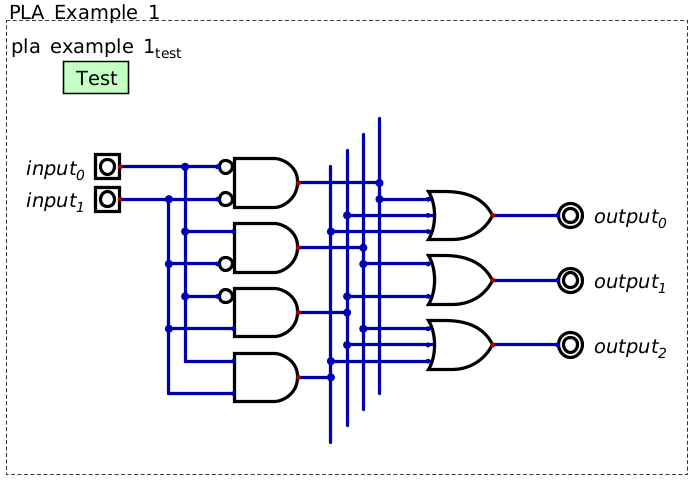

    Programmable logic array (PLA) mapping two inputs to three outputs. The PLA is made up of an array of and gates
    serving as a decoder and an array of or gates that will output a high signal when any of the decoded inputs are
    high.

* This basic design of an array of and gates followed by an array of or gates scales to arbitrary size
* Below is some truth table describing some functionality for a three input, four output PLA

.. list-table:: Three Input PLA with Some Output
    :widths: auto
    :align: center
    :header-rows: 1

    * - Input c
      - Input b
      - Input a
      -
      - Output a
      - Output b
      - Output c
      - Output d
    * - ``0``
      - ``0``
      - ``0``
      -
      - ``1``
      - ``0``
      - ``1``
      - ``0``
    * - ``0``
      - ``0``
      - ``1``
      -
      - ``0``
      - ``1``
      - ``0``
      - ``1``
    * - ``0``
      - ``1``
      - ``0``
      -
      - ``0``
      - ``0``
      - ``1``
      - ``0``
    * - ``0``
      - ``1``
      - ``1``
      -
      - ``1``
      - ``0``
      - ``0``
      - ``1``
    * - ``1``
      - ``0``
      - ``0``
      -
      - ``0``
      - ``1``
      - ``0``
      - ``0``
    * - ``1``
      - ``0``
      - ``1``
      -
      - ``1``
      - ``0``
      - ``1``
      - ``0``
    * - ``1``
      - ``1``
      - ``0``
      -
      - ``0``
      - ``1``
      - ``0``
      - ``1``
    * - ``1``
      - ``1``
      - ``1``
      -
      - ``1``
      - ``0``
      - ``1``
      - ``0``

* The PLA matching the functionality described in the above truth table is shown in the following image

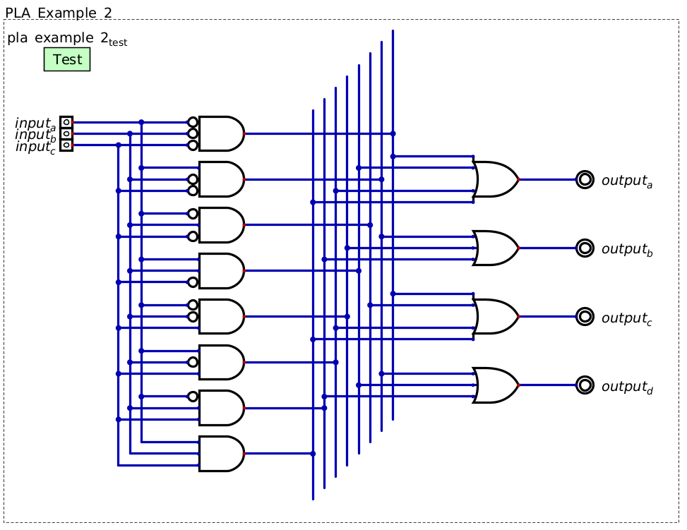

    Programmable logic array (PLA) mapping three inputs to four outputs. This figure shows how the general design of an
    array of and gates followed by an array of or gates can be scaled up.

Programmable Logic Array/Look Up Table Symbol
---------------------------------------------

* One may have realised that this functionality is effectively a dictionary/map/look up table
* In fact, within Digital, PLAs are called look up tables
* Below is a figure of a look up table from Digital

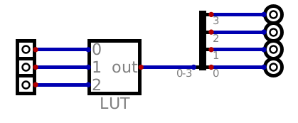

    Example of a look up table from Digital. This specific look up table maps three inputs to four outputs.

.. note::

    Look up tables are an abstract idea, and as such, the physical implementation is often not important. In practice,
    these look up tables could be PLAs, constructed with arrays of and gates and or gates, or they could be implemented
    with a form of memory mapping the input to some memory addresses, which in turn contains the desired output within
    that memory location.

Functional Completeness
=======================

* As seen with PLAs, any boolean logic function can be implemented systematically

    * In other words, any function can be physically created with configurations of AND, OR, and NOT gates

* This means that the set of {AND, OR, NOT} gates is *Functionally complete*
* Although other gates exist, they are not necessary for implementing any function

    * Nevertheless, they may make configuring a circuit for some functionality simpler

* However, review De Morgan's Laws

      * :math:`\lnot a \lor \lnot b = \lnot (a \land b)`
      * :math:`\lnot a \land \lnot b = \lnot (a \lor b)`

* This shows that, with OR and NOT gates, one can create the functionality of an AND gate

      * :math:`\lnot(\lnot a \lor \lnot b) = \lnot(\lnot (a \land b)) = a \land b`

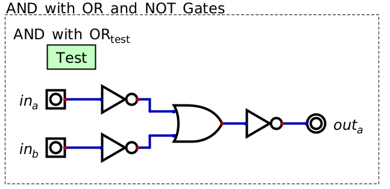

    Implementation of and gate functionality with only or gate and not gates.

* Similarly, with AND and NOT gates, the functionality of an OR gate can be created

    * :math:`\lnot(\lnot a \land \lnot b) = \lnot(\lnot (a \lor b)) = a \lor b`

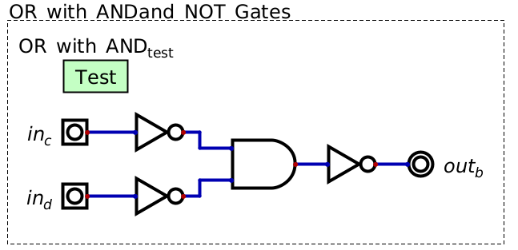

    Implementation of and gate functionality with only or gate and not gates.

* Therefore, the set of {AND, NOT} and {OR, NOT} are also functionally complete

Minimal Set
-----------

* One may wonder if a single gate type is sufficient to have a functionally complete set
* To prove this is the case, all one needs to do is show that the single gate type can

    * Implement the :math:`not` operation
    * Implement the :math:`and` operation
    * Implement the :math:`or` operation

* Seeing the reduced sets made up of {AND, NOT}/{OR, NOT}, one may wonder if {NAND} and {NOR} are functionally complete

.. admonition:: Activity

    Show that {NAND} and {NOR} are functionally complete.

For Next Time
=============

* Check out the :download:`Decoder <1-2_and_2-4_decoders.dig>` schematic for Digital
* Check out the :download:`Multiplexer <2_and_4_multiplexer.dig>` schematic for Digital
* Check out the :download:`Programmable Logic Array <programmable_logic_array.dig>` schematic for Digital
* Check out the :download:`Functional Completeness <functional_completeness.dig>` schematic for Digital
* Read Chapter 3 Sections 5 of your text

    * 3 pages