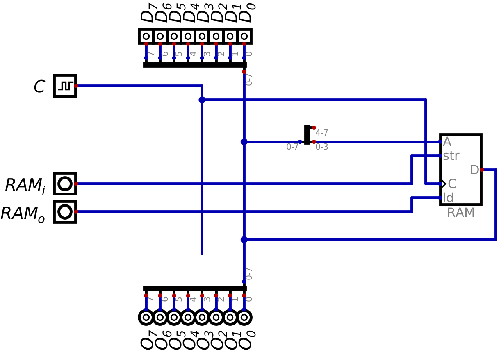
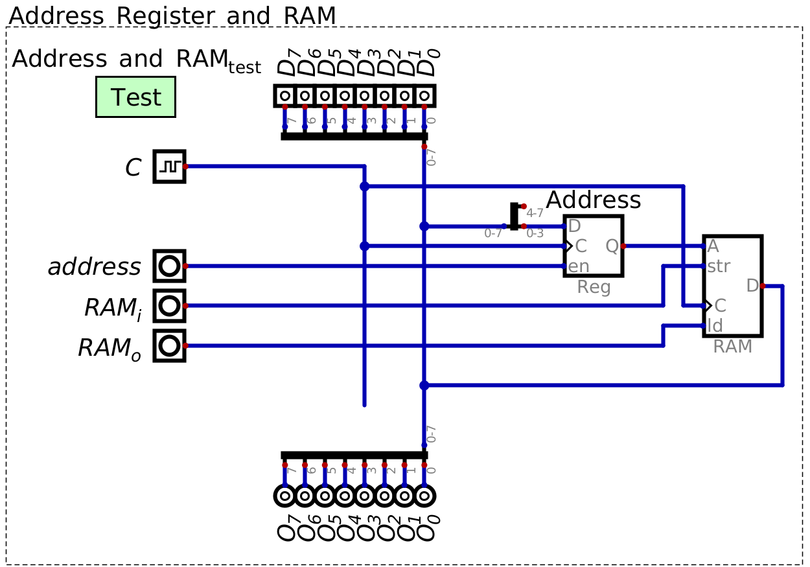
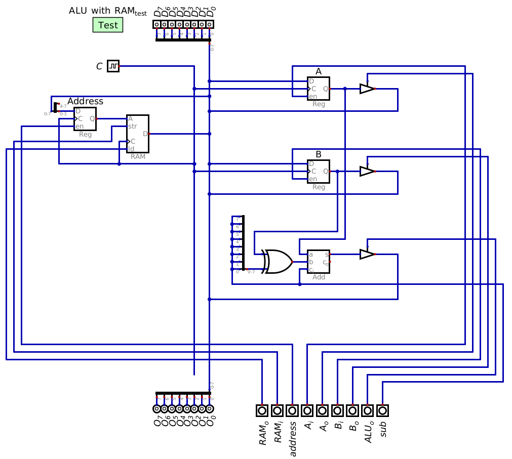
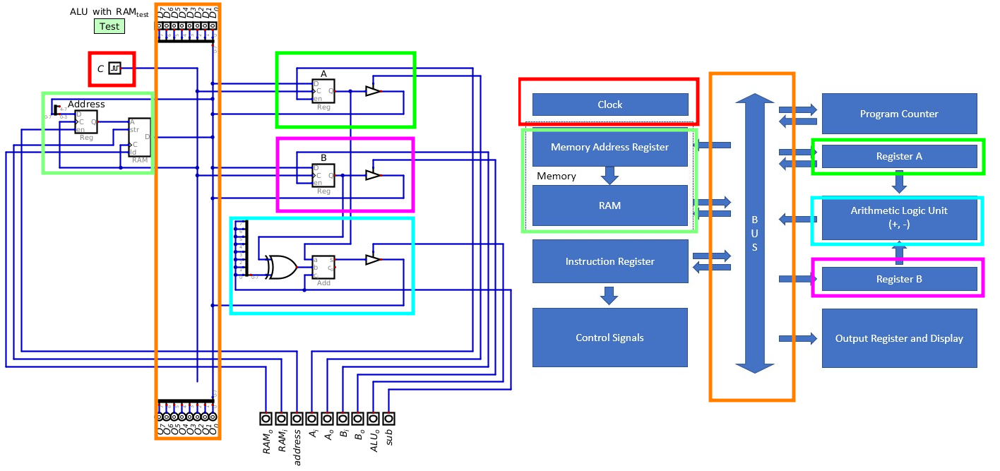

************************
Address Register and RAM
************************

* RAM stores data and instructions for the computer
* The values in RAM are temporary

    * RAM is not designed for long term storage
    * It is designed to store values the computer is working with  

* Although RAM was discussed in earlier topics, it is time to incorporate it into the ESAP system design

RAM Module
==========

* As previously discussed, memory stores data in individually indexable memory locations called addresses
* The number of unique memory addresses is called the address space
* Each location stores some amount of data, called the addressability
* The amount of data in a memory location is independent from the number of memory addresses

* Most computers are byte addressable, meaning each memory location stores one byte of data

    * This is not a requirement, however

* The total amount of data storable is the size of the address space times the addressability

.. figure:: memory_abstract_idea.png
    :width: 400 px
    :align: center

    Visualization of RAM. The left column is memory addresses, and the right is the data stored at the respective memory
    address.

* In the above example, a total of 16 unique memory addresses exist

    * Each address is represented as a row in the table
    * The memory address is included in the left column of the table

* This means, in this example, there is an address space of 16

    * Locations ``0b0000`` -- ``0b1111``
    * Or, ``0x0`` -- ``0xF``

* With an address space of 16, a total of four bits would be required to index each memory address

* The data stored in each of the 16 memory address is represented as the 16 letters

    * The letters ``a`` -- ``p``, one in each row
    * In the image, the addressability is not represented; one cannot determine the amount of data in each location

* In the current ESAP system being built, the address bus and data bus are partially shared
* However, even though the data bus has a total of 8 bits, only 4 bits will be used to index memory

    * The reasons for this is due to how program instructions will be encoded

        * 4 bits for the instruction and 4 for an operand

    * Details on how instructions are encoded will be covered in detail in a later topic
    * Thus, the reasons for this limitation will be made clear later

* With 4 bits, a total of 16 unique memory locations can be indexed
* The system will store 1 byte in each memory location, like most systems

    * A total of 8 bits will be stored in each memory location

* This means the system can store up to 16 bytes of data in RAM

.. note::

    Until the late 2000s/early 2010s, a typical computer used a 32 bit address space. One of the limitations of such a
    system is that 32 bits could index :math:`2^{32}`, or :math:`4,294,967,296` unique memory addresses. This may feel
    like a lot, but to put this into perspective, that's only :math:`4GB`.

Address Register
----------------

* Having the memory addresses and data share a bus poses a problem for the system

    * The values on the bus are always changing, but the indexed memory location may need to be static for some time

    A not particularly useful configuration of A RAM component with a shared address and data bus.

* Consider the above configuration of RAM in a system with a shard address and data bus

    * Mind the splitter used
    * Remember, only 4 bits are used to index memory
    * Thus, only the 4 least significant bits are useful for indexing RAM
    * The 4 most significant bits are ignored

* Is it possible, for example, to store the value 4 in memory address 2?

    * It's possible to index memory address 2 by configuring the data on the bus to ``0b00000010``
    * But as soon as the value 4 is added to the bus (``0b00000100``), memory address 4 is indexed, not 2

* The problem is, the memory address indexed in RAM will always be based on what value is currently on the bus
* Therefore, there needs to be a way to isolate the memory address from the value on the data bus

* A simple solution to this problem is to add an address register

    * Input the memory address to index into the address register
    * This value will be unchanged until explicitly updated
    * The address value stored in the address register will be what is indexing RAM
    * Now the data on the bus can change without impacting the memory address being indexed

    A configuration of RAM component with an address register facilitating the separation of a memory address and the
    changing values stored on the bus.

* With this configuration, there is now a small, but isolated address bus

    * The line connecting the output of the address register and the RAM component's address input
    * Between the register's :math:`Q` and RAM's :math:`A`

* To return to the previous example problem, it is now possible to load the value 4 into memory address 2

    #. Configure the data on the bus to be 2 (``0b00000010``)
    #. Load the value from the bus into the address register with the :math:`address` control signal
    #. Configure the data on the bus to be 4 (``0b00000100``)
    #. Load the value from the bus into RAM with the :math:`RAM_{i}` control signal

Including RAM in the System
===========================

* To include the RAM module, connect the corresponding components up to the existing ESAP ALU system
* Each of the control signal lines are moved to the bottom of the system

    Configuration of the ESAP ALU with RAM added to the system.

* Notice that the RAM module was added to the left hand side of the data bus

    * This is a design/style decision; it is not important that it is placed here

* Motivation for putting it on the left is

    * It will correspond to the ESAP system architecture overview already discussed
    * The image would get too long/tall if every component/module was stacked on the right hand side of the bus

    Comparison of the ALU with RAM and the ESAP architecture overview.

Executing Arithmetic on the ALU with RAM
----------------------------------------

* Like in the previous topic, consider performing arithmetic on arbitrary numbers
* This time, the numbers will be loaded to RAM, which will later be accessed to perform the operations
* For an example, consider calculating :math:`15 + 4 - 7`

* For demonstration purposes, the high-level program to be executed on the system will be as follows

    #. Load the data into RAM
    #. Calculate the sum of 15 and 4 and save the result to RAM
    #. Calculate the difference between the calculated sum and 7 and save the result to RAM

* Like in previous topics, the below tables represent programs
* However, due to space limitations, if a module has an input and output control signal, their columns are combined

    * Values will be represented as ``input/output``
    * For example, a low input, but high output would be represented as ``0/1``

.. list-table:: Load 15, 4, and 7 into RAM addresses 0, 1, and 2 respectively
    :widths: auto
    :align: center
    :header-rows: 1

    * - :math:`Address`
      - :math:`RAM`
      - :math:`A`
      - :math:`B`
      - :math:`ALU_{o}`
      - :math:`sub`
      -
      - :math:`D`
      -
      - :math:`C`
    * - ``1``
      - ``0/0``
      - ``0/0``
      - ``0/0``
      - ``0``
      - ``0``
      -
      - ``0x00``
      -
      - ``C``
    * - ``0``
      - ``1/0``
      - ``0/0``
      - ``0/0``
      - ``0``
      - ``0``
      -
      - ``0x0F``
      -
      - ``C``
    * - ``1``
      - ``0/0``
      - ``0/0``
      - ``0/0``
      - ``0``
      - ``0``
      -
      - ``0x01``
      -
      - ``C``
    * - ``0``
      - ``1/0``
      - ``0/0``
      - ``0/0``
      - ``0``
      - ``0``
      -
      - ``0x04``
      -
      - ``C``
    * - ``1``
      - ``0/0``
      - ``0/0``
      - ``0/0``
      - ``0``
      - ``0``
      -
      - ``0x02``
      -
      - ``C``
    * - ``0``
      - ``1/0``
      - ``0/0``
      - ``0/0``
      - ``0``
      - ``0``
      -
      - ``0x07``
      -
      - ``C``

* With the data loaded into RAM, the next steps are to load the data from RAM, perform addition, and save the result

.. list-table:: Load data for addition and save the result to RAM address 3
    :widths: auto
    :align: center
    :header-rows: 1

    * - :math:`Address`
      - :math:`RAM`
      - :math:`A`
      - :math:`B`
      - :math:`ALU_{o}`
      - :math:`sub`
      -
      - :math:`D`
      -
      - :math:`C`
    * - ``1``
      - ``0/0``
      - ``0/0``
      - ``0/0``
      - ``0``
      - ``0``
      -
      - ``0x00``
      -
      - ``C``
    * - ``0``
      - ``0/1``
      - ``1/0``
      - ``0/0``
      - ``0``
      - ``0``
      -
      - ``Z``
      -
      - ``C``
    * - ``1``
      - ``0/0``
      - ``0/0``
      - ``0/0``
      - ``0``
      - ``0``
      -
      - ``0x01``
      -
      - ``C``
    * - ``0``
      - ``0/1``
      - ``0/0``
      - ``1/0``
      - ``0``
      - ``0``
      -
      - ``Z``
      -
      - ``C``
    * - ``1``
      - ``0/0``
      - ``0/0``
      - ``0/0``
      - ``0``
      - ``0``
      -
      - ``0x03``
      -
      - ``C``
    * - ``0``
      - ``1/0``
      - ``0/0``
      - ``0/0``
      - ``1``
      - ``0``
      -
      - ``Z``
      -
      - ``C``

* Since the goal is to now subtract 7 from the result, it would be fine to save the result back into register A
* But for demonstration purposes, the result is being saved to RAM first

* The next step is to load more data from RAM to perform subtraction and save the result

.. list-table:: Load data for subtraction and save the result to RAM address 4
    :widths: auto
    :align: center
    :header-rows: 1

    * - :math:`Address`
      - :math:`RAM`
      - :math:`A`
      - :math:`B`
      - :math:`ALU_{o}`
      - :math:`sub`
      -
      - :math:`D`
      -
      - :math:`C`
    * - ``1``
      - ``0/0``
      - ``0/0``
      - ``0/0``
      - ``0``
      - ``0``
      -
      - ``0x03``
      -
      - ``C``
    * - ``0``
      - ``0/1``
      - ``1/0``
      - ``0/0``
      - ``0``
      - ``0``
      -
      - ``Z``
      -
      - ``C``
    * - ``1``
      - ``0/0``
      - ``0/0``
      - ``0/0``
      - ``0``
      - ``0``
      -
      - ``0x02``
      -
      - ``C``
    * - ``0``
      - ``0/1``
      - ``0/0``
      - ``1/0``
      - ``0``
      - ``0``
      -
      - ``Z``
      -
      - ``C``
    * - ``1``
      - ``0/0``
      - ``0/0``
      - ``0/0``
      - ``0``
      - ``0``
      -
      - ``0x04``
      -
      - ``C``
    * - ``0``
      - ``1/0``
      - ``0/0``
      - ``0/0``
      - ``1``
      - ``1``
      -
      - ``Z``
      -
      - ``C``

* If everything worked correctly, the contents of RAM should be

    * Address 0 --- 15
    * Address 1 --- 4
    * Address 2 --- 7
    * Address 3 --- 19
    * Address 4 --- 12

For Next Time
=============

* Something?

