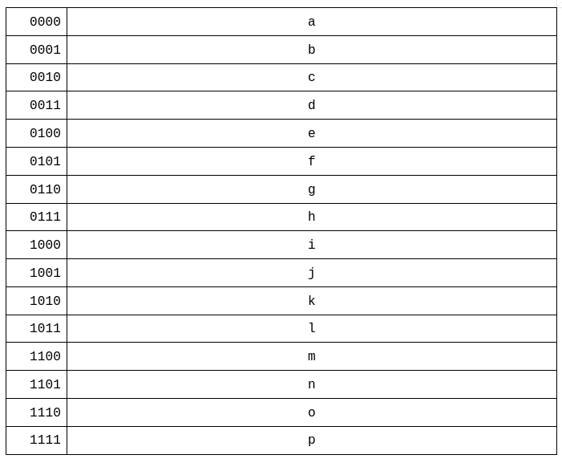

************************
Address Register and RAM
************************

* RAM stores data and instructions for the computer
* The values in RAM are temporary

    * RAM is not designed for long term storage
    * It is designed to store values the computer is working with  

* Although RAM was discussed in earlier topics, it is time to incorporate it into the ESAP system design

RAM Module
==========

* As previously discussed, memory stores data in individually indexable memory locations called addresses
* The number of unique memory addresses is called the address space
* Each location stores some amount of data, called the addressability
* The amount of data in a memory location is independent from the number of memory addresses

* Most computers are byte addressable, meaning each memory location stores one byte of data

    * This is not a requirement, however

* The total amount of data storable is the size of the address space times the addressability

    Visualization of RAM. The left column is memory addresses, and the right is the data stored at the respective memory
    address.

* In the above example, a total of 16 unique memory addresses exist

    * Each address is represented as a row in the table
    * The memory address is included in the left column of the table

* This means, in this example, there is an address space of 16

    * Locations ``0b0000`` -- ``0b1111``
    * Or, ``0x0`` -- ``0xF``

* With an address space of 16, a total of four bits would be required to index each memory address

* The data stored in each of the 16 memory address is represented as the 16 letters

    * The letters ``a`` -- ``p``, one in each row
    * In the image, the addressability is not represented; one cannot determine the amount of data in each location

* In the current ESAP system being built, the address bus and data bus are partially shared
* However, even though the data bus has a total of 8 bits, only 4 bits will be used to index memory

    * The reasons for this is due to how program instructions will be encoded

        * 4 bits for the instruction and 4 for an operand

    * Details on how instructions are encoded will be covered in detail in a later topic
    * Thus, the reasons for this limitation will be made clear later

* With 4 bits, a total of 16 unique memory locations can be indexed
* The system will store 1 byte in each memory location, like most systems

    * A total of 8 bits will be stored in each memory location

* This means the system can store up to 16 bytes of data in RAM

.. note::

    Until the late 2000s/early 2010s, a typical computer used a 32 bit address space. One of the limitations of such a
    system is that 32 bits could index :math:`2^{32}`, or :math:`4,294,967,296` unique memory addresses. This may feel
    like a lot, but to put this into perspective, that's only :math:`4GB`.

Address Register
----------------

Including RAM in the System
===========================

Executing Arithmetic on the ALU with RAM
========================================

For Next Time
=============

* Something?

