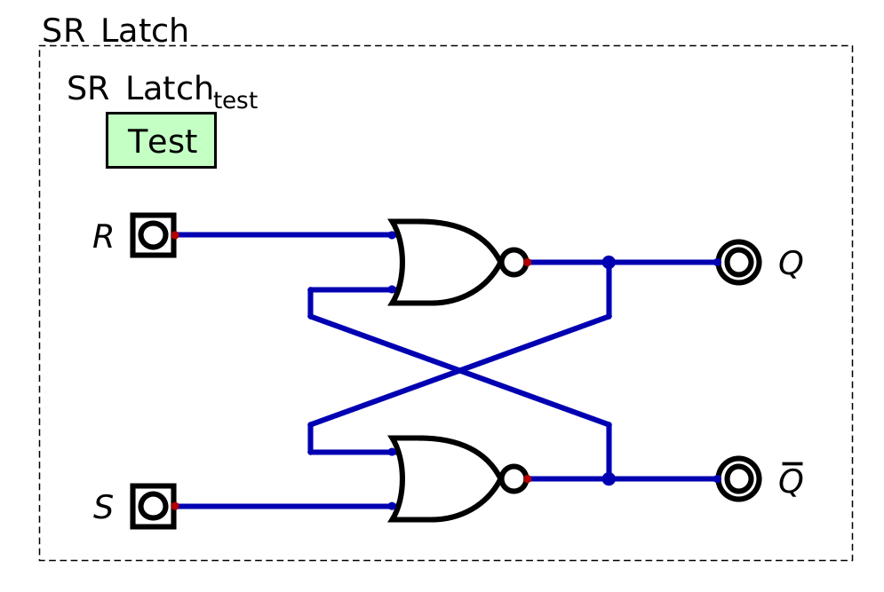

**********************
Latches and Flip-Flops
**********************

* The combinational logic topic covered circuits that did not store or require any stored data to operate
* Here, circuits capable of storing data for later use will be covered
* These can later be used to construct more complex circuits that make decisions based on a series of possible states

Set-Reset Latch (S-R Latch)
===========================

* One of the most basic circuits for storing data is a set-reset latch (S-R latch)
* What's unusual about this circuit is that it has internal feedback

    * The output of the circuit is fed back into itself as input

    An S-R latch using NOR gates. The :math:`S` means "set", :math:`R` is "reset", :math:`Q` is the bit being stored,
    and :math:`\lnot Q` is the inverse of the bit being stored. Notice how the outputs of the circuit (:math:`Q` and
    :math:`\lnot Q`) also serve as two of the four inputs to the circuit.

.. note::

    There are several possible designs for an S-R latch. The textbook uses a similar design to the above image, but
    uses two NANDs instead of NORs. Although this NAND based design would work slightly differently, the general idea 
    is the same.

* In an S-R Latch

    * :math:`S` stands for "set" --- set the stored bit to ``1``
    * :math:`R` stands for  "reset" --- clear the stored bit and set it to ``0``
    * :math:`Q` is the value of the bit being stored
    * :math:`\lnot Q` is the inverse of the bit being stored

* Since this circuit has internal feedback, it's behaviour depends on the current state

    * The way it behaves when changing :math:`S` or :math:`R` depends on the current output

.. list-table:: Truth Table for S-R Latch
    :widths: auto
    :align: center
    :header-rows: 1

    * - :math:`S`
      - :math:`R`
      -
      - :math:`Q`
      - :math:`\lnot Q`
      -
      - :math:`Q'`
      - :math:`\lnot Q'`
    * - ``0``
      - ``0``
      -
      - ``0``
      - ``1``
      -
      - ``0``
      - ``1``
    * - ``0``
      - ``0``
      -
      - ``1``
      - ``0``
      -
      - ``1``
      - ``0``
    * - ``1``
      - ``0``
      -
      - ``0``
      - ``1``
      -
      - ``1*``
      - ``0*``
    * - ``1``
      - ``0``
      -
      - ``1``
      - ``0``
      -
      - ``1``
      - ``0``

    * - ``0``
      - ``1``
      -
      - ``0``
      - ``1``
      -
      - ``0``
      - ``1``
    * - ``0``
      - ``1``
      -
      - ``1``
      - ``0``
      -
      - ``0**``
      - ``1**``
    * - ``1``
      - ``1``
      -
      - ``0``
      - ``1``
      -
      - ``0``
      - ``0``
    * - ``1``
      - ``0``
      -
      - ``1``
      - ``0``
      -
      - ``0``
      - ``0``

* In the above table

    * :math:`Q/\lnot Q` designate the state before changing :math:`S/R`
    * :math:`Q'/\lnot Q'` designate the state after changing :math:`S/R`
    * Also note that :math:`Q/\lnot Q` should never be equal

* When :math:`S` and :math:`R` are both ``0``, the output state of the circuit will not change

    * The values of :math:`Q` and :math:`\lnot Q`, whatever they are, will not change
    * This is called the *quiet state*, or *quiescent state*

* When :math:`S` is set high, one of two things can happen

    * The circuit may be in a *stable state*, meaning the outputs do not change

        * This will happen when the output of :math:`Q` is already ``1``

    * Alternatively, the circuit may be put into an *unstable state*, meaning the values of the output change

        * The outputs of this state are emphasized within the above truth table with ``*``
        * This happens when the output of :math:`Q` is ``0``
        * This will cause :math:`Q` to become ``1``
        * This then causes the output of :math:`\lnot Q` to also change, putting the circuit into a stable state
        * In practice, the unstable state will be resolved nearly instantaneously --- on the order of nanoseconds

* When :math:`R` is set high, like with setting :math:`S` high, one of two things can happen

    * The circuit may be in a *stable state*, meaning the outputs do not change
    * The circuit may be put into an *unstable state*, meaning the values change

        * The outputs of this state are emphasized within the above truth table with ``**``

* Finally, if both :math:`S` and :math:`R` are high, the outputs are both ``0``, but this is an invalid state

    * It's not reasonable to set and reset at the same time
    * Further, having both :math:`Q` and :math:`\lnot Q` equal is inadmissible
    * One *could* do it, but there is no real utility in doing so

.. admonition:: Activity

    When the circuit turns on for the first time and all inputs are ``0``, what will the outputs of :math:`Q` and
    :math:`\lnot Q` be?

S-R Latch with Enable
---------------------

Data Latch (D Latch)
====================

D Flip-Flop
===========

For Next Time
=============

* Check out the :download:`S-R Latch <SR_latch.dig>` schematic for Digital
* Read Chapter 3 Section 6 of your text

    * 14 pages