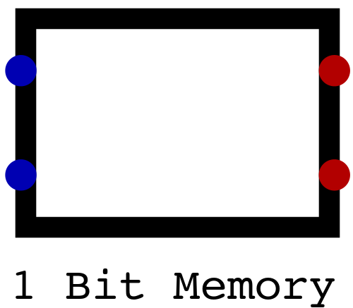
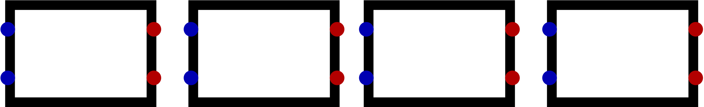
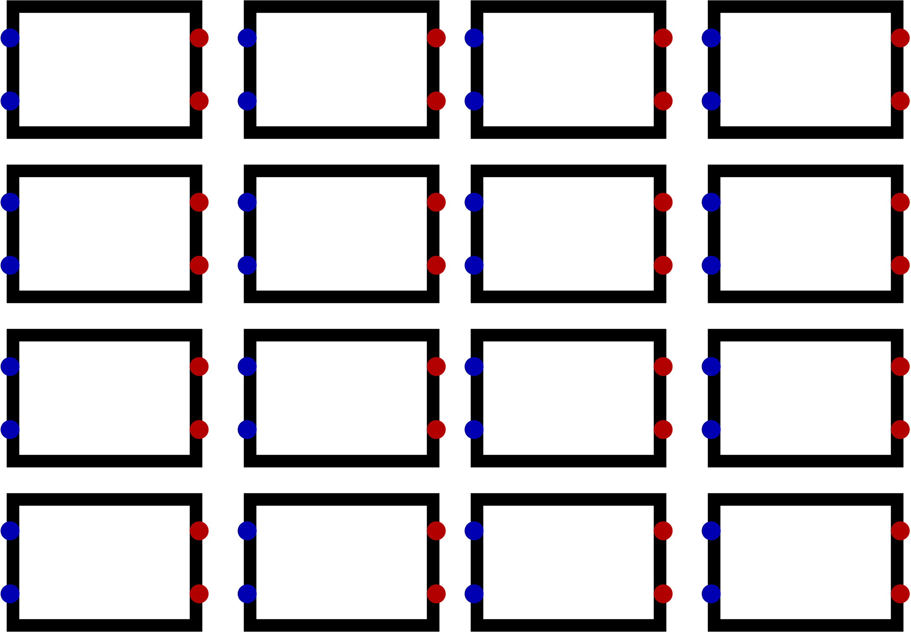

******
Memory
******

* Until now, all circuits discussed made no use of stored information
* However, storing data for later use is an important function of a typical digital computer
* Memory can be used to store

    * Data, such as the value of a variable
    * Instructions, such as a program

Bits, Bytes, and Data
=====================

* Before getting into the details on memory, it's important to be clear on encoded and decoded information
* All values within a typical computer are encoded as binary patterns

* For example, consider the binary sequence ``01100001``
* This binary pattern is an encoding that can have different meaning depending on how and what it's encoding

    * The pattern could mean :math:`97_{10}` if it's an encoding for an integer
    * Or it could be an encoding for the letter ``a``
    * It may encode the colour blue
    * It could even be a pattern to control circuitry within a CPU to perform addition

.. note::

    The word "data" is used to refer to raw values/symbols that have no intrinsic meaning, while the word "information"
    is used to refer to data that has some meaning within some context.

    For example, the number :math:`3` alone is data, but the number :math:`3` can be information if it's referring to,
    for instance, the quantity of ducks swimming in a pond.

    To put this in the context of encoded/decoded information, the pattern ``01100001`` is data, but what it
    encodes/means would be information.

* A *bit* is the most basic unit of data in typical computing
* As already discussed, a bit is a single digit in base two
* However, a bit is represented within computers as a single signal
* These bits/signals can take on two possible states ``0`` or ``1``
* This means that, with one bit/signal, a total of two unique values can be represented

.. figure:: one_bit_signals.png
    :width: 333 px
    :align: center

    Single bit/signal shown twice with the two possible states it can take --- off and on.

* As more bits/signals get added, more possible combinations of states/unique values can be created

    * In base two, with :math:`n` bits, a total of :math:`2^{n}` unique values can be represented
    * For example, with two bits, four states can be created

        * ``00``
        * ``01``
        * ``10``
        * ``11``

.. figure:: two_bit_signals.png
    :width: 500 px
    :align: center

    All four possible combinations of values two bits/signals can take on.

* A *byte* is a group of eight bits

    * The reason it's eight bits is for historical and practical reasons
    * These details will not be covered here

* With a byte, a total of :math:`2^{8} = 256` unique values can be represented

.. figure:: eight_bit_signals.png
    :width: 250 px
    :align: center

    A byte encoding the pattern ``01100001``, assuming the top signal corresponds to the least significant bit.

* Above is an example of a byte encoding some data
* Assuming the top signal is the least significant bit, the pattern is ``01100001``
* However, as discussed, this pattern has no meaning without some context

    * It's a raw encoding

Random Access Memory (RAN)
==========================

* Memory provides a way to store data for later use
* There are several different broad types of memory within a computer, but they all serve the same general purpose
* In this course, the types of memory that will be covered are

    * Random Access Memory (RAM) --- Stores data and instructions the computer is using
    * Registers --- Stores data and instructions the CPU is actively using

* For this topic, RAM will be the focus

Address Space and Addressability
--------------------------------

* In a typical computer, RAM stores data the computer is using along with the instructions of the programs being run

    * Technically, instructions are data

* RAM is commonly made up of some number of memory *locations*
* Each of these locations can be uniquely identified with a *memory address*
* The total number of uniquely identifiable locations is referred to as the *address space*

* Each of these memory locations stores some data or instruction
* The amount of data stored in each location is the memory's *addressability*
* Usually, RAM is *byte addressable*, meaning each memory location can store 1 byte/8 bits of data

.. figure:: memory_abstract_idea.png
    :width: 500 px
    :align: center

    High-level visualization of RAM as a table. The left column contains each memory location's unique memory address,
    while the right column represents the data stored at the specific memory address. Here, the memory addresses are
    four bit binary numbers and the data are represented as characters. The use of characters ``a`` through ``p`` in
    this figures is arbitrary and not meaningful.

* The above figure provides a high-level visualization of RAM
* In this figure, there are 16 unique memory locations, each identifiable with a four bit binary number
* Each memory address contains some data, represented here as some character

* If one, for example, asked what is stored at memory address 3 (``0011``), the answer would be ``d``
* However, like the memory address, the data being stored is some pattern of ``0``\s and ``1``\s

4x4 Bit Memory Example
======================

* Imagine there exists some way to store a single bit of data
* For now, this one bit storage component will be represented as a box

    A box representing some component capable of storing a single bit of data.

* If one wanted to store more bits, they could group multiple one bit storage components together

    Four boxes, each representing a component capable of storing one bit of data. Together, these four boxes are able to
    store four bits of information.

* If one now wants the ability to store several groups of many bits, they could stack sets of these components together

    Four groups of four boxes. One can think of this as a block of memory with four memory addresses, each storing four
    bits of data. Each row represents a memory address, and each column represents a bit within that memory address.

* Consider a 4x4 block of RAM

    * Four bits per memory address
    * Four memory addresses

* Using the above image for reference, one can think of the 4x4 block of memory as

    * Four rows, each representing a unique memory address
    * Four columns, each representing a bit within that memory address

* For this RAM to be useful, one needs a way to

    * Write data to a specific memory address
    * Read data from a specific memory address

* With this 4x4 block of RAM

    * Two address lines would be required to uniquely identify each memory location
    * Four data lines would be required to input data
    * Four data lines would be required to output data

* Fortunately, decoders and multiplexers provide a way to specify memory addresses to write and read from

    * If writing, a memory address can be activated by feeding the address lines into a decoder
    * If reading, a multiplexer can be used to output each bit's data, whatever it is, at a specific memory address

.. figure:: 4x4_memory_with_plexers.png
    :width: 750 px
    :align: center

    Visualization of a 4x4 block of RAM. Here, address lines are decoded to select a memory address (row) for writing
    data from the data input lines. Bits from all memory addresses (column) are mapped to a multiplexer that will output
    the value stored at the specified memory address to the data output lines.

* The question remains --- how does one actually store data?

For Next Time
=============

* `Watch Ben Eater's video on S-R Latches <https://www.youtube.com/watch?v=KM0DdEaY5sY>`_
* `Watch Ben Eater's video on D Latches <https://www.youtube.com/watch?v=peCh_859q7Q>`_
* `Watch Ben Eater's video on D Flip-Flops <https://www.youtube.com/watch?v=YW-_GkUguMM>`_
* Read Chapter 3 Sections 4 of your text

    * 3 pages