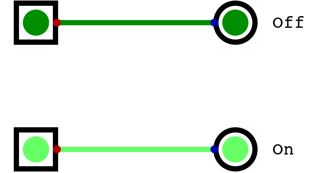
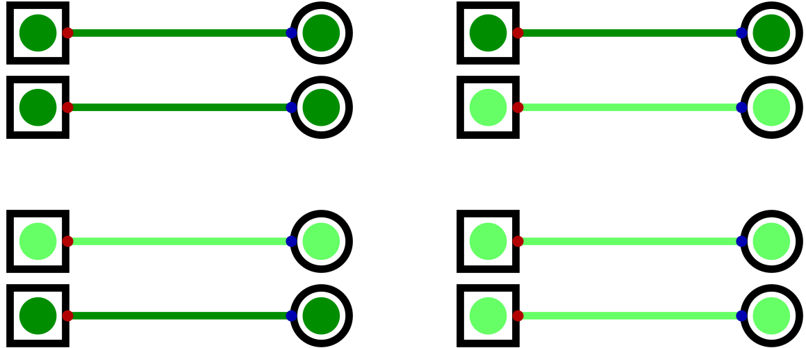
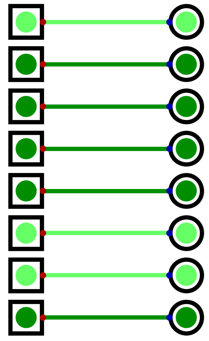

******
Memory
******

* Until now, all circuits discussed made no use of stored information
* However, storing data for later use is an important function of a typical digital computer
* Memory can be used to store

    * Data, such as the value of a variable
    * Instructions, such as a program

Bits, Bytes, and Data
=====================

* Before getting into the details on memory, it's important to be clear on encoded and decoded information
* All values within a typical computer are encoded as binary patterns

* For example, consider the binary sequence ``01100001``
* This binary pattern is an encoding that can have different meaning depending on how and what it's encoding

    * The pattern could mean :math:`97_{10}` if it's an encoding for an integer
    * Or it could be an encoding for the letter ``a``
    * It may encode the colour blue
    * It could even be a pattern to control circuitry within a CPU to perform addition

.. note::

    The word "data" is used to refer to raw values/symbols that have no intrinsic meaning, while the word "information"
    is used to refer to data that has some meaning within some context.

    For example, the number :math:`3` alone is data, but the number :math:`3` can be information if it's referring to,
    for instance, the quantity of ducks swimming in a pond.

    To put this in the context of encoded/decoded information, the pattern ``01100001`` is data, but what it
    encodes/means would be information.

* A *bit* is the most basic unit of data in typical computing
* As already discussed, a bit is a single digit in base two
* However, a bit is represented within computers as a single signal
* These bits/signals can take on two possible states ``0`` or ``1``
* This means that, with one bit/signal, a total of two unique values can be represented

    Single bit/signal shown twice with the two possible states it can take --- off and on.

* As more bits/signals get added, more possible combinations of states/unique values can be created

    * In base two, with :math:`n` bits, a total of :math:`2^{n}` unique values can be represented
    * For example, with two bits, four states can be created

        * ``00``
        * ``01``
        * ``10``
        * ``11``

    All four possible combinations of values two bits/signals can take on.

* A *byte* is a group of eight bits

    * The reason it's eight bits is for historical and practical reasons
    * These details will not be covered here

* With a byte, a total of :math:`2^{8} = 256` unique values can be represented

    A byte encoding the pattern ``01100001``, assuming the top signal corresponds to the least significant bit.

* Above is an example of a byte encoding some data
* Assuming the top signal is the least significant bit, the pattern is ``01100001``
* However, as discussed, this pattern has no meaning without some context

    * It's a raw encoding

Address Space
=============

Addressability
==============

256 Byte Memory Example
=======================

For Next Time
=============

* `Watch Ben Eater's video on S-R Latches <https://www.youtube.com/watch?v=KM0DdEaY5sY>`_
* `Watch Ben Eater's video on D Latches <https://www.youtube.com/watch?v=peCh_859q7Q>`_
* `Watch Ben Eater's video on D Flip-Flops <https://www.youtube.com/watch?v=YW-_GkUguMM>`_
* Read Chapter 3 Sections 4 of your text

    * 3 pages