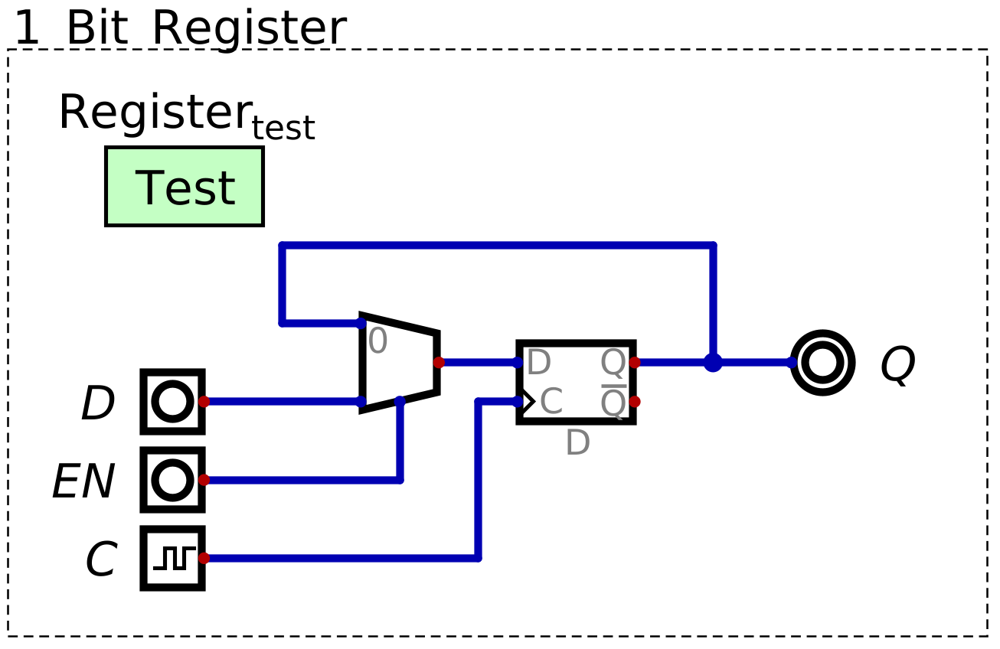
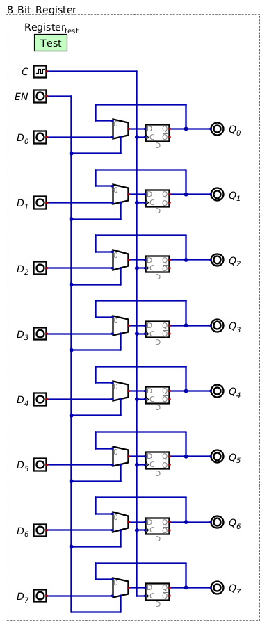
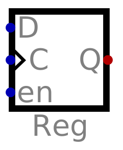
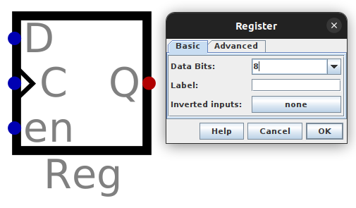
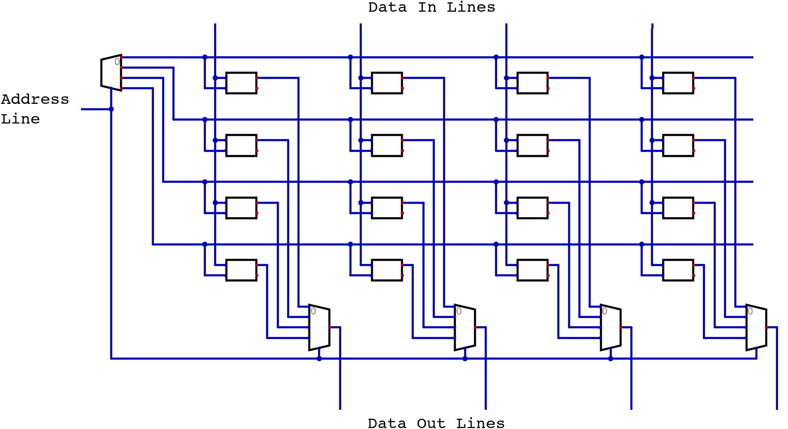
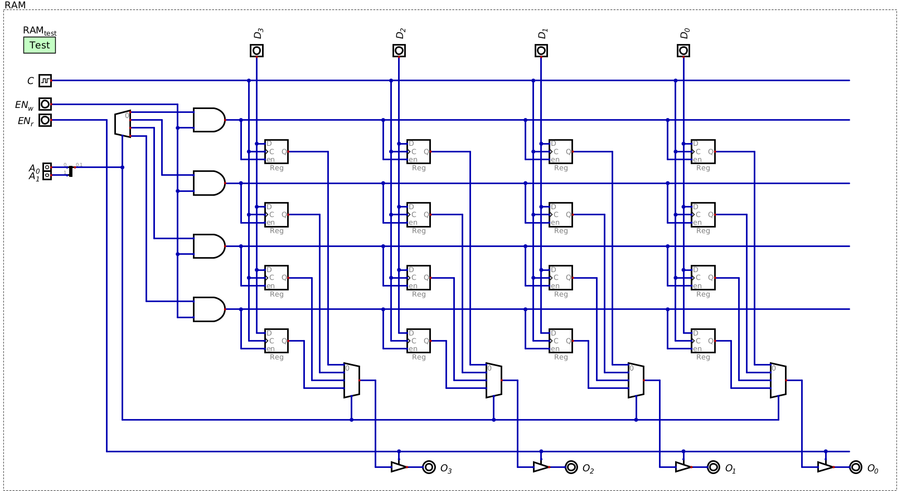
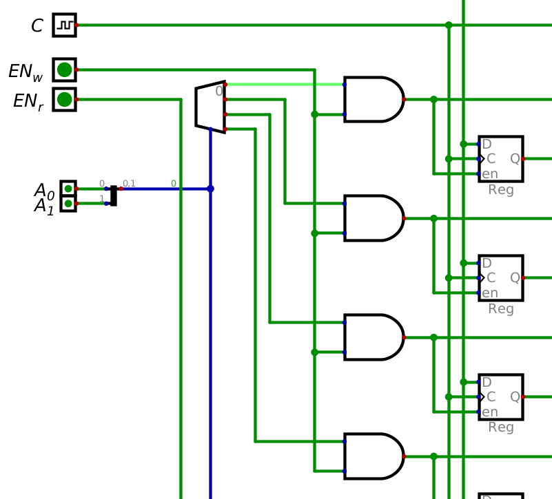
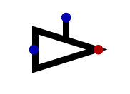
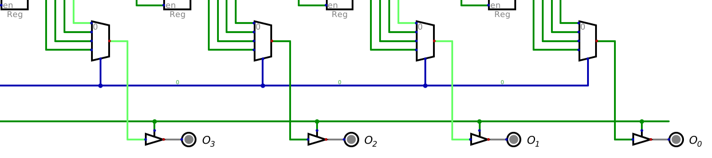

*****************
Registers and RAM
*****************

* D flip-flops allow one to store a single bit of information
* However, they always update what's stored on every clock pulse
* In many cases, one wants more control over *when* the stored data in the D flip-flop is updated

Registers
=========

* D flip-flops have several uses, but they always update the stored value every time the clock pulses

    * If the data line is low, then the D flip-flop will store a ``0`` on a clock pulse
    * If the data line is high, then a ``1`` is stored on a clock pulse

* However, for general purpose memory, the goal is to leave the stored data alone for several clock cycles
* In other words, there needs to be a way to toggle when the signal on the data line is to be stored on a clock pulse

    * When enabled, store the data on the data line when the clock pulses
    * When not enabled, ignore the data on the data line and leave the stored data unchanged when the clock pulses

* One way this can be achieved is to still update the stored value on every clock pulse
* However, it will update to either

    * The value on the data line
    * The value that is already stored

* This means there will effectively be two data lines

    * The actual data line
    * A feedback line from the D flip-flop's output

* Then, all that is needed is a multiplexer to toggle between which of the two data lines should be read form

    A D flip-flop with enable, which can be used as a register. When the :math:`EN` signal is low, the multiplexer
    selects the :math:`Q` signal, meaning the value of :math:`Q` will be fed back into the D flip-flop, which will be
    re-latched on a clock pulse, leaving the value stored effectively unchanged. When :math:`EN` is high, the value from
    the :math:`D` line will be latched on a clock pulse.

* This type of structure is called a D flip-flop with enable, and can be used as a *register*

    * For registers, it is common to ignore :math:`\lnot Q`

* The two data lines are

    * :math:`D` --- the actual data line
    * :math:`Q` --- the output of the D flip-flop

* The multiplexer in front of the D flip-flop allows for selecting which data line's signal is stored

* When :math:`EN` is low

    * The multiplexer selects the :math:`Q` line
    * The value of :math:`D` is ignored
    * The value of :math:`Q`, whatever it is, will be re-latched into the D flip-flop on a clock pulse
    * The value stored in the register is effectively unchanged

* When :math:`EN` is high

    * The multiplexer selects the :math:`D` line
    * The value of :math:`Q` is ignored
    * The value of :math:`D`, whatever it is, is latched into the D flip-flop on a clock pulse
    * The value stored in the register is updated

.. note::

    One may wonder, why go through the trouble of using a multiplexer and feeding the output :math:`Q` back into the
    circuit when one could simply AND the clock signal with the enable signal? If this were the case, when :math:`EN` is
    low, no clock pulse will reach the D flip-flop, when :math:`EN` is high, clock pulses can pass through the AND gate.
    In other words, this simpler design would function perfectly as a D flip-flop with enable.

    One could absolutely do this; however, in practice, although this *can* work, it would cause a slight delay in the
    clock signal which could cause problems. Usually, it's a good idea to leave the clock signal alone.

Storing More than a Bit
-----------------------

* A D flip-flop with enable can act as a register to effectively store a single bit of information
* To store more than a single bit, configure multiple registers in parallel
* For example, to store 8 bits/1 byte of data, stack eight registers together

    Eight D flip-flops with enables (registers) configured in parallel such that they can store eight bits/one byte of
    information. A single :math:`EN` signal controls when all bits are stored in the register.

* The design shown above can scale such that an arbitrary number of bits can be stored

Register Symbol
---------------

* Many components are represented as a box

    * For example, D flip-flops and registers are both represented as boxes

* However, these components are differentiated by their input labels and sometimes a label
* In Digital, registers are represented with the following symbol

    The symbol of a register within Digital.

* In the above figure, notice how the :math:`\lnot Q` output is not included
* Typically, for registers, this output is not included

    * If one truly needs it, invert the :math:`Q` output

* Digital also allows the user to edit a register component to store a specified number of bits

    * If more than one bit is to be stored, the data lines would need to be combined with a merger component

    A register component within Digital capable of storing 8 bits of data.

Random Access Memory
====================

* Without knowing how to actually store data, the high level idea of RAM was previously discussed

    Visualization of an incomplete 4x4 block of RAM.

* To review, above is a 4x4 block of RAM

    * There are four 4 bit memory addresses

* A decoder is used to select which memory address is active

    * Notice how the decoded line activates all bits within a memory address

* Multiplexers are used to relay the stored data out from the selected memory address

    * Notice that there is a multiplexer for each of the 4 bits in the memory addresses

* Since registers (D flip-flops with enable) can be used to store data, they can be used for building RAM

    A 4x4 block of RAM using registers to store bits with controllable inputs, a clock signal, and read/write enables.

* The above figure is a modified version of the same idea
* Here, 1 bit registers are used to store the data
* A clock signal is included
* Controllable inputs for the memory address are added
* Controllable inputs for the input data along with outputs are included
* This design also includes a control over when data is written to RAM
* Additionally, it includes a control over when data is read from RAM

Controlling Writes
------------------

* When using a decoder to select a memory address, one of the decoded signals is always going to be high
* This creates a problem as one of the memory addresses would be written to every clock pulse, even if not intended
* Thus, there needs to be a way to have more control over when data is written to a memory address

* One possible way to address this problem is to have a write enable signal toggle if clock pulses reach the registers

    * This *can* work, but as discussed above, it may create problems in practice
    * In general, it is best to not manipulate the clock signal

* An alternative is to have a write enable signal control if the decoded signals are active or not
* This can be achieved by ANDing an enable signal with each decoded signal
* Below is a figure showing the relevant portion of the 4x4 block of RAM

    Controlling writes with a write enable signal. Here, the memory address selected is ``00``, which means the
    corresponding decoded signal (top) after the decoder is active. However, since :math:`EN_{w}` is low, the decoded
    signal can not reach the registers at memory address ``00``.

Controlling Reads
-----------------

* Similar to the decoder, multiplexers will always be outputting the selected signal
* However, it is desirable to have control over when a signal is being read/output from RAM

* Here, a problem arises
* Typically, several computer components share a collection of signal lines to transfer data
* This shared collection of signal lines is called the *bus*

    * The bus will be discussed in more detail in the subsequent topic

* Therefore, it is important that only specific components are reading/writing form the bus at a time

    * Otherwise, the signals on the bus could become corrupted and lose meaning

* The trouble here is, when a component is outputting a low signal, it isn't simply outputting nothing
* Instead, the component connects the signal line to ground, thereby sinking the signal

    * Trying to put any data on a signal line that is sunk to ground would result in it also being sunk to ground

* In other words, there needs to be a way to output a ``0``, a ``1``, and to output *nothing*
* This is where a *driver* comes in

    A driver component capable of allowing a signal to pass only when the control signal is high. When enabled, the
    input signal is relayed to the output. When enable is low, the driver's output signal is in a high impedance
    state, meaning there is effectively no output.

* A driver is a component that can act as a switch
* When the driver is active, it relays, or *drives*, the input signal to the output
* When it is not active, it is in a "high impedance", or "high-Z" state

    * This effectively means the driver outputs nothing

* This facilitates tri-state logic

    * ``0``
    * ``1``
    * ``Z`` (nothing)

* Therefore, drivers are an ideal tool for controlling when RAM is being read from

    Drivers controlling when data is being read from RAM. Here, despite the data being read from RAM being ``1010``, as
    seen by the multiplexer signal lines, the :math:`EN_{r}` signal is low, meaning the drivers are in a high impedance
    state, thereby effectively outputting nothing.

For Next Time
=============

* Check out the :download:`1 bit register <1_bit_register.dig>` schematic for Digital
* Check out the :download:`1 byte register <8_bit_register.dig>` schematic for Digital
* Check out the :download:`RAM <4x4_ram.dig>` schematic for Digital
* Read Chapter 3 Section 6 of your text

    * 14 pages