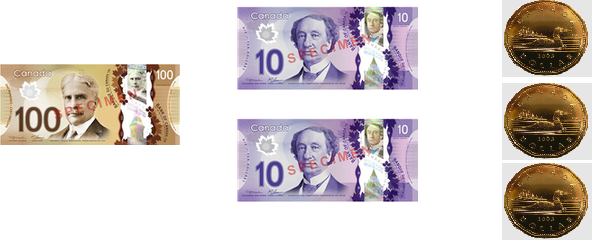

************
Number Bases
************

Decimal (Base Ten)
==================

* The decimal number system is used in everyday life
* The decimal number system is base ten; it consists of ten different symbols/numerals

    * :math:`0, 1, 2, 3, 4, 5, 6, 7, 8, 9`

* These symbols have an ordering to them

    * :math:`0 \rightarrow 1 \rightarrow  2 \rightarrow  3 \rightarrow  4 \rightarrow  5 \rightarrow  6 \rightarrow  7 \rightarrow  8 \rightarrow  9`

* These symbols also have a meaning/value associated with them

    * The symbol :math:`5` means *five*
    * It conveys a magnitude

* The magnitude of these values correspond to the ordering

    * :math:`0 < 1 <  2 <  3 <  4 <  5 <  6 <  7 <  8 <  9`

Counting in Base Ten
--------------------

* Counting in base ten consists of moving to the next symbol

    .. list-table:: Counting with Ten Symbols
        :widths: 50 50

        * - :math:`0`
          - Zero
        * - :math:`1`
          - One
        * - :math:`2`
          - Two
        * - :math:`3`
          - Three
        * - :math:`4`
          - Four
        * - :math:`5`
          - Five
        * - :math:`6`
          - Six
        * - :math:`7`
          - Seven
        * - :math:`8`
          - Eight
        * - :math:`9`
          - Nine
        * - :math:`????`
          - Ten?

* However, there are only ten unique symbols
* This means it's not possible to count past nine with the symbols alone
* This is where symbol position comes in

Position
^^^^^^^^

* First, consider that each number has an infinite number of zeros in front of it

    * Why this is will be discussed shortly

* Consider the below table where only seven of the leading zeros are included

    * Thus, these numbers will each have a total of eight symbols
    * Each of these symbols/numerals, in this context, is called a *digit*

        * Digit comes from latin (*digitus*), meaning finger or toe, of which, humans typically have ten of each

    .. list-table:: Values Expressed with Eight Digits
        :widths: 50 50

        * - :math:`00000000`
          - Zero
        * - :math:`00000001`
          - One
        * - :math:`00000002`
          - Two
        * - :math:`00000003`
          - Three
        * - :math:`00000004`
          - Four
        * - :math:`00000005`
          - Five
        * - :math:`00000006`
          - Six
        * - :math:`00000007`
          - Seven
        * - :math:`00000008`
          - Eight
        * - :math:`00000009`
          - Nine

* To count past the value nine, a new rule is introduced
* If the no more symbols are left

    * Reset the symbol to zero in the current position
    * Change to the subsequent symbol in the next position

    .. list-table:: Counting with Digits
        :widths: 50 50

        * - ...
          - ...
        * - :math:`00000008`
          - Eight
        * - :math:`00000009`
          - Nine
        * - :math:`00000010`
          - Ten
        * - :math:`00000011`
          - Eleven
        * - ...
          - ...
        * - :math:`00000018`
          - Eighteen
        * - :math:`00000019`
          - Nineteen
        * - :math:`00000020`
          - Twenty
        * - ...
          - ...
        * - :math:`00000099`
          - Ninety Nine
        * - :math:`00000100`
          - One Hundred
        * - :math:`00000101`
          - One Hundred and One
        * - ...
          - ...

* Consider the number :math:`101`
* Although this number contains two ones, they have a different meaning because of their position

Names
^^^^^

* Each of these positions has a name
* From right to left, they are

    .. list-table:: Digit Position Names
        :widths: 50 50 50 50

        * - First Digit
          - Ones
          - :math:`10^{0}`
          - :math:`1`
        * - Second Digit
          - Tens
          - :math:`10^{1}`
          - :math:`10`
        * - Third Digit
          - Hundreds
          - :math:`10^{2}`
          - :math:`100`
        * - Fourth Digit
          - Thousands
          - :math:`10^{3}`
          - :math:`1000`
        * - Fifth Digit
          - Ten Thousands
          - :math:`10^{4}`
          - :math:`10000`
        * - Sixth Digit
          - Hundred Thousands
          - :math:`10^{5}`
          - :math:`100000`
        * - Seventh Digit
          - Millions
          - :math:`10^{6}`
          - :math:`1000000`
        * - Eighth Digit
          - Ten Millions
          - :math:`10^{7}`
          - :math:`10000000`
        * - ...
          - ...
          - ...
          - ...

* As a consequence of the counting pattern, each position corresponds to a value that is the base raised to some power
* Consider the number :math:`123`
* The symbol :math:`1` in the hundreds position is :math:`1 \times 10^{2}`

    * There is one *hundred*

* The symbol :math:`2` in the tens position is :math:`2 \times 10^{1}`

    * There are two *tens*

* The symbol :math:`3` in the ones position is :math:`3 \times 10^{0}`

    * Three *ones*

* Thus, the number is :math:`1 \times 10^{2} + 2 \times 10^{1} + 3 \times 10^{0}`

* It may feel strange to think about the number :math:`123` like this
* But this is what the decimal encoding of the number is conveying

    The value :math:`123` represented with Canadian Dollars. There is one hundred, two tens, and three ones.

Consequence of Finite Digits
^^^^^^^^^^^^^^^^^^^^^^^^^^^^

* Although with integers, there are an infinite number of leading zeros and positions
* Only eight digits were used to encode the numbers in the above examples
* Ths means there is a limit to the number of unique positive integer values that can be expressed
* The largest number is :math:`99999999`

    * Ninety nine million, nine hundred and ninety nine thousand, nine hundred and ninety nine

* Obviously there are values larger than this, but they are not representable with only 8 digits

Binary (Base Two)
=================

* Decimal is the typical way numbers are encoded in every day life
* However, base ten (decimal) is only an encoding

    * It's not a *number*, it's a way to represent a number

* Other bases could just as easily be used
* For example, binary (base two)
* Instead of ten symbols, only two are used --- :math:`0, 1`

    * :math:`0` means zero, like base ten
    * :math:`1` means one, like base ten

* The symbols have an ordering to the magnitude of values, like base ten

    * :math:`0 \rightarrow 1`
    * :math:`0 < 1`

* Position matters, like base ten

    * The value of a :math:`1` depends on *where* it is

* There are an infinite number of leading zeros

    * :math:`1 == 00000001 == 0000000000000001`

* In decimal, the symbols are called digits
* In binary, they are called *bits*

    * Binary information digit --- bit

* The counting rules are the same

    * Increment to the next symbol
    * If there are no more symbols

        * Reset to :math:`0`
        * Increment the symbol in the next position

    .. list-table:: Counting in Binary
        :widths: 50 50

        * - :math:`00000000`
          - Zero
        * - :math:`00000001`
          - One
        * - :math:`00000010`
          - Two
        * - :math:`00000011`
          - Three
        * - :math:`00000100`
          - Four
        * - :math:`00000101`
          - Five
        * - :math:`00000110`
          - Six
        * - :math:`00000111`
          - Seven
        * - :math:`00001000`
          - Eight
        * - ...
          - ...

* With eight bits, the largest positive integer that could be represented is :math:`255`

    * Can represent the numbers 0 through to 255

* Like base ten, the specific bit position carries different values
* These values are always the base to some power
* Although these bit positions don't really go by specific names, they can be named like the digits

    .. list-table:: Bit Position Names
        :widths: 50 50 50 50

        * - First Digit
          - Ones
          - :math:`2^{0}`
          - :math:`1`
        * - Second Digit
          - Twos
          - :math:`2^{1}`
          - :math:`2`
        * - Third Digit
          - Fours
          - :math:`2^{2}`
          - :math:`4`
        * - Fourth Digit
          - Eights
          - :math:`2^{3}`
          - :math:`8`
        * - Fifth Digit
          - Sixteens
          - :math:`2^{4}`
          - :math:`16`
        * - Sixth Digit
          - Thirty-twos
          - :math:`2^{5}`
          - :math:`32`
        * - Seventh Digit
          - Sixty-fours
          - :math:`2^{6}`
          - :math:`62`
        * - Eighth Digit
          - One hundred and twenty eights
          - :math:`2^{7}`
          - :math:`128`
        * - ...
          - ...
          - ...
          - ...

* Like base ten, the binary number can be broken down to the sum of its positional values
* Consider the number :math:`1111011`

    * One *Sixty-four*
    * One *thirty-two*
    * One *sixteen*
    * One *eight*
    * Zero *fours*
    * One *two*
    * One *one*

* Thus, the number is

    :math:`1 \times 2^{6} + 1 \times 2^{5} + 1 \times 2^{4} + 1 \times 2^{3} + 0 \times 2^{2} + 1 \times 2^{1} + 1 \times 2^{0}`

    :math:`1 \times 64 + 1 \times 32 + 1 \times 16 + 1 \times 8 + 0 \times 4 + 1 \times 2 + 1 \times 1`

    :math:`64 + 32 + 16 + 8 + 0 + 2 + 1`

    :math:`123`

.. note::

    Position really matters --- have you ever counted to :math:`31` on one hand?

    Typically, when counting with fingers, the position of the finger is ignored. This means that the biggest number
    one could count to on one hand is five. This is effectively base 1.

    However, it is possible to make use of the position of each finger to get more out of your hand. Try it yourself.

    .. figure:: finger_counting_binary_19.png
        :width: 150 px
        :align: center
        :target: https://en.wikipedia.org/wiki/Finger_binary

        The number 19 in binary represented with fingers. The thumb is the least significant bit (ones) and the pinky
        finger is the most significant bit (sixteens).

Hexadecimal (Base 16)
=====================

* Using a base larger than ten is fine
* However, there are only ten conventional numerals
* Because of this, additional symbols are needed to represent values greater than 9

* Consider hexadecimal --- base 16

    * Often called *hex*

* Although any symbol could be used to represent the values 10 through 15, the letters :math:`A` through :math:`F` are used

* Like counting in decimal and binary, the same rules apply to hexadecimal
* The symbols have an ordering to their magnitudes

    * :math:`0 < 1 <  2 <  3 <  4 <  5 <  6 <  7 <  8 <  9 < A < B < C < D < E < F`

* Counting works the same way

    * Leading zeros also exist, but are excluded below for brevity

    .. list-table:: Counting in Hexadecimal
        :widths: 50 50

        * - :math:`0`
          - Zero
        * - :math:`1`
          - One
        * - ...
          - ...
        * - :math:`9`
          - Nine
        * - :math:`A`
          - Ten
        * - :math:`B`
          - Eleven
        * - :math:`C`
          - Twelve
        * - :math:`D`
          - Thirteen
        * - :math:`E`
          - Fourteen
        * - :math:`F`
          - Fifteen
        * - :math:`10`
          - Sixteen
        * - :math:`11`
          - Seventeen
        * - ...
          - ...
        * - :math:`FF`
          - Two Hundred and Fifty Five
        * - :math:`100`
          - Two Hundred and Fifty Six
        * - :math:`101`
          - Two Hundred and Fifty Seven
        * - ...
          - ...

* Like binary, the hexadecimal digits don't really have names, but they can be named to get a sense of their meaning

    .. list-table:: Hexadecimal Digit Position Names
        :widths: 50 50 50 50

        * - First Digit
          - Ones
          - :math:`16^{0}`
          - :math:`1`
        * - Second Digit
          - Sixteens
          - :math:`16^{1}`
          - :math:`16`
        * - Third Digit
          - Two Hundred and Fifty Sixes
          - :math:`16^{2}`
          - :math:`255`
        * - Fourth Digit
          - Four thousand and Ninty Sixes
          - :math:`16^{3}`
          - :math:`4096`
        * - ...
          - ...
          - ...
          - ...

* Like decimal and binary, a hexadecimal number can be broken down into the sum of its positional values
* Consider the number :math:`7B`

    * Seven *Sixteens*
    * Eleven *Ones*

* Thus, the number can be calculated as follows

    :math:`7 \times 16^{1} + 11 \times 16^{0}`

    :math:`7 \times 16 + 11 \times 1`

    :math:`112 + 11`

    :math:`123`

Converting Numbers Between Bases
================================

* Although only three bases were discussed so far, but there is nothing stopping one from using base 5, or 123, or ...

* A subscript is added to the number to specify the base when there is a potential for ambiguity
* For example, consider the number :math:`10`

    * What number is that?
    * Is it a base ten number?
    * Base two?
    * Hexadecimal?

* Ambiguity is eliminated by including the subscript

    * :math:`10_{10}` means ten
    * :math:`10_{2}` means two
    * :math:`10_{16}` means sixteen

* In a computing context, binary and hexadecimal are often written as ``0b10`` and ``0x10`` respectively

Converting to Decimal
---------------------

* It is often useful to convert numbers from other bases to decimal since that is what is used in everyday life

    * Saying :math:`123` is a lot easier for us to understand than saying :math:`1111011_{2}` or :math:`7B_{16}`
    * However, an encoding is only an encoding --- these all *mean* the same thing

* For both the binary and hexadecimal bases discussed, numbers were already converted to decimal

    * :math:`1111011_{2}`

        :math:`(1 \times 2^{6} + 1 \times 2^{5} + 1 \times 2^{4} + 1 \times 2^{3} + 0 \times 2^{2} + 1 \times 2^{1} + 1 \times 2^{0})_{10}`

        :math:`(1 \times 64 + 1 \times 32 + 1 \times 16 + 1 \times 8 + 0 \times 4 + 1 \times 2 + 1 \times 1)_{10}`

        :math:`(64 + 32 + 16 + 8 + 0 + 2 + 1)_{10}`

        :math:`123_{10}`

    * :math:`7B_{16}`

        :math:`(7 \times 16^{1} + 11 \times 16^{0})_{10}`

        :math:`(7 \times 16 + 11 \times 1)_{10}`

        :math:`(112 + 11)_{10}`

        :math:`123_{10}`

* In general, multiply the value of the digit in base ten by the value of the base in base ten to the power of its corresponding position

* For example, given some number of :math:`n` digits :math:`d` in base :math:`b`

    :math:`(d_{n-1}d_{n-2}...d_{2}d_{1}d_{0})_{b}`

* The value in base ten would be calculated as follows

    :math:`(d_{n-1} \times b^{n-1} + d_{n-2} \times b^{n-2} + ... + d_{2} \times b^{2} + d_{1} \times b^{1} + d_{0} \times b^{0})_{10}`

* Consider the number :math:`J204_{20}` --- note that :math:`J_{20} == 19_{10}` in this example

    :math:`(19 \times 20^{3} + 2 \times 20^{2} + 0 \times 20^{1} + 4 \times 20^{0})_{10}`

    :math:`(19 \times 8000 + 2 \times 400 + 0 \times 20 + 4 \times 1)_{10}`

    :math:`(152000 + 800 + 0 + 4)_{10}`

    :math:`152804_{10}`

Converting from Decimal
-----------------------

* To convert a number from decimal to some arbitrary base :math:`b`

    * Divide the number by :math:`b` and keep the quotient :math:`q_{0}` and remainder :math:`r_{0}`
    * The value of :math:`r_{0}` is the digit for the least significant position
    * Divide :math:`q_{0}` by the base :math:`b` to get a new quotient :math:`q_{1}` and remainder :math:`r_{1}`
    * The value of :math:`r_{1}` is the digit for the next position
    * Repeat until the quotient is zero

* Consider converting the number :math:`123_{10}` to binary

    .. list-table:: Converting :math:`123_{10}` to Binary
        :widths: 50 50 50 50
        :header-rows: 1

        * - Digit/Bit Position
          - Division
          - :math:`q`
          - :math:`r`
        * - :math:`0`
          - :math:`123/2`
          - :math:`61`
          - :math:`1`
        * - :math:`1`
          - :math:`61/2`
          - :math:`30`
          - :math:`1`
        * - :math:`2`
          - :math:`30/2`
          - :math:`15`
          - :math:`0`
        * - :math:`3`
          - :math:`15/2`
          - :math:`7`
          - :math:`1`
        * - :math:`4`
          - :math:`7/2`
          - :math:`3`
          - :math:`1`
        * - :math:`5`
          - :math:`3/2`
          - :math:`1`
          - :math:`1`
        * - :math:`6`
          - :math:`1/2`
          - :math:`0`
          - :math:`1`

* Therefore, the number :math:`123_{10}` is :math:`1111011_{2}`

* Consider converting the number :math:`123_{10}` to hexadecimal

    .. list-table:: Converting :math:`123_{10}` to Hexadecimal
        :widths: 50 50 50 50
        :header-rows: 1

        * - Hex Digit Position
          - Division
          - :math:`q`
          - :math:`r`
        * - :math:`0`
          - :math:`123/16`
          - :math:`7`
          - :math:`11_{10}` or :math:`B_{16}`
        * - :math:`1`
          - :math:`7/16`
          - :math:`0`
          - :math:`7`

* Therefore, the number :math:`123_{10}` is :math:`7B_{2}`

Converting Between Arbitrary Bases
----------------------------------

* Converting between arbitrary bases will not be covered in detail

    * If one really wants to convert between base, they can do it in two steps with decimal
    * For example, converting from base 5 to base 7

        * Convert from base five to decimal
        * Convert from decimal to base 7

* However, there is an interesting trick when converting between bases when one is an even power of the other
* Consider binary and hexadecimal

    * :math:`2^{4} == 16`

* Each group of four bits corresponds to a single hexadecimal digit
* This is perhaps best illustrated with an example

    :math:`1111011_{2}`

* Take the least significant batch of four bits and convert to hexadecimal

    :math:`1011_{2} == 11_{10} == B_{16}`

* Take the next batch of four bits, add leading zeros if necessary, and convert to hexadecimal

    :math:`0111_{2} == 7_{10} == 7_{16}`

* One can then combine the hexadecimal digits to create the hexadecimal number

    :math:`1111011_{2} == 7B_{16}`

* This works because, with any grouping of four bits, sixteen unique values can be represented

    * :math:`0` through :math:`15`

* With hexadecimal, sixteen unique values can be represented with a single hexadecimal digit

    * :math:`0` through :math:`F`

* This works in general when one base is an even power of another
* In the below table, observe that

    * Base four can be obtained by combining two bits from base two
    * Base eight can be obtained by combining three bits from base two
    * Base sixteen can be obtained by combining four bits from base two
    * Base sixteen can also be obtained by combing two base four digits

    .. list-table:: Numbers in Base two, Four, Eight, and Sixteen
        :widths: 50 50 50 50
        :header-rows: 1

        * - Base Two
          - Base Four
          - Base Eight
          - Base Sixteen
        * - :math:`0000`
          - :math:`00`
          - :math:`00`
          - :math:`0`
        * - :math:`0001`
          - :math:`01`
          - :math:`01`
          - :math:`1`
        * - :math:`0010`
          - :math:`02`
          - :math:`02`
          - :math:`2`
        * - :math:`0011`
          - :math:`03`
          - :math:`03`
          - :math:`3`
        * - :math:`0100`
          - :math:`10`
          - :math:`04`
          - :math:`4`
        * - :math:`0101`
          - :math:`11`
          - :math:`05`
          - :math:`5`
        * - :math:`0110`
          - :math:`12`
          - :math:`06`
          - :math:`6`
        * - :math:`0111`
          - :math:`13`
          - :math:`07`
          - :math:`7`
        * - :math:`1000`
          - :math:`20`
          - :math:`10`
          - :math:`8`
        * - :math:`1001`
          - :math:`21`
          - :math:`11`
          - :math:`9`
        * - :math:`1010`
          - :math:`22`
          - :math:`12`
          - :math:`A`
        * - :math:`1011`
          - :math:`23`
          - :math:`13`
          - :math:`B`
        * - :math:`1100`
          - :math:`30`
          - :math:`14`
          - :math:`C`
        * - :math:`1101`
          - :math:`31`
          - :math:`15`
          - :math:`D`
        * - :math:`1110`
          - :math:`32`
          - :math:`16`
          - :math:`E`
        * - :math:`1111`
          - :math:`33`
          - :math:`17`
          - :math:`F`

For Next Time
=============

* `Watch Ben Eater's video on how semiconductors work <https://www.youtube.com/watch?v=33vbFFFn04k>`_
* Read Chapter 2 of your text

    * 23 pages