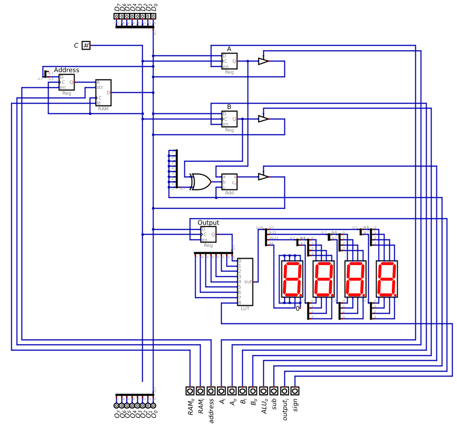
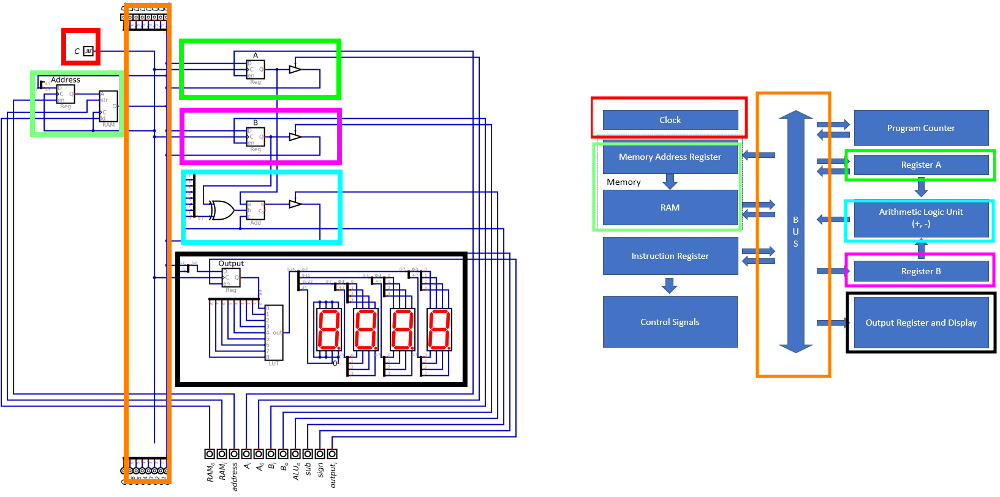
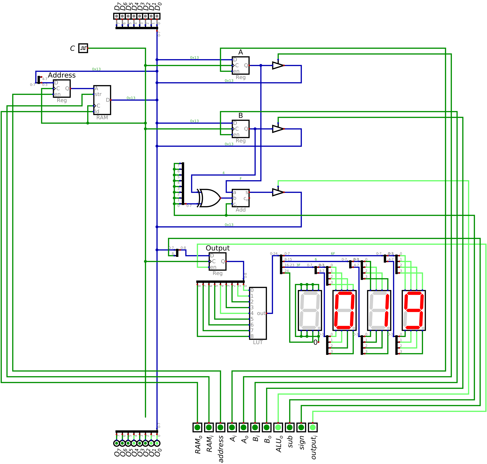

===============
Output Register
===============

* The look up tables provides a simple way to convert binary numbers to their seven segment display patterns
* Now, a register will be incorporated into the design to provide control over which data is being output to the display

Output Module
=============

* With the LUT and seven segment display configuration, it is possible to output values from our system
* However, like with the memory module, there needs to be a way to separate the data to be output from the bus

    * Otherwise, the display would show whatever is currently on the bus

* Thus, like with the memory module, a register will be used to store the value that is of interest
* This register will be called the *output register*
* The seven segment displays will always show the contents of the output register

.. figure:: output_register_and_seven_segment_display.png
    :width: 666 px
    :align: center

    A register is added to the LUT and seven segment displays to create the output module for the system.

* With this design, one can control when the data is loaded into the output register for displaying
* As discussed in the previous topic, the :math:`signed` signal controls when to output two's complement numbers

    * Remember, this signal is ultimately an input signal like the other 8 input signals to the LUT
    * However, it effectively controls which block of 256 values are addressed by the 8 bits from the output register

        * When the signal is low, the 8 bits from the output register address 0 -- 255
        * When the signal is high, the 8 bits from the output register address 256 -- 511

Including Output in the System
==============================

* Adding the output module to the ESAP system is an exercise in connecting the corresponding components

    * Like when adding the RAM module to the system

    Configuration of the ESAP system with the ALU, RAM, and output modules connected.

* Like before, the control signals are moved to the bottom of the design to keep them together
* The placement of the output register in the ESAP system is not important, but does match the architecture overview

    Comparison of the current system and the ESAP architecture overview.

Example of Outputting from the System
=====================================

* Like previous examples, the numbers 15 and 4 will be added together, but this time the result will be output
* A simpler version of the program will be implemented here

    * Load 15 into A
    * Load 4 into B
    * Output the sum to the output register

* The below table shows the control logic configuration to execute this program

    * The address register and RAM in/out are excluded for space

.. list-table:: Add 15 and 4, and output the result
    :widths: auto
    :align: center
    :header-rows: 1

    * - :math:`A`
      - :math:`B`
      - :math:`ALU_{o}`
      - :math:`sub`
      - :math:`out_{i}`
      - :math:`sign`
      -
      - :math:`D`
      -
      - :math:`C`
    * - ``1/0``
      - ``0/0``
      - ``0``
      - ``0``
      - ``0``
      - ``0``
      -
      - ``0x0F``
      -
      - ``C``
    * - ``0/0``
      - ``1/0``
      - ``0``
      - ``0``
      - ``0``
      - ``0``
      -
      - ``0x04``
      -
      - ``C``
    * - ``0/0``
      - ``0/0``
      - ``1``
      - ``0``
      - ``1``
      - ``0``
      -
      - ``Z``
      -
      - ``C``

* The below image shows the state of the system after adding 15 and 4 together and outputting the result
* Due to the output register, the computer could continue to operate while still outputting this value
* In other words, the control signals could change, along with the data on the bus, and the output would remain

    * Unless new data was put into the output register

    ESAP system outputting 19 on the seven segment displays. This would be the final state of the system after executing
    the program described in the above table.

For Next Time
=============

* Something?

