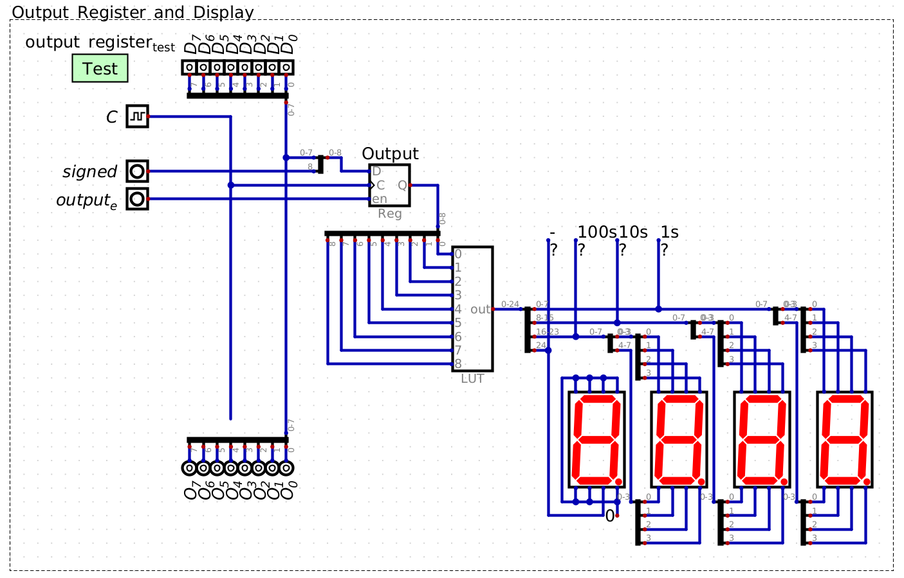

===============
Output Register
===============

* The look up tables provides a simple way to convert binary numbers to their seven segment display patterns
* Now, a register will be incorporated into the design to provide control over which data is being output to the display

Output Module
=============

* With the LUT and seven segment display configuration, it is possible to output values from our system
* However, like with the memory module, there needs to be a way to separate the data to be output from the bus

    * Otherwise, the display would show whatever is currently on the bus

* Thus, like with the memory module, a register will be used to store the value that is of interest
* This register will be called the *output register*
* The seven segment displays will always show the contents of the output register

    A register is added to the LUT and seven segment displays to create the output module for the system.

* With this design, one can control when the data is loaded into the output register for displaying
* As discussed in the previous topic, the :math:`signed` signal controls when to output two's complement numbers

    * Remember, this signal is ultimately an input signal like the other 8 input signals to the LUT
    * However, it effectively controls which block of 256 values are addressed by the 8 bits from the output register

        * When the signal is low, the 8 bits from the output register address 0 -- 255
        * When the signal is high, the 8 bits from the output register address 256 -- 511

Including Output in the System
==============================

Example of Outputting from the System
=====================================

For Next Time
=============

* Something?

