**********************
Seven Segment Displays
**********************

* Binary values from the data bus have been readable through Digital's output components
* However, base 10 is preferable when viewing numbers
* Further, the data on the bus is always changing

    * Sometimes output should persist
    * Not all data on the bus needs to be output

* An output register will be used to improve system outputs
* Seven segment displays will be used as the mechanism for displaying base 10 numbers

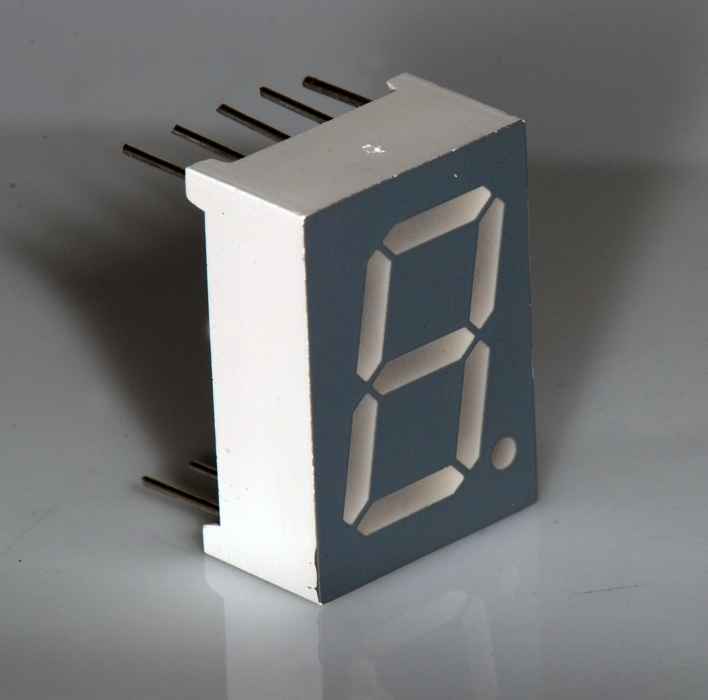

    A common seven segment LED display. By turning different segments of the display on/off, different values can be
    visually represented.

Seven Segment Display
=====================

* Seven segment displays are made up of seven toggleable segments
* By turning these segments on/off, different symbols can be represented

    * A total of :math:`2^{7}` (:math:`128`) unique patterns can be represented

        * Although not all would necessary be meaningful

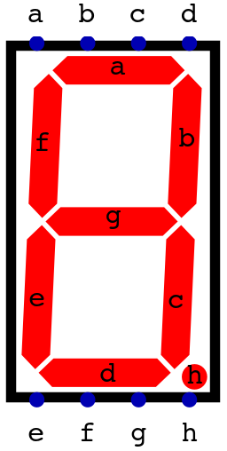

    A seven segment display from Digital with the eight inputs and corresponding segments labelled. When a high signal
    is applied to an input, the respective segment would turn on.

* Although they are called seven segment displays, it's common to have an eighth segment representing a decimal point

    * Which explains why these components have eight inputs
    * Thus, there is actually a total of :math:`2^{8}` (:math:`256`) unique patterns

* Since a one signal controls one segment, eight signals are required to control the eight total segments

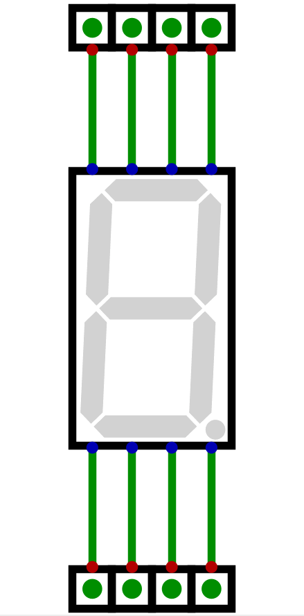

    Animation of each of the eight inputs on a seven segment display being activated. As each input is made high, the
    corresponding segment turns on.

* One can think of these eight signals as 8 bits/1 byte
* But, it is important to remember that the bit patterns is an encoding

    * Some decoding is needed to derive meaning

* For example, assume a byte is used to control the seven segment display such that ``a`` is the least significant bit

    * Each bit in the byte controls one segment
    * ``hgfedcba``

* The number 9 is ``0b00001001``
* However, this bit pattern would display the following

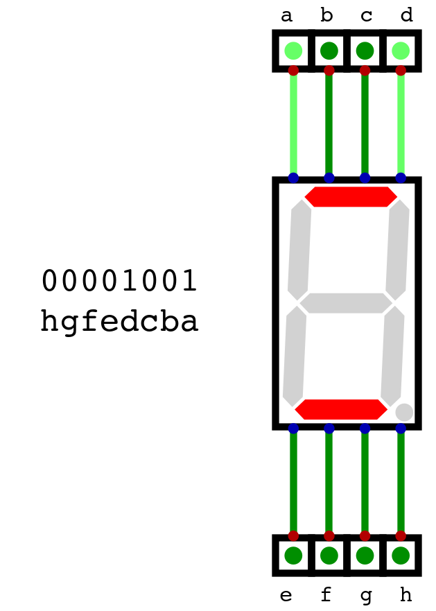

    The state of a seven segment display when the inputs are set to ``0b00001001``, ordered such that ``a`` is the least
    significant bit and ``h`` is the most significant.

* In other words, the byte representing 9 as an integer has an entirely different meaning when used for the display

    * ``0b00001001`` is only an encoding

Binary Numbers to Decimal for a Seven Segment Displays
======================================================

* A system to convert the binary numbers to their respective seven segment display patterns needs to be developed
* As discussed, a single byte can be used for each seven segment display
* Here, the display's ``a`` input will be the least significant bit, and ``h`` will be the most significant

    * This ordering is a design decision and not a requirement

* Below is a table showing each decimal number's bit pattern for the seven segment display

.. list-table:: Decimal Numbers and Their Seven Segment Display Patterns following ``hgfedcba``
    :widths: auto

    * - Decimal
      - Binary
      -
      - Display Pattern
      - Display Hex
      - Output
    * - ``0``
      - ``0b00000000``
      -
      - ``0b00111111``
      - ``0x3F``
      - .. image:: seven_segment_display_0.png
            :width: 50
    * - ``1``
      - ``0b00000001``
      -
      - ``0b00000110``
      - ``0x06``
      - .. image:: seven_segment_display_1.png
            :width: 50
    * - ``2``
      - ``0b00000010``
      -
      - ``0b01011011``
      - ``0x5B``
      - .. image:: seven_segment_display_2.png
            :width: 50
    * - ``3``
      - ``0b00000011``
      -
      - ``0b01001111``
      - ``0x4F``
      - .. image:: seven_segment_display_3.png
            :width: 50
    * - ``4``
      - ``0b00000100``
      -
      - ``0b01100110``
      - ``0x66``
      - .. image:: seven_segment_display_4.png
            :width: 50
    * - ``5``
      - ``0b00000101``
      -
      - ``0b01101101``
      - ``0x6D``
      - .. image:: seven_segment_display_5.png
            :width: 50
    * - ``6``
      - ``0b00000110``
      -
      - ``0b01111101``
      - ``0x7D``
      - .. image:: seven_segment_display_6.png
            :width: 50
    * - ``7``
      - ``0b00000111``
      -
      - ``0b00000111``
      - ``0x07``
      - .. image:: seven_segment_display_7.png
            :width: 50
    * - ``8``
      - ``0b00001000``
      -
      - ``0b01111111``
      - ``0x7F``
      - .. image:: seven_segment_display_8.png
            :width: 50
    * - ``9``
      - ``0b00001001``
      -
      - ``0b01101111``
      - ``0x6F``
      - .. image:: seven_segment_display_9.png
            :width: 50

.. note::

    One may have noticed that the **seven** segment display pattern for the number **seven** is the binary number **seven**.

    This is in no way meaningful, and is a consequence of the arbitrary bit ordering to the inputs, but an interesting
    observation nonetheless.

* Consider, however, the number 10, which is easily representable in binary with 8 bits
* One cannot represent this number with a single digit

    * Although hexadecimal can be used, and an ``A`` can be displayed on a seven segment display, this misses the point
    * The goal is to show decimal numerals
    * And further, the same issue arises with hexadecimal numbers once the number 16 is hit

* The system being designed can represent eight bit numbers

    * A total of 256
    * 0 -- 255

* Thus, a total of three digits are required for this system's output

* Fortunately, there is a simple way to deal with this
* Use three displays and three bytes for an 8 bit integer

    * Map a single 8 bit integer to three 8 bit patterns, one for each of the three displays

* In other words, the number 10 maps to a byte for 0, a byte for 1, and another byte for 0

    * ``0b00001010`` maps to ``0b0011111111``, ``0b00000110``, and ``0b0011111111``

* Below is an example of displaying the number 123

    * ``0b01111011`` maps to ``0b00000110``, ``0b01011011``, and ``0b01001111``

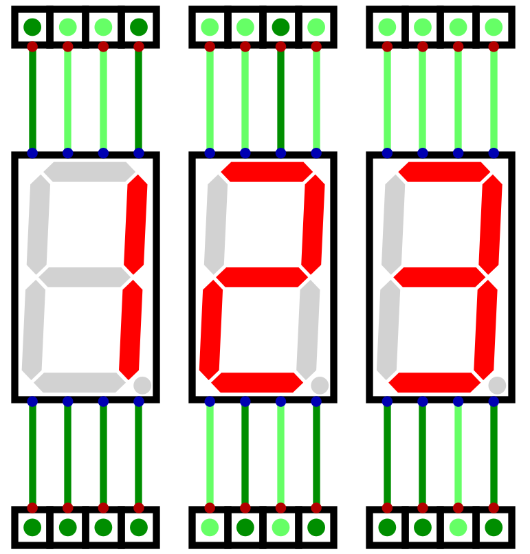

    Three seven segment displays showing the number 123. The number 123, represented in binary as ``0b01111011`` must
    map to three bytes to display 1, 2, and 3. These bytes would be ``0b00000110``, ``0b01011011``, and ``0b01001111``
    respectively.

* Further, since the system works with two's complement numbers, negative numbers should be displayable on the output

    * Numbers -128 -- 127

* This is achieved with a forth display that would only ever activate the ``g`` input, when necessary

    * This forth, leftmost display would only activate ``g`` when showing a negative number
    * Positive numbers would have nothing displayed on this forth display

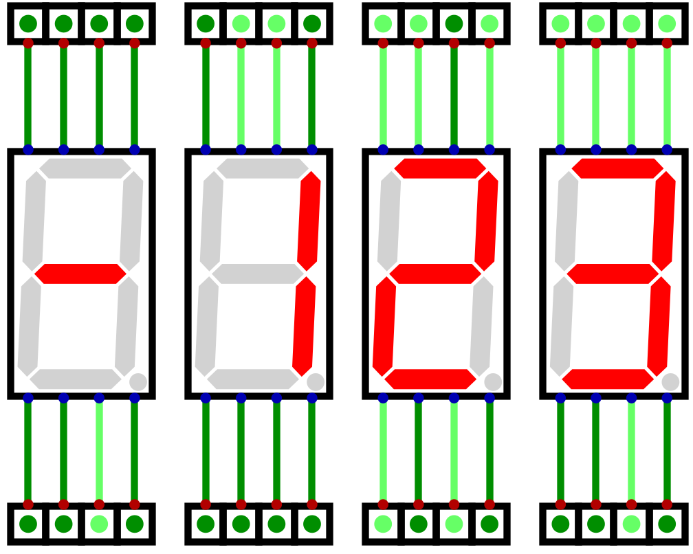

    Four seven segment displays showing the twos complement number -123 (``0b10000101``). The left most display in this
    configuration would only ever be used to show the negative sign, when appropriate.

Programmable Logic Arrays and Look Up Tables
--------------------------------------------

* As discussed earlier in the semester, *Programmable Logic Arrays* (PLAs) can be used to create any logical mapping

    * Can map any binary input to a binary output

* Thus, they are ideal for mapping the system's binary numbers to their seven segment display patterns
* Unfortunately, however, they scale very poorly with input size and become very difficult to work with

    * They scale exponentially

* Below is an example of a PLA mapping four bits to only the least significant digit's seven segment display pattern

    * Two digits would be required to display all possible 4 bit integers
    * For simplicity (and sanity), only the one digit was included

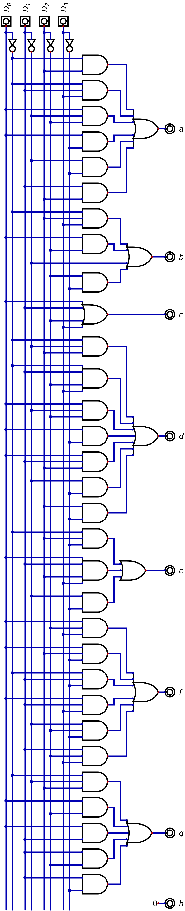

    Programmable logic array mapping a 4 bit binary number to a seven segment display pattern for only the least
    significant digit.

* A PLA for all three output bits for an 8 bit number would be markedly larger and much more difficult to work with
* Fortunately, as discussed earlier in the semester, *Look Up Tables* (LUT) can be used to simplify such functionality
* In fact, one can edit the LUT easily to enter bit patterns by hand

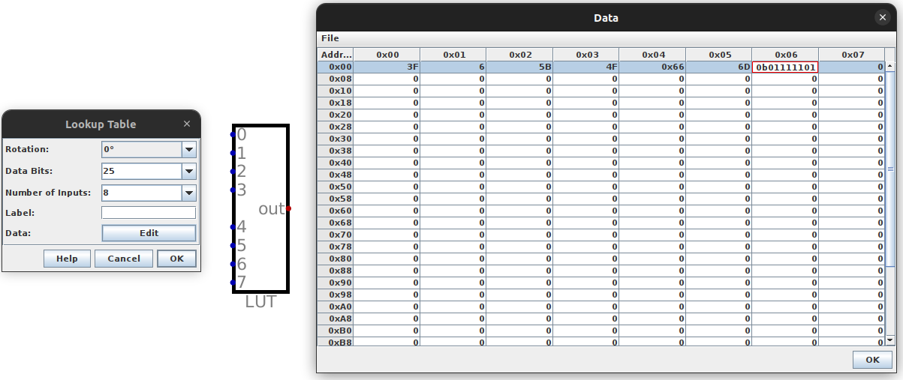

    Editing a Look Up Table within Digital

* A LUTs contents can be saved to a file, which would produce something like below

    * Note that the values here are in hexadecimal, not binary
    * Further, this is far from complete for the 8 bit, 3 digit display

    .. code:: text

        v2.0 raw
        3f
        6
        5b
        4f
        66
        6d
        7d

* Treating the LUT as a map/dictionary, the key is the row number, and the value is the contents of that row

    * In the above example, the "key" 3 maps to the "value" ``4f``
    * The 3rd row (starting at 0) contains ``4f``

* To make things even easier, one can even import a hex file to the LUT

    * This way, there is no need to enter all 256 patterns by hand
    * Instead, the hex file can be generated programmatically

Using a LUT to Map Numbers to Seven Segment Display Patterns
============================================================

* Since the system is 8 bit, the LUT will be used to decode an 8 bit number into the three digit output

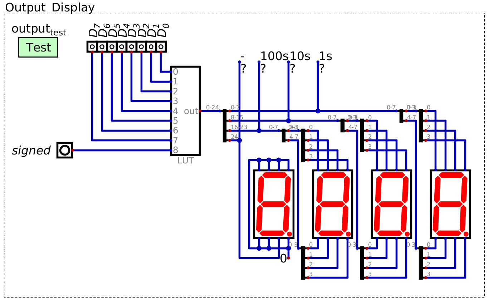

    Look up table for decoding an 8 bit binary number into a pattern for a seven segment display to represent a three
    digit decimal number. This design can display both unsigned and signed (two's complement) binary numbers, depending
    on the state of the "signed" signal. The left most seven segment display is only used to display a negative sign,
    when necessary. This image includes "probes" labelled -, 100s, 10s, and 1s for testing purposes, but are not
    necessary.

* The LUT takes 8 input lines representing an 8 bit number
* Additionally, the LUT will have one additional input line to specify if the number is signed

    * If the number is two's complement
    * This will be discussed in greater detail below

* Thus, the LUT will have a total of 9 input signals

* The LUT would map these input signals to the corresponding seven segment display patterns for the output

    * For example, the number ``0b10101010`` would map to the patterns to display the decimal number 170
    * The number ``0b10101010`` would map to the pattern for -086 if the :math:`signed` signal was high

* Since each digit uses 8 bits for its display pattern, and there are three digits, a total of 24 bits are needed
* However, there is an additional output signal needed to control the negative sign

    * Notice in the design that only one line from the LUT is connected to the left most seven segment display
    * Specifically, the line is connected directly to segment ``g`` of the display, which would be the negative sign

* Thus, there is a total of 25 output bits

* With the design used here

    * The least significant 8 bits of the 25 correspond to the least significant seven segment display
    * The most significant bit controls the negative sign

Creating Seven Segment Display Patterns
---------------------------------------

* A Python script will be used to generate the hex file to be loaded into the LUT
* A series of constants for each bit pattern will be created

    * Notice that these constants are added to a list
    * Within this list, the bit pattern for ``X`` is found in index ``X``

.. literalinclude:: create_seven_segment_patterns_for_look_up_table.py
    :language: python
    :lineno-match:
    :start-after: # [begin-seven_segment_digit_pattern_constants]
    :end-before: # [end-seven_segment_digit_pattern_constants]

Unsigned Integers
^^^^^^^^^^^^^^^^^

* To create the 25 bit output patterns, two bitwise operators will be used

    * Bit shifting

        * Move bits to the left/right in a binary pattern
        * For example, consider shifting a binary pattern 4 bits to the left

            * ``0b0101 << 4`` results in ``0b01010000``

    * Bitwise ``OR``

        * Perform ``OR`` on each bit in two bit patterns
        * For example

            * ``0b11001100 | 0b11110000`` results in ``0b11111100``

* Further, given some number, it is possible to obtain the each individual digit with basic arithmetic

    * Divide the number by the desired digit's *place* value, then mod 10
    * For example, consider the number ``123``

        * ``123 / 100 = 1``, ``1 % 10 = 1``, therefore the 100s place is ``1``
        * ``123 / 10 = 12``, ``12 % 10 = 2``, therefore the 10s place is ``2``
        * ``123 / 1 = 123``, ``123 % 10 = 3``, therefore the 1s place is ``3``

* With this, the idea is to take each 8 bit number, obtain each place's digit's pattern, and left shift where necessary
* This is best explained with an example
* Consider the number 123 --- each digits pattern is as follows

    * 1 --- ``00000110``
    * 2 --- ``01011011``
    * 3 --- ``01001111``

* Bit shift the 8 bits for the 100s number 16 bits to the left, shift the 10s 8 bits to the left, and the 1s shift 0
* Each pattern would then be as follows (leading ``0``\s and spaces are included for visual clarity)

    * 1 --- ``00000110 00000000 00000000``
    * 2 --- ``00000000 01011011 00000000``
    * 3 --- ``00000000 00000000 01001111``

* Finally, performing bitwise ``OR`` on these patterns would result in the full pattern for the 8 bit number

    * 123 ---  ``00000110 01011011 01001111``

* Note that the most significant, 25th bit, is not needed here as the number is positive

    * If a leading bit is not explicitly set to ``1``, it will be ``0``

* Further, in the below code, bit shifting the 1s digit to the left 0 bits has no functional purpose

    * It is included for consistency

.. literalinclude:: create_seven_segment_patterns_for_look_up_table.py
    :language: python
    :lineno-match:
    :start-after: # [begin-unsigned_patterns]
    :end-before: # [end-unsigned_patterns]

Signed Integers
^^^^^^^^^^^^^^^

* The same idea is used for the signed integers, but following the two's complement pattern

    * ``0b00000000`` -- ``0b011111111`` corresponds to integers 0 -- 127
    * ``0b10000000`` -- ``0b11111111`` correspond to integers -128 -- -1

* For all patterns representing negative numbers, the most significant, 25th bit, is set high

    * To represent the negative sign
    * A single ``1`` would be bit shifted to the left 25

.. literalinclude:: create_seven_segment_patterns_for_look_up_table.py
    :language: python
    :lineno-match:
    :start-after: # [begin-signed_patterns]
    :end-before: # [end-signed_patterns]

* Since that there are two sets of numbers to decode (unsigned and signed), each set can be stored in their own LUT

    * One LUT has all the unsigned 8 bit integer patterns
    * The other LUT has all the signed 8 bit integer patterns

* A control signal and multiplexer can be used to select which type of integer to display

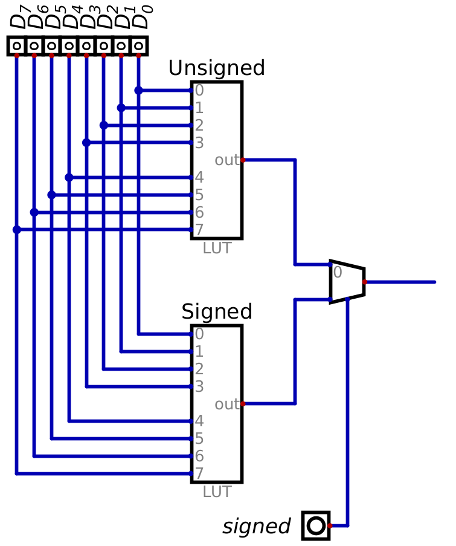

    Two look up tables, each storing their respective 8 bit unsigned/signed integer patterns for seven segment displays.
    A signal called :math:`signed` controls a multiplexer which allows for selecting which integer type
    (unsigned/signed) is actually output to the seven segment displays.

* However, the same functionality can be achieved with a single LUT with an additional input signal
* 8 bits represent the number, and the 9th input would be the :math:`signed` control line

* Remember, with 9 input bits, a total of :math:`2^{9}` (:math:`512`) unique values can be indexed

    * Thus, the first 256 numbers could be unsigned integers, and the following 256 could be signed
    * In other words ``0b0 00000000`` -- ``0b0 11111111`` store the unsigned integers
    * ``0b1 00000000`` -- ``0b1 11111111`` store the signed integers

* One could think of it as the 9th bit selecting which block of 256 values to index

    * In the same way as the control signal and multiplexer would select which LUT's pattern is output

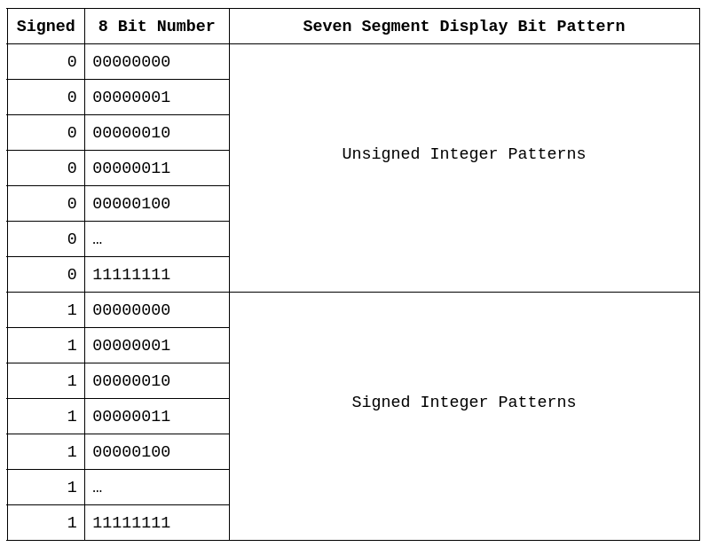

    Table representing how the nine input signals on the look up table map to the 512 unique display patterns. When the
    :math:`signed` control signal is low, the 8 bit binary number input would map to the 256 unsigned integer patterns
    in 0 -- 255. When the :math:`signed` control signal is high, the 8 bit binary number maps the 256 signed integer
    patterns in 256 -- 512.

* Notice how, with this configuration, the *meaning* of the input signals differ

    * The first 8 bits represent some binary number
    * The ninth bit is not part of the binary number, but represent a control signal

Saving to a Hex File
^^^^^^^^^^^^^^^^^^^^

* Finally, the lists of patterns are saved to a hex file that can be loaded into the LUT
* The ``v2.0 raw`` is necessary for Digital to parse the hex files
* The first 256 patterns are the unsigned integer patterns
* The following 256 patterns are the signed integers

.. literalinclude:: create_seven_segment_patterns_for_look_up_table.py
    :language: python
    :lineno-match:
    :start-after: # [begin-save_to_file]
    :end-before: # [end-save_to_file]

* Once generated, the hex file can be loaded into the LUT
* Below are examples of using the LUT to decode the signal ``0b10101010`` as an unsigned and signed integer

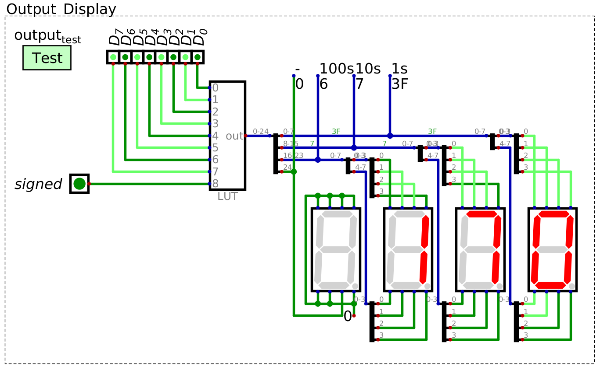

    LUT decoding the binary pattern ``0b10101010`` to the unsigned decimal number 170``.

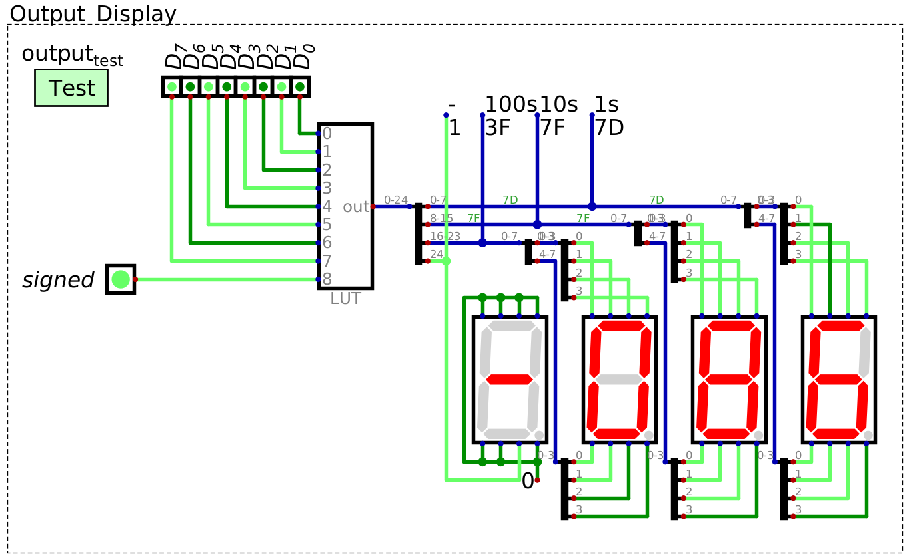

    LUT decoding the binary pattern ``0b10101010`` to the signed, two's complement decimal number -86``. The LUT is
    outputting the two's complement pattern since the 9th input bit, which acts as a control signal for signed integers,
    is set to high.

For Next Time
=============

* Something?