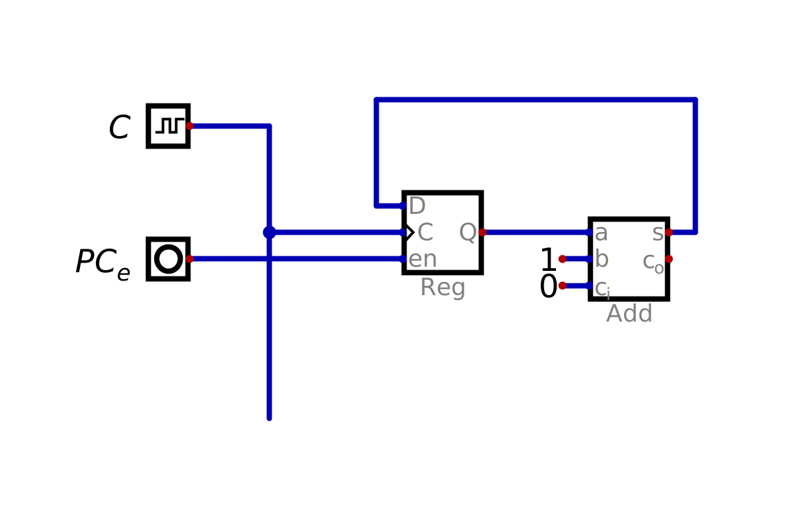
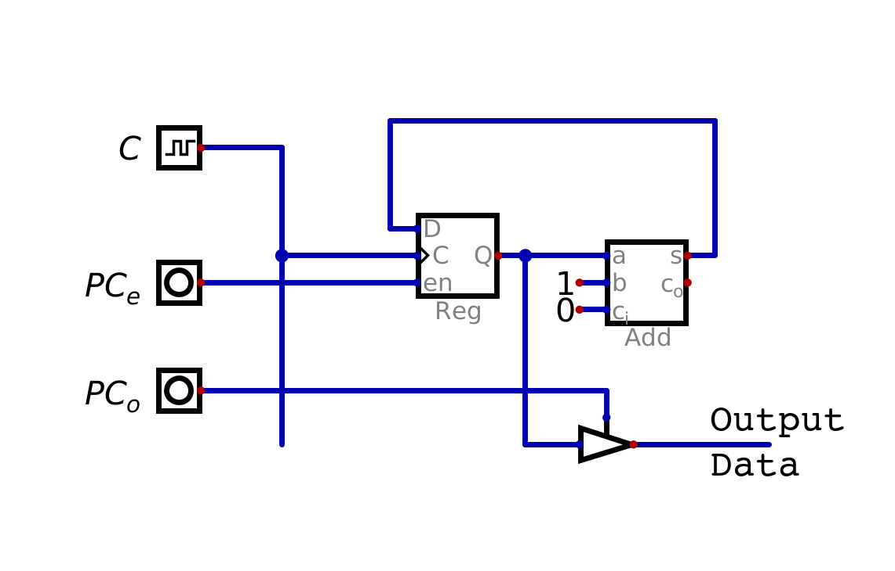
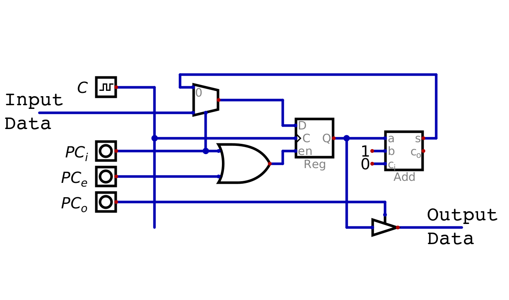
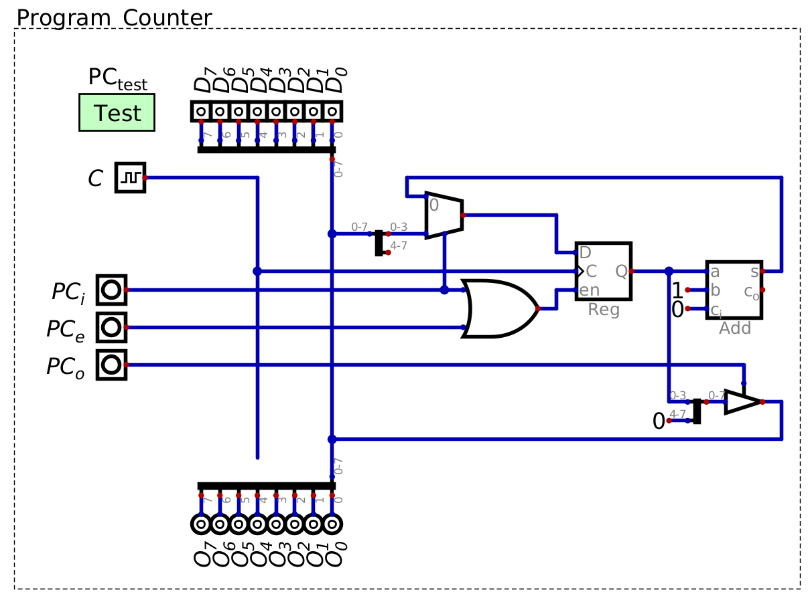
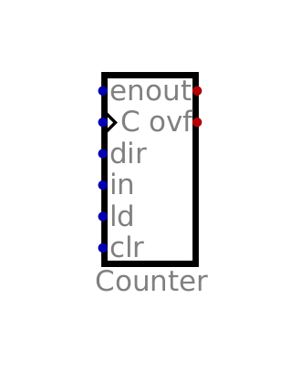

===============
Program Counter
===============

* As of now, only data was stored in RAM
* However, RAM will eventually be used to store instructions in addition to data

    * Although, instructions are data

* These instructions are retrieved from RAM one at a time, and the system then executes the instruction
* The program counter is a component that keeps track of the memory address of the next instruction

    * It effectively keeps track of which *line* of the program is to be run next

Program Counter Module
======================

* The program counter has several important functions

    * Keeps track of the memory address of the next instruction to run
    * Increment the memory address stored

        * However, this should not happen on every clock cycle
        * Instructions often take several clock cycles to complete
        * Thus, there needs to be a way to control when the program counter increments

    * Output its current value
    * Set its current value to a specific memory address

        * Important for looping and conditionals

Storing and Incrementing Values
-------------------------------

    Configuration of a register and adder set to add 1 to the value in the register. Although the adder is always adding
    one to the value stored in the register, the value in the register only updates when the :math:`PC_{e}` signal is
    high.

* Storing a value can be achieved with a register
* Incrementing a value can be achieved with an adder set to only ever add 1 to some inputted value

* With the above configuration, the adder is always adding 1 to the value stored/output by the register (:math:`Q`)

    * The adder's carry in is set to ``0`` and the carry out is ignored

* However, even though the value at the register's :math:`D` input is always :math:`Q+1`, it only updates when enabled

    * When the :math:`PC_{e}` control signal is set high

* This design provides control over when the counter increments

Controlling Output
------------------

    A driver can be used to control when the counter's value is output. Note that the counter's output is the register's
    output (:math:`Q`), not the output of the adder (:math:`S`).

* To control the output, use a driver like in previous designs
* Note, the counter's output is :math:`Q` --- the register's output

    * The output of the adder is for updating the state of the counter

Controlling Inputs
------------------

    A multiplexer and a new signal :math:`PC_i` to control which value to store to the register --- the output of the
    adder or the input data.

* In addition to incrementing, the program counter must be able to store specified input data when needed
* Therefore, the counter's register must be able to store one of two potential values

    * The output from the adder, containing the incremented value
    * Some input data from elsewhere

* A multiplexer can be used to control which of the two signals is active on the register's input :math:`D`
* A control signal :math:`PC_{i}` controls the multiplexer

    * In the above configuration, when :math:`PC_{i}` is low, the register's :math:`D` input is the incremented value
    * When :math:`PC_{i}` is high, the register's :math:`D` input is the input data

* If either :math:`PC{i}` or :math:`PC_{e}` are high, the program counter's register must be enabled

Program Counter Design
----------------------

    Program counter module with an 8 bit data bus. For the ESAP system, the program counter only needs 4 bits as there
    are 16 RAM addresses, therefore splitters/mergers are used to have the program counter interface with the bus.

* Due to ESAP's design, only 4 bits are used to index RAM

    * The least significant 4 bits on the bus

* Since the program counter is keeping track of memory addresses, the program counter only needs to manage 4 bits
* Therefore, some mechanism to interface between the two bit lengths is needed
* Here, splitters/mergers are used to fit the 4 bit program counter into the 8 bit design

    * Data from the bus is split

        * Only the least significant 4 bits are connected to the program counter's register

    * Data to the bus is merged with zeros

        * To pad the counter's 4 bit output to be a full 8 bits

Counter Component
-----------------

* Since counters are a common tool, they are often represented as a single component

    Counter component with an input for loading in data.

* The above image shows the counter component with presets

    * A counter with the ability to load data into the counter

* This component includes several inputs not required for the ESAP's program counter

    * The clear input, which resets the counter to 0, is not needed
    * The direction input, which controls the counter direction, does not need to be manipulated

        * Only needs to count up for the ESAP system

    * For both, these inputs could be tied to constants

.. figure:: program_counter_component.png
    :width: 500 px
    :align: center

    Program counter module configuration using the built in counter component.

Including the Program Counter in the System
===========================================

Using the Program Counter in the System
=======================================

For Next Time
=============

* Something?

