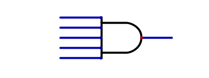
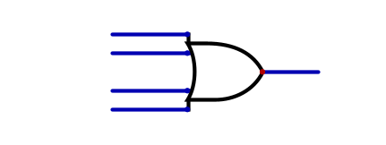
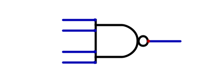

***********
Logic Gates
***********

* With clever configurations of transistors, boolean logic operators can be implemented
* This allows for the ability to perform logical operators on electrical signals

.. warning::

    More complex transistor configurations for each of the below logic gates are contained within the textbook. The
    reason for their added complexity is a consequence of the physical limitations of how transistors work. These
    more complex configurations would be more inline with how logic gates are actually physically built.

    Fortunately, the simulator being used for this course is idealized and several physical limitations are ignored,
    which allows for the simpler configurations to be used. Nothing will be lost by using the simpler configurations
    since (a) the abstract ideas are the same between the simple and complex configurations, (b) the more complex
    configurations are only necessary because of the physical properties of semiconductors, and (c) for the most part,
    transistors will not be directly interacted with going forward in this course.

.. note::

    Going forward, words for boolean operators and logic gates will be stylized to help designate what is being
    referred to.

    For example, the typesetting for words when referring to mathematical boolean operators will be stylized like so
    --- :math:`and`. However, when referring to a logic gate, the words will be stylized like this --- AND.

    They both mean the same thing on an abstract level, but efforts are made to eliminate ambiguity.

AND Gate
========

* Consider the :math:`and` operator --- output ``1`` when both operands are ``1``, otherwise output ``0``

.. list-table:: Truth Table for :math:`and`
    :widths: auto
    :align: center
    :header-rows: 1

    * - :math:`a`
      - :math:`b`
      -
      - :math:`a \land b`
    * - ``0``
      - ``0``
      -
      - ``0``
    * - ``0``
      - ``1``
      -
      - ``0``
    * - ``1``
      - ``0``
      -
      - ``0``
    * - ``1``
      - ``1``
      -
      - ``1``

* Knowing how transistors work as switches, how can two switches be configured to output ``1`` when they are both "on"?

    * When two input signals are ``1``, output ``1``, otherwise output ``0``

.. figure:: and_gate_with_transistors.png
    :width: 500 px
    :align: center

    Two transistors in series configured to perform the :math:`and` operation. Both transistors would need to be "on" in
    order for the signal at the top transistor's source (``1``) to reach the output at the bottom transistor's drain.

* With two transistors in *series*, both would need to be "on" for the signal to travel through to the output

    * *Series* meaning, one after the other along the same conductor
    * In a series circuit, the signal can only travel along the single conductor

* If either switch (or both) is "off", the signal could not travel to the output
* This perfectly corresponds to the :math:`and` boolean operator
* This circuit is called an *AND gate*

.. note::

    Each circuit seen so far has had a "Test" component. This allows one to create unit tests for circuits to help
    ensure correctness. Although the unit tests can get more complex and expressive, a simple form of unit tests for
    Digital is truth tables. Below is a unit test for the AND circuit, which is the truth table defining how the circuit
    should behave.

    .. figure:: and_gate_unit_test.png
        :width: 666 px
        :align: center

        Unit test for the AND circuit. Each column corresponds to a labelled input/output and each row specifies
        expected states.

* Boolean operators are used extensively within computer architecture
* Thus, special symbols are used to designate specific operators' gates
* Below is two images with the symbol for an AND gate

    * The first image is of the symbol for the AND gate
    * The second shows how the inputs and output would correspond to the full AND gate built with transistors

.. figure:: and_gate_symbol.png
    :width: 500 px
    :align: center

    Symbol for an AND gate.

.. figure:: and_gate_symbol_with_labels.png
    :width: 500 px
    :align: center

    Symbol for an AND gate with labelled inputs and output corresponding to the AND gate built with transistors.

.. note::

    This is the first major layer of abstraction that will be seen throughout this course. Instead of thinking of
    logic gates in terms of the whole schematic with transistors, they are represented as a single symbol.

OR Gate
=======

* For :math:`or`, a signal of ``1`` should reach the output if either switch is "on"

.. list-table:: Truth Table for :math:`or`
    :widths: auto
    :align: center
    :header-rows: 1

    * - :math:`a`
      - :math:`b`
      -
      - :math:`a \lor b`
    * - ``0``
      - ``0``
      -
      - ``0``
    * - ``0``
      - ``1``
      -
      - ``1``
    * - ``1``
      - ``0``
      -
      - ``1``
    * - ``1``
      - ``1``
      -
      - ``1``

.. figure:: or_gate_with_transistors.png
    :width: 500 px
    :align: center

    Two transistors in parallel configured to perform the :math:`or` operation. Either transistors would need to be "on"
    in order for the signal to reach the output.

* With two transistors in *parallel*, either would need to be "on" for the signal to travel through to the output

    * *Parallel* meaning, transistors on separate conductors that split from the same conductor and re-join
    * The parallel circuits, the signal can travel through each separate conductor

* Below is an image of the symbol for an OR gate

.. figure:: or_gate_symbol.png
    :width: 500 px
    :align: center

    Symbol for an OR gate.

NOT Gate
========

* Now consider the :math:`not` operator

.. list-table:: Truth Table for :math:`not`
    :widths: auto
    :align: center
    :header-rows: 1

    * - :math:`a`
      -
      - :math:`\lnot a`
    * - ``0``
      -
      - ``1``
    * - ``1``
      -
      - ``0``

* The NOT gate is a little different from the AND/OR gates

.. figure:: not_gate_with_transistors.png
    :width: 500 px
    :align: center

    NOT gate with a transistor. When the transistor is turned "on", the circuit's voltage will drop to neutral as ground
    would be directly connected to the output.

* Notice how the output is on the source end of the transistor
* This is because the output should be ``1`` when the gate is "off",
* But as soon as the gate is "on", the output should become ``0``

* If it is unclear how this works, consider that

    * When the transistor is "off", the signal from the voltage source, through the resistor, is connected to the output
    * When the transistor is "on", the output would be directly connected to ground, sinking the signal

* If still unclear, consider a plugged sink with a faucet running that is overflowing with water
* If someone removes the plug from the drain, the water can then flow through the drain and stop overflowing

    * This would be like what happens when the transistor is turned "on"

.. admonition:: Activity

    How would one configure the schematic for :math:`not` if using a P-channel MOSFET instead of a N-channel like above?

* Below is an image of the symbol for a NOT gate

.. figure:: not_gate_symbol.png
    :width: 500 px
    :align: center

    Symbol for a NOT gate.

* However, NOT is sometimes represented as only the circle

    * In fact, the triangle in the gate means a *buffer* component

* It is also common to simplify a NOT input to another gate by adding a circle to the symbol's respective input
* Below is an example of an AND gate with one input inverted

    * The top image shows one input explicitly inverted with a NOT gate
    * The bottom image is simplified to show that the input is inverted

.. figure:: not_added_to_and_gate.png
    :width: 500 px
    :align: center

    Two representations of an AND gate with the top input being inverted.

Other Gate Symbols
==================

* Adding a circle to the output would signify an inverted output, like the below NOR and NAND gate symbols

.. figure:: nor_gate_symbol.png
    :width: 500 px
    :align: center

    Symbol for a NOR gate.

.. figure:: nand_gate_symbol.png
    :width: 500 px
    :align: center

    Symbol for a NAND gate.

* Another common symbol is for exclusive OR (XOR)

.. figure:: xor_gate_symbol.png
    :width: 500 px
    :align: center

    Symbol for a XOR gate.

Additional Inputs
=================

* Typically, these logic gates have two inputs
* However, having more than two inputs is normal

* An AND gate with more than two inputs outputs ``1`` only when all inputs are ``1``

    Single AND gate with five inputs.

* An OR gate with more than two inputs outputs ``1`` if any of the inputs are ``1``

    Single OR gate with four inputs.

* A NAND gate with more than two inputs is an AND gate with the same number of inputs, but with an inverted output

    * In other words, outputs ``1`` as long as not all inputs are ``1`` (at least one input is ``0``)

    Single NAND gate with four inputs.

* A NOR gate with more than two inputs is the same as an OR gate with the same number of inputs, with an inverted output

    * Outputs ``1`` only when all inputs are ``0``

* An XOR with more than two inputs effectively works as a parity check

    * Checks if the number of ``1`` inputs is even or odd
    * Output ``0`` when an even number of inputs are ``1``
    * Output ``1`` when an odd number of inputs are ``1``

For Next Time
=============

* Check out the :download:`boolean operators built with transistors <boolean_operators_with_transistors.dig>` schematic for Digital
* Read Chapter 3 Section 3 of your text

    * 5 pages