***************************
Transistors and Logic Gates
***************************

* When talking about electricity and semiconductors, things can get rather nuanced and complex
* However, the level of detail covered for this topic will be kept appropriate for the course content
* As such, certain analogies and ideas will be used that are technically inaccurate, but sufficient for our needs

Symbols
=======

* For this course, software called `Digital <https://github.com/hneemann/Digital>`_ will be used to create digital circuits
* There are a number of symbols representing components that will need to be understood
* Although some of you may be familiar with electronic component symbols, there are some things to note

    * Certain components have different symbols depending on their context
    * Some components have different symbols in different regions of the world

* When using Digital

    * An up arrow is used to signify a positive charge
    * A single horizontal line represents ground --- something with no charge; neutral
    * Typically, within the context of computer architecture, the voltage between this positive charge and ground is 5V

.. figure:: vcc_ground.png
    :width: 50 px
    :align: center

    Screenshot from Digital of a positive charge (up arrow) connected directly to ground (horizontal line).

* A single horizontal line is common within computer architecture and is the symbol found in Digital

    * There are other common symbols for ground depending on the context of how it is used

.. figure:: ground_symbols.png
    :width: 333 px
    :align: center
    :target: https://en.wikipedia.org/wiki/Ground_(electricity)

    Examples of three commonly used ground symbols. These have slightly different meanings, but all ultimately signify
    something with a neutral charge.

* In the above example, a voltage source was connected directly to ground
* In practice, this is a bad idea as that could cause damage and injury

    * Current would be too high

* A resistor, for example, could be added to the circuit to limit its current
* Below is an example of the simple circuit containing a resistor

.. figure:: vcc_resistor_ground.png
    :width: 50 px
    :align: center

    Screenshot from Digital of a positive charge (up arrow) connected to ground (horizontal line) through a resistor
    (box).

* In North America, a sawtooth symbol is used to represent a resistor, but elsewhere in the world it is typically a box

    * Like in the above figure

* Digital was not made in North America, thus, it makes use of the box symbol

.. figure:: resistor_symbols.png
    :width: 333 px
    :align: center

    Left --- Typical symbol for a resistor in North America. Right --- Typical symbol for a resistor outside North
    America.

* One of the commonly seen symbols for transistors are actually only for a specific, but common type of transistor

    * Bipolar Junction Transistors (BJT)

* The transistors available within the simulator Digital are Metal-Oxide-Semiconductor Field-Effect Transistors (MOSFET)

    * These transistors are common within computers

* The symbol used in this course for transistors will be of MOSFET transistors

.. figure:: transistor_symbols.png
    :width: 333 px
    :align: center

    Left --- Symbol for a Bipolar Junction Transistor (BJT). Right --- Symbol for a Metal-Oxide-Semiconductor
    Field-Effect Transistor (MOSFET).

Transistors
===========

* Transistors may be one of the most important inventions/discoveries in human history

    *  J. Bardeen, W. Brattain, and W. Shockley got the 1956 Nobel Prize in Physics for creating the first transistor

* Transistors are *semiconductor* devices

    * Not strictly a conductor or insulator
    * Can control the conductive properties of the component

.. note::

    The details on how transistors physically work is outside the scope of this course. For those interested, Ben Eater
    have two videos describing, at a high-level, how they work.

        * `Semiconductors <https://www.youtube.com/watch?v=33vbFFFn04k>`_
        * `Transistors <https://www.youtube.com/watch?v=DXvAlwMAxiA>`_

* Transistors perform simple tasks, but are critically important for our everyday lives
* Typically, transistors are used for signal amplification or as a switches
* For this course, the focus will be on transistor's ability to be used as a switch

* As already discussed, there are several kinds of transistors, but for this course, the focus will be on MOSFET

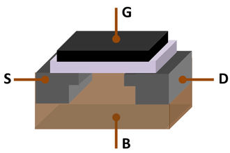

    Three-dimensional model of a Metal-oxide-semiconductor field-effect transistor (MOSFET). S --- source, D --- drain,
    G --- gate, and B --- body of the transistor. The source, drain, and gate have terminals to connect to a circuit.

.. note::

    Within the context of digital circuits, it is common to refer to signals as ``0``\s and ``1``\s. The use of ``0``
    and ``1`` do not signify a specific voltage, but instead ``0`` means a relatively low voltage and ``1`` means a
    relatively high voltage.

* Below is an image of an N-channel MOSFET
* This transistor can act as a switch for a signal to travel from the source to the drain
* With this type of transistor, the switch is closed (on) when a positive charge is applied to the gate terminal

    * This would allow the signal to travel from the source to the drain
    * The signal at the source is arbitrary

* The switch would be closed (off) is no positive charge is applied to the gate

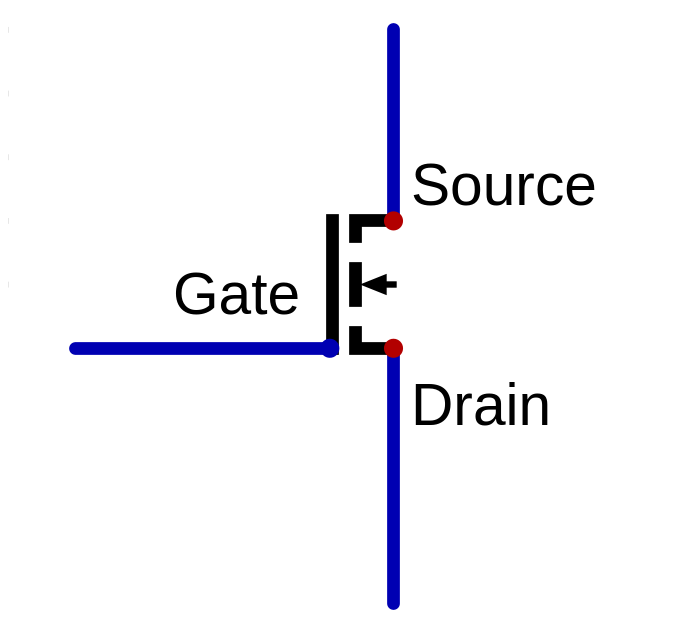

    N-channel MOSFET as a switch. The switch is "on" when a positive charge is applied to the gate terminal, allowing a
    signal to travel from the source to the drain. If no positive charge is applied to the gate, the switch is "off",
    not allowing a signal to pass through the transistor.

* P-channel MOSFETs exist, which act similar to N-channel, but turn "on" when no positive charge is applied to the gate

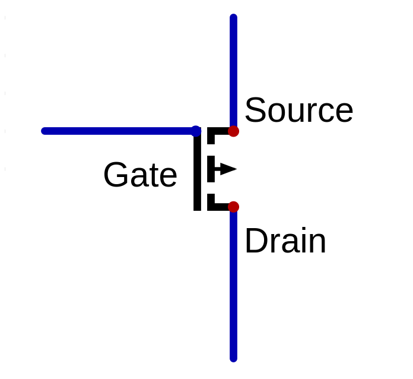

    P-channel MOSFET as a switch. The switch is "on" when a negative charge is applied to the gate terminal.

.. note::

    For the most part, N-channel MOSFET transistors will be used in this course.

* Below is a circuit with an N-channel MOSFET acting as a switch on some signal that is always on (``1``)
* There are several components to note

    * N-channel MOSFET
    * Voltage source providing a signal for the source
    * A current limiting resistor and ground connected to the drain
    * A toggleable square button connected to the gate labelled :math:`switch_{a}`

        * Allows for changing the state of the signal applied to the gait when running a simulation
        * These are called *inputs* within Digital

    * A circle to read circuit output labelled :math:`switch_{o}`

        * Allows for easily observing the signal at some point in the circuit
        * These are called *outputs* within Digital

    * A box called "Test" labelled :math:`switch_{tests}`

        * These are where unit tests are written for the circuit
        * These will be discussed in more detail later

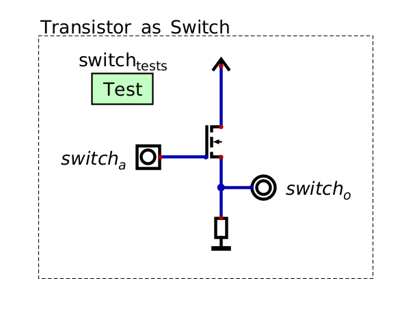

    Screenshot of a circuit created in Digital showing an N-channel MOSFET as a switch.

* When no positive charge (a signal of ``0``) is applied to the gate, the transistor does not allow a signal to pass
* The output of this circuit in this state is therefore a signal of ``0``

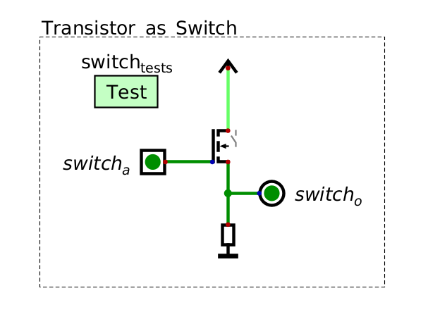

    Screenshot of a circuit created in Digital showing an N-channel MOSFET as a switch. Here, the switch is off,
    therefore the output of the circuit is ``0``.

* When a positive charge (``1``) is applied to the gate, the transistor allows the signal at the source (``1``) to pass
* Therefore, the output of the circuit in this state is ``1``

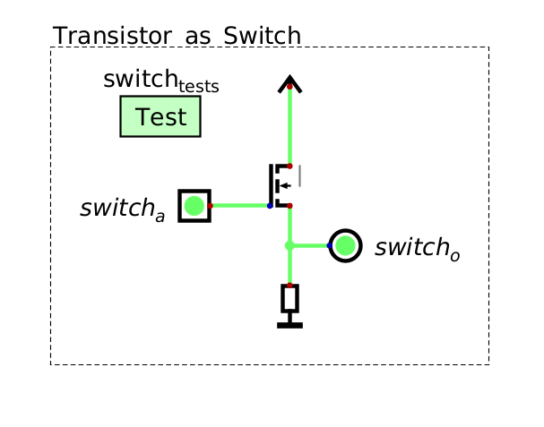

    Screenshot of a circuit created in Digital showing an N-channel MOSFET as a switch. Here, the switch is on,
    allowing the ``1`` from the source to pass to the output.

* Although this example may seem silly, remember that the actual signal at the source is arbitrary

    * In the above example, the signal at the source was always set to ``1``

* Further, they become more interesting when combined with additional transistors in clever ways

Logic Gates
===========

* With clever configurations of transistors, boolean logic operators can be implemented
* This allows for the ability to perform logical operators on electrical signals

.. warning::

    More complex transistor configurations for each of the below logic gates are contained within the textbook. The
    reason for their added complexity is a consequence of the physical limitations of how transistors work. These
    more complex configurations would be more inline with how logic gates are actually physically built.

    Fortunately, the simulator being used for this course is idealized and several physical limitations are ignored,
    which allows for the simpler configurations to be used. Nothing will be lost by using the simpler configurations
    since (a) the abstract ideas are the same between the simple and complex configurations, (b) the more complex
    configurations are only necessary because of the physical properties of semiconductors, and (c) for the most part,
    transistors will not be directly interacted with going forward in this course.

And Gate
--------

* Consider the **and** operator --- output ``1`` when both operands are ``1``, otherwise output ``0``

.. list-table:: Truth Table for **and**
    :widths: auto
    :align: center
    :header-rows: 1

    * - :math:`a`
      - :math:`b`
      -
      - :math:`a \land b`
    * - ``0``
      - ``0``
      -
      - ``0``
    * - ``0``
      - ``1``
      -
      - ``0``
    * - ``1``
      - ``0``
      -
      - ``0``
    * - ``1``
      - ``1``
      -
      - ``1``

* Knowing how transistors work as switches, how can two switches be configured to output ``1`` when they are both "on"?

    * When two input signals are ``1``, output ``1``, otherwise output ``0``

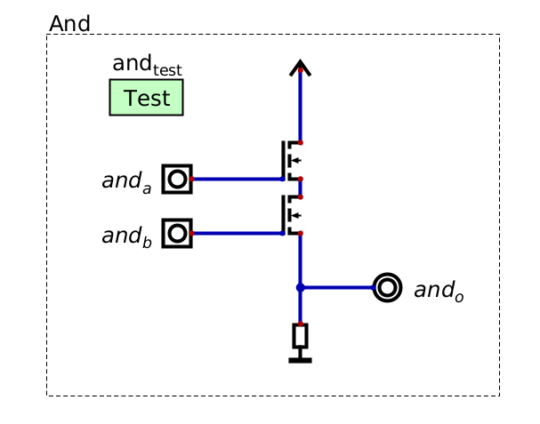

    Two transistors in series. Both transistors would need to be "on" in order for the signal at the top transistor's
    source (``1``) to reach the output at the bottom transistor's drain.

* With two transistors in *series*, both would need to be "on" for the signal to travel through to the output

    * *Series* meaning, one after the other along the same conductor
    * In a series circuit, the signal can only travel along the single conductor

* If either switch (or both) is "off", the signal could not travel to the output
* This perfectly corresponds to the **and** boolean operator
* This circuit is called an *and gate*

.. note::

    Each circuit seen so far has had a "Test" component. This allows one to create unit tests for circuits to help
    ensure correctness. Although the unit tests can get more complex and expressive, a simple form of unit tests for
    Digital is truth tables. Below is a unit test for the **and** circuit, which is the truth table defining how the
    circuit should behave.

    .. figure:: and_gate_unit_test.png
        :width: 666 px
        :align: center

        Unit test for the **and** circuit. Each column corresponds to a labelled input/output and each row specifies
        expected states.

* Boolean operators are used extensively within computer architecture
* Thus, special symbols are used to designate specific operators' gates
* Below is two images with the symbol for an and gate

    * The first image is of the symbol for the and gate
    * The second shows how the inputs and output would correspond to the full and gate built with transistors

    Symbol for an and gate.

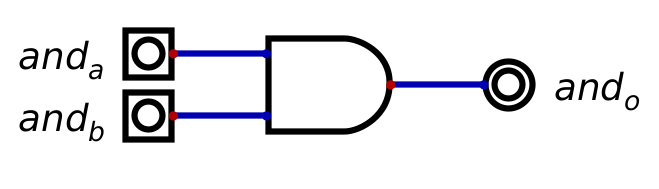

    Symbol for an and gate with labelled inputs and output corresponding to the *and gate* built with transistors.

.. note::

    This is the first major layer of abstraction that will be seen throughout this course. Instead of thinking of
    logic gates in terms of the whole schematic with transistors, they are represented as a single symbol.

Or Gate
-------

* For **or**, a signal of ``1`` should reach the output if either switch is "on"

.. list-table:: Truth Table for **or**
    :widths: auto
    :align: center
    :header-rows: 1

    * - :math:`a`
      - :math:`b`
      -
      - :math:`a \lor b`
    * - ``0``
      - ``0``
      -
      - ``0``
    * - ``0``
      - ``1``
      -
      - ``1``
    * - ``1``
      - ``0``
      -
      - ``1``
    * - ``1``
      - ``1``
      -
      - ``1``

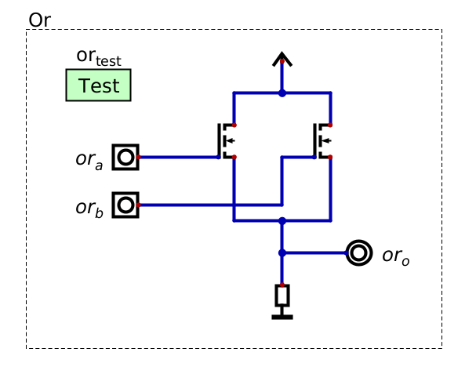

    Two transistors in parallel. Either transistors would need to be "on" in order for the signal to reach the output.

* With two transistors in *parallel*, either would need to be "on" for the signal to travel through to the output

    * *Parallel* meaning, transistors on separate conductors that split from the same conductor and re-join
    * The parallel circuits, the signal can travel through each separate conductor

* Below is an image of the symbol for an or gate

    Symbol for an or gate.

Not Gate
--------

* Now consider the **not** operator

.. list-table:: Truth Table for **not**
    :widths: auto
    :align: center
    :header-rows: 1

    * - :math:`a`
      -
      - :math:`\lnot a`
    * - ``0``
      -
      - ``1``
    * - ``1``
      -
      - ``0``

* The not gate is a little different from the and/or gates

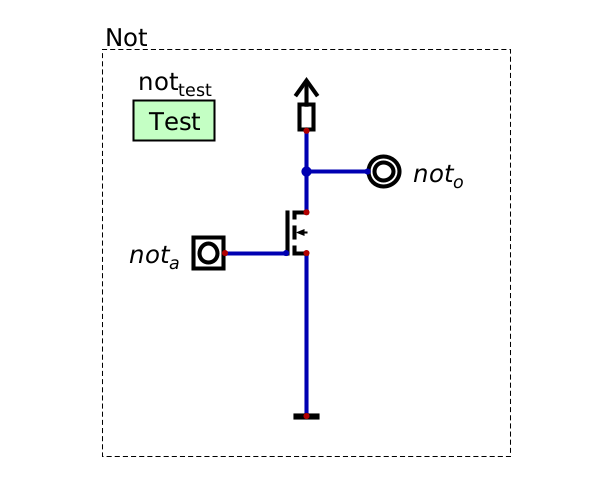

    Not gate with a transistor. When the transistor is turned "on", the circuit's voltage will drop to neutral as ground
    would be directly connected to the output.

* Notice how the output is on the source end of the transistor
* This is because the output should be ``1`` when the gate is "off",
* But as soon as the gate is "on", the output should become ``0``

* If it is unclear how this works, consider that

    * When the transistor is "off", the signal from the voltage source, through the resistor, is connected to the output
    * When the transistor is "on", the output would be directly connected to ground, sinking the signal

* If still unclear, consider a plugged sink with a faucet running that is overflowing with water
* If someone removes the plug from the drain, the water can then flow through the drain and stop overflowing

    * This would be like what happens when the transistor is turned "on"

.. admonition:: Activity

    How would one configure the schematic for **not** if using a P-channel MOSFET instead of a N-channel like above?

* Below is an image of the symbol for a not gate

    Symbol for a not gate.

* However, not is sometimes represented as only the circle

    * In fact, the triangle in the gate means a *buffer* component

* It is also common to simplify a not input to another gate by adding a circle to the symbol's respective input
* Below is an example of an and gate with one input inverted

    * The top image shows one input explicitly inverted with a not gate
    * The bottom image is simplified to show that the input is inverted

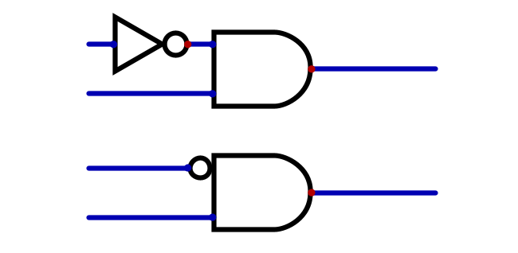

    Two representations of an and gate with the top input being inverted.

Other Gate Symbols
------------------

* Adding a circle to the output would signify an inverted output, like the below nor and nand gate symbols

    Symbol for a nor gate.

    Symbol for a nand gate.

* Another common symbol is for exclusive or (xor)

    Symbol for a xor gate.

For Next Time
=============

* Check out the :download:`transistors as a switch <transistor_as_switch.dig>` schematic for Digital
* Check out the :download:`boolean operators built with transistors <boolean_operators_with_transistors.dig>` schematic for Digital
* Read Chapter 3 Section 3 of your text

    * 5 pages